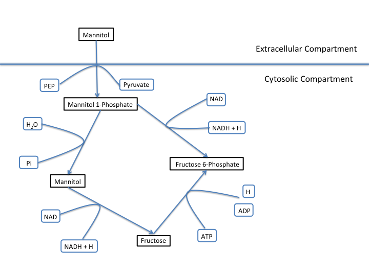

Tutorial
========

This tutorial will show you how to get PSAMM up and running on your computer,
how to work with the PSAMM YAML format, how to import published models into
PSAMM, and how to apply the main tools included with PSAMM to your models.

.. contents::
   :depth: 1
   :local:

Downloading the PSAMM Tutorial Data
_____________________________________

The PSAMM tutorial materials are available in the psamm-tutorial GitHub repository

These files can be downloaded using the following command:

.. code-block:: shell

    $ git clone https://github.com/zhanglab/psamm-tutorial.git

This will create a directory named ``psamm-tutorial`` in your current working
folder. You can then navigate to this directory using the following command:

.. code-block:: shell

    $ cd psamm-tutorial

Now you should be in the ``psamm-tutorial`` folder and should see the following
folders:

.. code-block:: shell

    additional_files/
    E_coli_sbml/
    E_coli_excel/

These directories include all of the files that will be needed to run the tutorial.

PSAMM Installation
____________________

PSAMM can be installed using the Python package installer pip. We recommend
that all installations be performed under a virtual Python environment. Major
programs and dependencies include: ``psamm-model``, which supports model
checking, model simulation, and model exports; Linear programming (LP) solvers
(e.g. Cplex, Gurobi, QSopt_ex), which provide the solution of linear
programming problems; ``psamm-import``, which supports the import of models
from SBML, JSON, and Excel formats.

Setting up a Virtual Python Environment
~~~~~~~~~~~~~~~~~~~~~~~~~~~~~~~~~~~~~~~

It is recommended that the PSAMM software and dependencies should be
installed under a virtual Python environment. This can be done by using
the Virtualenv_ software. Virtualenv will set up a Python environment that
permits you to install Python packages in a local directory that will not
interfere with other programs in the global Python. The virtual environment
can be set up at any local directory that you have write permission to. For
example, here we will set up the virtual environment under the main directory
of this PSAMM tutorial. First, run the following command if you are not in
the ``psamm-tutorial`` folder:

.. _Virtualenv: https://virtualenv.pypa.io/

.. code-block:: shell

    $ cd <PATH>/psamm-tutorial

In this command, ``<PATH>`` should be substituted by the directory path to
where you created the ``psamm-tutorial``. This will change your current
directory to the ``psamm-tutorial`` directory. Then, you can create a virtual
environment in the ``psamm-tutorial`` directory:

.. code-block:: shell

    $ virtualenv psamm-env

That will set up the virtual environment in a folder called ``psamm-env/``.
The next step is to activate the virtual environment so that the Python that is
being used will be the one that is in the virtualenv. To do this use the
following command:

.. code-block:: shell

    $ source psamm-env/bin/activate

This will change your command prompt to the following:

.. code-block:: shell

    (psamm-env) $

This indicates that the virtual environment is activated, and any installation
of Python packages will now be installed in the virtual environment. It is
important to note that when you leave the environment and return at a later
time, you will have to reactivate the environment (use the ``source`` command
above) to be able to use any packages installed in it.

.. note::

    For Windows users, the virtual environment is installed in a different
    file structure. The ``activate`` script on these systems will reside in a
    ``Scripts`` folder. To activate the environment on these systems use the
    command:

    .. code-block:: batch

        > psamm-env\Scripts\activate

.. note::

    After activating the environment, the command ``pip list`` can be used to
    quickly get an overview of the packages installed in the environment and
    the version of each package.

Installation of ``psamm-model`` and ``psamm-import``
~~~~~~~~~~~~~~~~~~~~~~~~~~~~~~~~~~~~~~~~~~~~~~~~~~~~

The next step will be to install ``psamm-model`` and ``psamm-import`` as well
as their requirements. To do this, you can use the Python Package Installer,
`pip`. To install both ``psamm-import`` and ``psamm-model`` you can use the
following command:

.. code-block:: shell

    (psamm-env) $ pip install git+https://github.com/zhanglab/psamm-import.git

This will install ``psamm-import`` from its Git repository and also install its
Python dependencies automatically. One of these dependencies is
``psamm-model``, so when ``psamm-import`` is installed you will also be
installing ``psamm-model``.

If you only want to install ``psamm-model`` in the environment you can run
the following command:

.. code-block:: shell

    (psamm-env) $ pip install psamm

It is important to note that if only ``psamm-model`` is installed you will be
able to apply PSAMM only on models that are represented in the YAML format
which will be described later on in the tutorial.

Installation of LP Solvers
~~~~~~~~~~~~~~~~~~~~~~~~~~

The LP (linear programming) solvers are necessary for analysis of metabolic
fluxes using the constraint-based modeling approaches.

Cplex is the recommended solver for PSAMM and is available with an academic
license from IBM. Instructions on how to install Cplex can be found at the
following URL: `Cplex`_

.. _Cplex: http://www-01.ibm.com/support/docview.wss?uid=swg21444285

Once Cplex is installed, you need to install the Python bindings under
the psamm-env virtual environment using the following command:

.. code-block:: shell

    (psamm-env) $ pip install <PATH>/IBM/ILOG/CPLEX_Studio<XXX>/cplex/python/<python_version>/<platform>

The directory path in the above command should be replaced with the path to
the IBM Cplex installation in your computer. This will install the Python
bindings for Cplex into the virtual environment.

.. note::
    While the Cplex software will be installed globally, the Python bindings
    should be installed specifically under the virtual environment with the
    PSAMM installation.

PSAMM also supports the use of two other linear programming solvers, Gurobi and
QSopt_ex. To install the Gurobi solver, Gurobi will first need to be installed
on your computer. Gurobi can be obtained with an academic license from
here: `Gurobi`_

Once Gurobi is installed the Python bindings will need to be installed in the
virtual environment by using pip to install them from the package directory. An
example of how this could be done on a OSX is (on other platforms the path will
be different):

.. _Gurobi: http://www.gurobi.com/registration/download-reg

.. code-block:: shell

    (psamm-env) $ pip install /Library/gurobi604/mac64/

The QSopt_ex solver can also be used with PSAMM. To install this solver you
will first need to install Qsopt_ex on your computer and afterwards the
Python bindings (`python-qsoptex`) can be installed in the virtual environment:

.. code-block:: shell

    (psamm-env) $ pip install python-qsoptex

Please see the `python-qsoptex documentation`_ for more information on
installing both the library and the Python bindings.

.. _`python-qsoptex documentation`: https://github.com/jonls/python-qsoptex

.. note::
    The QSopt_ex solver does not support Integer LP problems and as a result
    cannot be used to perform flux analysis with thermodynamic constraints. If this
    solver is used thermodynamic constraints cannot be used during simulation. By
    default ``psamm-model`` will not use these constraints.

Once a solver is installed you should now be able to fully use all of the
``psamm-model`` flux analysis functions. To see a list of the installed solvers
the use the ``psamm-list-lpsolvers`` command:

.. code-block:: shell

    (psamm-env) $ psamm-list-lpsolvers

You will see the details on what solvers are installed currently and
avaliable to PSAMM. For example if the Gurobi and Cplex solvers were both
installed you would see the following output from ``psamm-list-lpsolvers``:

.. code-block:: shell

    Prioritized solvers:
    Name: cplex
    Priority: 10
    MILP (integer) problem support: True
    Rational solution: False
    Class: <class 'psamm.lpsolver.cplex.Solver'>

    Name: gurobi
    Priority: 9
    MILP (integer) problem support: True
    Rational solution: False
    Class: <class 'psamm.lpsolver.gurobi.Solver'>

    Unavailable solvers:
    qsoptex: Error loading solver: No module named qsoptex

By default the solver with the highest priority (highest priority number) is
used in constraint based simulations. If you want to use a solver with a
lower priority you will need to specify it by using the ``--solvers`` option.
For example to run FBA on a model while using the Gurobi solver the following
command would be used:

.. code-block:: shell

    (psamm-env) $ psamm-model fba --solver name=gurobi

Importing Existing Models (psamm-import)
________________________________________

In order to work with a metabolic model in PSAMM the model must be converted
to the PSAMM-specific YAML format. This format allows for a human readable
representation of the model components and allows for enhanced customization
with respect to the organization of the metabolic model. This enhanced
organization will allow for a more direct interaction with the metabolic
model and make the model more accessible to both the modeler and experimental
biologists.

Import Formats
~~~~~~~~~~~~~~

``psamm-import`` supports the import of models in various formats. For the SBML
format, it supports the COBRA-compliant SBML specifications, the FBC
specifications, and the basic SBML specifications in levels 1, 2, and 3;
for the JSON format, it supports the import of JSON files directly from the
`BiGG`_ database or from locally downloaded versions;
the supports to Excel import is model specific and are available for 17
published models. There is also a generic Excel import for models produced by
the ModelSEED pipeline. To see a list of these models or model formats that
are supported, use the command:

.. _BiGG: http://bigg.ucsd.edu

.. code-block:: shell

    (psamm-env) $ psamm-import list

In the output, you will see a list of specific Excel models that are supported
by ``psamm-import`` as well as the different SBML parsers that are available in
PSAMM:

.. code-block:: shell

    Generic importers:
    json          COBRA JSON
    modelseed     ModelSEED model (Excel format)
    sbml          SBML model (non-strict)
    sbml-strict   SBML model (strict)

    Model-specific importers:
    icce806       Cyanothece sp. ATCC 51142 iCce806 (Excel format), Vu et al., 2012
    ecoli_textbook  Escerichia coli Textbook (core) model (Excel format), Orth et al., 2010
    ijo1366       Escerichia coli iJO1366 (Excel format), Orth et al., 2011
    gsmn-tb       Mycobacterium tuberculosis GSMN-TB (Excel format), Beste et al., 2007
    inj661        Mycobacterium tuberculosis iNJ661 (Excel format), Jamshidi et al., 2007
    inj661m       Mycobacterium tuberculosis iNJ661m (Excel format), Fang et al., 2010
    inj661v       Mycobacterium tuberculosis iNJ661v (Excel format), Fang et al., 2010
    ijn746        Pseudomonas putida iJN746 (Excel format), Nogales et al., 2011
    ijp815        Pseudomonas putida iJP815 (Excel format), Puchalka et al., 2008
    stm_v1.0      Salmonella enterica STM_v1.0 (Excel format), Thiele et al., 2011
    ima945        Salmonella enterica iMA945 (Excel format), AbuOun et al., 2009
    irr1083       Salmonella enterica iRR1083 (Excel format), Raghunathan et al., 2009
    ios217_672    Shewanella denitrificans OS217 iOS217_672 (Excel format), Ong et al., 2014
    imr1_799      Shewanella oneidensis MR-1 iMR1_799 (Excel format), Ong et al., 2014
    imr4_812      Shewanella sp. MR-4 iMR4_812 (Excel format), Ong et al., 2014
    iw3181_789    Shewanella sp. W3-18-1 iW3181_789 (Excel format), Ong et al., 2014
    isyn731       Synechocystis sp. PCC 6803 iSyn731 (Excel format), Saha et al., 2012

Now the model can be imported using the ``psamm-import`` functions. Return to
the ``psamm-tutorial`` folder if you have left it using the following command:

.. code-block:: shell

    (psamm-env) $ cd <PATH>/psamm-tutorial

Importing an SBML Model
~~~~~~~~~~~~~~~~~~~~~~~

In this tutorial, we will use the `E. coli` textbook core model [1]_ as an
example to demonstrate the functions in PSAMM. The model should be imported
from the SBML model. To import the ``E_coli_core.xml`` model to YAML format run
the following command:

.. code-block:: shell

    (psamm-env) $ psamm-import sbml --source E_coli_sbml/ecoli_core_model.xml --dest E_coli_yaml

This will convert the SBML file in the ``E_coli_sbml`` directory into the YAML
format that will be stored in the ``E_coli_yaml/`` directory. The output will
give the basic statistics of the model and should look like this:

.. code-block:: shell

    ...
    WARNING: Species M_pyr_b was converted to boundary condition because of "_b" suffix
    WARNING: Species M_succ_b was converted to boundary condition because of "_b" suffix
    INFO: Detected biomass reaction: R_Biomass_Ecoli_core_w_GAM
    Model: Ecoli_core_model
    - Biomass reaction: R_Biomass_Ecoli_core_w_GAM
    - Compounds: 72
    - Reactions: 95
    - Genes: 0
    INFO: Using default flux limit of 1000.0
    INFO: Converting exchange reactions to medium definition

``psamm-import`` will produce some warnings if there are any aspects of the
model that are going to be changed during import. In this case the warnings are
notifying you that the species with a ``_b`` suffix have been converted to a
boundary condition. You should also see information on whether the biomass
reaction was identified, as well as some basic information on the model name,
size and the default flux settings.

Importing an Excel Model
~~~~~~~~~~~~~~~~~~~~~~~~

The process of importing an Excel model is the same as importing an SBML model
except that you will need to specify the specific model name in the command.
The list of supported models can be seen using the list function above. An
example of an Excel model import is below:

.. code-block:: shell

    (psamm-env) $ psamm-import ecoli_textbook --source E_coli_excel/ecoli_core_model.xls --dest converted_excel_model

This will produce a YAML version of the Excel model in the
``converted_excel_model/`` directory.

Since the Excel models are not in a standardized format these parsers need to
be developed on a model-by-model basis in order to parse all of the relevant
information out of the model. Future support will be added for more Excel
based models as the parsers are developed.

Importing a JSON Model
~~~~~~~~~~~~~~~~~~~~~~

``psamm-import`` also supports the conversion of JSON format models that follows
the conventions in COBRApy. If the JSON model is stored locally, it can be
converted with the following command:

.. code-block:: shell

    (psamm-env) $ psamm-import json --source e_coli_json/e_coli_core.json --dest converted_json_model/

Alternatively, an extension of the JSON importer has been provided,
``psamm-import-bigg``, which can be applied to convert JSON models from `BiGG`_
database. To see the list of available models on the BiGG database the
following command can be used:

.. code-block:: shell

    (psamm-env) $ psamm-import-bigg list

This will show the available models as well as their names. You can then
import any of these models to YAML format. For example, using the following
command to import the `E. coli` iJO1366 [2]_ model from the BiGG database:

.. code-block:: shell

    (psamm-env) $ psamm-import-bigg iJO1366 --dest converted_json_model_bigg/

.. note::
    To use ``psamm-import-bigg`` you must have internet access so
    that the models can be downloaded from the online BiGG database.

YAML Format and Model Organization
__________________________________

The PSAMM YAML format stores individual models under a designated directory,
in which there will be a number of files that stores the information of the
model and specifies the simulation conditions. The entry point of the YAML
model is a file named ``model.yaml``, which points to additional files that
store the information of the model components, including compounds, reactions,
flux limits, medium conditions, etc. While we recommend that you use the name
``model.yaml`` for the central reference file, the file names for the included
files are flexible and can be customized as you prefer. In this tutorial, we
simply used the names: ``compounds.yaml``, ``reactions.yaml``, ``limits.yaml``,
and ``medium.yaml`` for the included files.

First change directory into ``E_coli_yaml``:

.. code-block:: shell

    (psamm-env) $ cd E_coli_yaml/

The directory contains the main ``model.yaml`` file as well as the included
files:

.. code-block:: shell

    (psamm-env) $ ls
    compounds.yaml
    limits.yaml
    medium.yaml
    model.yaml
    reactions.yaml

These files can be opened using any standard text editor. We highly recommend
using an editor that includes syntax highlighting for the YAML language (we
recommend the Atom_ editor which includes built-in support for YAML and is
available for OSX, Linux and Windows). You can also use a command like ``less``
to quickly inspect the files:

.. _Atom: https://atom.io/

.. code-block:: shell

    (psamm-env) $ less <file_name>.yaml

The central file in this organization is the ``model.yaml`` file. The following
is an example of the ``model.yaml`` file that is obtained from the import of
the `E. coli` textbook model. The ``model.yaml`` file for this imported SBML
model should look like the following:

.. code-block:: yaml

    name: Ecoli_core_model
    biomass: R_Biomass_Ecoli_core_w_GAM
    default_flux_limit: 1000.0
    compounds:
    - include: compounds.yaml
    reactions:
    - include: reactions.yaml
    media:
    - include: medium.yaml
    limits:
    - include: limits.yaml

The ``model.yaml`` file defines the basic components of a metabolic model,
including the model name (`Ecoli_core_model`), the biomass function
(`R_Biomass_Ecoli_core_w_GAM`), the compound files (``compounds.yaml``), the
reaction files (``reactions.yaml``), the flux boundaries (``limits.yaml``), and
the medium conditions (``medium.yaml``). The additional files are defined using
include functions. This organization allows you to easily change
aspects of the model like the exchange reactions by simply referencing a
different media file in the central ``model.yaml`` definition.

This format can also be used to include multiple files in the list of
reactions and compounds. This feature can be useful, for example, if you
want to name different reaction files based on the subsystem designations or
cellular compartments, or if you want to separate the temporary reactions
that are used to fill reaction gaps from the main model. An example of how you
could designate multiple reaction files is found below. This file can be found
in the additional files folder in the file ``complex_model.yaml``.

.. code-block:: yaml

    name: Ecoli_core_model
    biomass: R_Biomass_Ecoli_core_w_GAM
    default_flux_limit: 1000.0
    model:
    - include: core_model_definition.tsv
    compounds:
    - include: compounds.yaml
    reactions:
    - include: reactions/cytoplasm.yaml
    - include: reactions/periplasm.yaml
    - include: reactions/transporters.yaml
    - include: reactions/extracellular.yaml
    media:
    - include: medium.yaml
    limits:
    - include: limits.yaml

As can be see here the modeler chose to distribute their reaction database
files into different files representing various cellular compartments and roles.
This organization can be customized to suit your preferred workflow.

There are also situations where you may wish to designate only a subset
of the reaction database in a metabolic simulation. In these situations it is
possible to use a model definition file to identify which subset of reactions
will be used from the larger database. The model definition file is simply a
list of reaction IDs that will be included in the simulation.

An example of how to include a model definition file can be found below.

.. code-block:: yaml

    name: Ecoli_core_model
    biomass: R_Biomass_Ecoli_core_w_GAM
    default_flux_limit: 1000.0
    model:
    - include: subset.tsv
    compounds:
    - include: compounds.yaml
    reactions:
    - include: reactions.yaml
    media:
    - include: medium.yaml
    limits:
    - include: limits.yaml

.. note::
    When the model definition file is not identified, PSAMM will include
    the entire reaction database in the model. However, when it is identified,
    PSAMM will only include the reactions that are listed in the model
    definition file in the model. This design can be useful when you want to
    make targeted tests on a subset of the model or when you want to include a
    larger database for use with the gap filling functions.

Reactions
~~~~~~~~~

The ``reactions.yaml`` file is where the reaction information is stored in the
model. A sample of this kind of file can be seen below:

.. code-block:: yaml

    - id: R_ACALDt
      name: acetaldehyde reversible transport
      equation: '|M_acald_e[C_e]| <=> |M_acald_c[C_c]|'
      subsystem: Transport, Extracellular
    - id: R_ACKr
      name: acetate kinase
      equation: '|M_ac_c[C_c]| + |M_atp_c[C_c]| <=> |M_actp_c[C_c]| + |M_adp_c[C_c]|'
      subsystem: Pyruvate Metabolism

Each reaction entry is designated with the reaction ID first. Then the various
properties of the reaction can be listed below it. The required properties for
a reaction are ID and equation. Along with these required attributes others
can be included as needed in a specific project. These can include but are not
limited to EC numbers, subsystems, names, and genes associated with the
reaction. For example, in a collaborative reconstruction you may want to
include a field named ``authors`` to identify which authors have contributed to
the curation of a particular reaction.

Reaction equations can be formatted in multiple ways to allow for more
flexibility during the modeling process. The reactions can be formatted in a
string format based on the ModelSEED reaction format. In this representation
individual compounds in the reaction are represented as compound IDs followed by
the cellular compartment in brackets, bordered on both sides by single pipes.
For example if a hydrogen compound in the cytosol was going to be in an equation
it could be represented as follows:

.. code-block:: shell

    |Hydr[cytosol]|

These individual compounds can be assigned stoichiometric coeficients by adding
a number in parentheses before the compound. for example if a reaction contained
two hydrogens it could appear as follows:

.. code-block:: shell

    (2) |Hydr[cytosol]|

These individual components are separated by + signs in the reaction string. The
separation of the reactants and products is through the use of an equal sign
with greater than or less than signs designating directionality. These could
include => or <= for reactions that can only progress in one direction or <=>
for reactions that can progress in both directions. An example of a correctly
formatted reaction could be as follows:

.. code-block:: shell

    '|M_ac_c[C_c]| + |M_atp_c[C_c]| <=> |M_actp_c[C_c]| + |M_adp_c[C_c]|'

For longer reactions the YAML format
provides a way to list each reaction component on a single line. For example a
reaction could be represented as follows:

.. code-block:: yaml

    - id: R_ACKr
      name: acetate kinase
      equation:
        compartment: C_c
        reversible: yes
        left:
          - id: M_ac_c
            value: 1
          - id: M_atp_c
            value: 1
        right:
          - id: M_actp_c
            value: 1
          - id: M_adp_c
            value: 1
      subsystem: Pyruvate Metabolism

This line based format can be especially helpful when dealing with larger
equations like biomass reactions where there can be dozens of components in
a single reaction.

Gene associations for the reactions in a model can also be included in the
reaction definitions so that gene essentiality experiments can be performed
with the model. These genes associations are included by adding the ``genes``
property to the reaction like follows:

.. code-block:: yaml

    - id: R_ACALDt
      name: acetaldehyde reversible transport
      equation: '|M_acald_e[C_e]| <=> |M_acald_c[C_c]|'
      subsystem: Transport, Extracellular
      genes: gene_0001

More complex gene associations can also be included by using logical and/or
statements in the genes property. When performing gene essentiallity simulations
this logic will be taken into account. Some examples of using this logic with
the genes property can be seen below:

.. code-block:: yaml

    genes: gene_0001 or gene_0002

    genes: gene_0003 and gene_0004

    genes: gene_0003 and gene_0004 or gene_0005 and gene_0006

    genes: gene_0001 and (gene_0002 or gene_0003)

Compounds
~~~~~~~~~

The ``compounds.yaml`` file is organized in the same way as the
``reactions.yaml``. An example can be seen below.

.. code-block:: yaml

    - id: M_13dpg_c
      name: 3-Phospho-D-glyceroyl-phosphate
      formula: C3H4O10P2
    - id: M_2pg_c
      name: D-Glycerate-2-phosphate
      formula: C3H4O7P
    - id: M_3pg_c
      name: 3-Phospho-D-glycerate
      formula: C3H4O7P

The compound entries begin with a compound ID which is then followed by the
compound properties. These properties can include a name, chemical formula,
and charge of the compound.

Limits
~~~~~~

The limits file is used to designate reaction flux limits when it is different
from the defaults in PSAMM. By default, PSAMM would assign the lower and
upper bounds to reactions based on their reversibility, i.e. the boundary of
reversible reactions are :math:`-1000 \leq vi \leq 1000`, and the boundary for
irreversible reactions are :math:`0 \leq vi \leq 1000`. Therefore, the
``limits.yaml`` file will consist of only the reaction boundaries that are
different from these default values. For example, if you want to force flux
through an artificial reaction like the ATP maintenance reaction `R_ATPM` you
can add in a lower limit for the reaction in the limits file like this:

.. code-block:: yaml

    - reaction: R_ATPM
      lower: 8.39

Each entry in the limits file includes a reaction ID followed by upper and
lower limits. Note that when a model is imported only the non-default flux
limits are explicitly stated, so some of the imported models will not contain
a predefined limits file. In the `E. coli` core model, only one reaction has a
non-default limit. This reaction is an ATP maintenance reaction and the
modelers chose to force a certain level of flux through it to simulate the
general energy cost of cellular maintenance.

Medium
~~~~~~

The medium file is where you can designate the boundary conditions for
the model. A name for the media can be designated at the top of the file
using the ``name`` tag, and the compartment of the medium compounds can be
designated using the ``compartment`` tag. The media can be organized into
multiple sections to represent exchange reactions for different compartments
in the model if that is desired. An example of the medium file can be seen
below.

.. code-block:: yaml

    name: Default medium
    compartment: C_e
    compounds:
    - id: M_ac_e
      reaction: R_EX_ac_e
      lower: 0.0
    - id: M_acald_e
      reaction: R_EX_acald_e
      lower: 0.0
    - id: M_akg_e
      reaction: R_EX_akg_e
      lower: 0.0
    - id: M_co2_e
      reaction: R_EX_co2_e

Each entry starts with the ID of the boundary compound and followed by lines
that defines the lower and upper limits of the compound flux. Internally,
PSAMM will translate these boundary compounds into exchange reactions in
metabolic models. Additional properties can be designated for the exchange
reactions including an ID for the reaction, the compartment for the reaction,
and lower and upper flux bounds for the reaction. In the same way that only
non-standard limits need to be specified in the limits file, only non-standard
exchange limits need to be specified in the media file.

Model Format Customization
~~~~~~~~~~~~~~~~~~~~~~~~~~

The YAML model format is highly customizable to suit your preferences.
File names can be changed according to your own design. These customizations
are all allowed by PSAMM as long as the central ``model.yaml`` file is also
updated to reflect the different file names referred. While all the file names
can be changed it is recommended that the central ``model.yaml`` file name does
not change. PSAMM will automatically detect and read the information from the
file if it is named ``model.yaml``. If you *do* wish to also alter the name of
this file you can do so but whenever any PSAMM commands are run you will need
to specify the path of your model file using the ``--model`` option. For
example, to run FBA with a different central model file named
``ecoli_model.yaml``, you could run the command like this:

.. code-block:: shell

    (psamm-env) $ psamm-model --model ecoli_model.yaml fba

FBA in PSAMM
______________

PSAMM allows for the integration of the model development and curation process
with the simulation process. In this way changes to a metabolic model can be
immediately tested using the various flux analysis tools that are present in
PSAMM. In this tutorial, aspects of the `E. coli` core model [1]_ will be
expanded to demonstrate the various functions available in PSAMM and throughout
these changes the model will be analyzed with PSAMM's simulation functions to
make sure that these changes are resulting in a functional model.

Flux Balance Analysis (FBA) is one of the basic methods that allows you
to quickly examine if the model is viable (i.e. can produce biomass). PSAMM
provides the ``fba`` function in the ``psamm-model`` command to perform FBA on
metabolic models. For example, to run FBA on the `E. coli` core model first
make sure that the current directory is the ``E_coli_yaml/`` directory using
the following command:

.. code-block:: shell

    (psamm-env) $ cd <PATH>/psamm-tutorial/E_coli_yaml/

Then run FBA on the model with the following command.

.. code-block:: shell

    (psamm-env) $ psamm-model fba

Note that the command above should be executed within the folder that stores
the ``model.yaml`` file. Alternatively, you could run the following command anywhere
in your file system:

.. code-block:: shell

    (psamm-env) $ psamm-model --model <PATH-TO-MODEL.YAML> fba

By default, PSAMM fba will use the biomass function designated in the central
model file as the objective function. If the biomass tag is not defined in a
``model.yaml`` file or if you want to use a different reaction as the
objective function, you can simply specify what the reaction ID is at the
end of the command. For example to maximize the citrate synthase reactions,
R_CS, the command would be as follows:

.. code-block:: shell

    (psamm-env) $ psamm-model fba R_CS

The following is a sample of some output from the FBA command:

.. code-block:: shell

    INFO: Model: Ecoli_core_model
    INFO: Model Git version: 9812080
    INFO: Using R_Biomass_Ecoli_core_w_GAM as objective
    INFO: Loop removal disabled; spurious loops are allowed
    INFO: Setting feasibility tolerance to 1e-09
    INFO: Solving took 0.00 seconds
    R_ACALDt	0.0	|Acetaldehyde[C_e]| <=> |Acetaldehyde[C_c]|
    R_ACKr	0.0	|ATP[C_c]| + |Acetate[C_c]| <=> |Acetyl-phosphate[C_c]| + |ADP[C_c]|
    R_ACONTa	6.00724957535	|Citrate[C_c]| <=> |cis-Aconitate[C_c]| + |H2O[C_c]|
    R_ACONTb	6.00724957535	|cis-Aconitate[C_c]| + |H2O[C_c]| <=> |Isocitrate[C_c]
    ...
    INFO: Objective flux: 0.873921506968

At the beginning of the output of ``psamm-model`` commands information about
the model as well as information about simulation settings will be printed.
At the end of the output PSAMM will print the maximized flux of the designated
objective function. The rest of the output is a list of the reaction IDs in the
model along with their fluxes,
and the reaction equations represented with the compound names.  This output is
human readable because the reactions equations are represented with the full
names of compound. It can be saved as a tab separated file that can be sorted
and analyzed quickly allowing for easy analysis and comparison between FBA in
different conditions.

Flux balance analysis will be used throughout this tutorial as both a checking
tool during model curation and an analysis tool. PSAMM allows you to easily
integrate analysis tools like this into the various steps during model
development.

Version Control with the YAML Format
____________________________________

The YAML format contains a logical division of the model information and
allows for easier modification and interaction with the model. Moreover, the
text-based representation of YAML files can enable the tracking of model
modifications using version control systems. In this tutorial we will
demonstrate the use of the Git version control system during model development
to track the changes that have been added to an existing model. This feature
will improve the documentation of the model development process and improve
collaborative annotations during model curation.

A broad overview of how to use various Git features can be found here: `Git`_

.. _Git: https://git-scm.com

Initiate a Git Repository for the YAML Model
~~~~~~~~~~~~~~~~~~~~~~~~~~~~~~~~~~~~~~~~~~~~

Throughout this tutorial version tracking using Git will be highlighted in
various sections. As you follow along with the tutorial you can try to run the
Git commands to get a sense of how Git and PSAMM work together. We will also
highlight how the features of Git help with model curation and
development when using the YAML format.

To start using Git to track the changes in this model the folder must first
be initialized as a Git repository. To do this first enter the YAML model
directory and use the following command:

.. code-block:: shell

    (psamm-env) $ git init

After the folder is initialized as a Git repository the files that were
initially imported from the SBML version can be added to the repository
using the following command:

.. code-block:: shell

    (psamm-env) $ git add *.yaml

this will stage all of the files with the ``yaml`` extension to be committed.
Then the addition of these files can be added to the repository to be tracked
by using the following command:

.. code-block:: shell

    (psamm-env) $ git commit -m 'Initial import of E. coli Core Model'

Now these files will be tracked by Git and any changes that are made will be
easily viewable using various Git commands. PSAMM will also print out the Git
commit ID when any commands are run. This makes it easier for you to track
exactly what version of the model a past simulation was done on.

The next step in the tutorial will be to add in a new carbon utilization
pathway to the `E. coli` core model and Git will be used to track these new
additions and manage the curation in an easy to track manner. The tutorial
will return to the version tracking at various points in order to show how
this can be used during model development.

FBA on Model Before Expansion
~~~~~~~~~~~~~~~~~~~~~~~~~~~~~

Now that the model is imported and being tracked by Git it will be helpful to
do a quick simulation to confirm that the model is complete and able to
generate flux. To do this you can run the FBA command in the model directory:

.. code-block:: shell

    (psamm-env) $ psamm-model fba

The following is a sample of the output from this initial flux balance
analysis. It can be seen that the model is generating flux through the
objective function and seems to be a complete working model. Now that this
is known any future changes that are made to the model can be made with the
knowledge that the unchanged model was able to generate biomass flux.

.. code-block:: shell

    R_ACALDt	0.0	|Acetaldehyde[C_e]| <=> |Acetaldehyde[C_c]|
    R_ACKr	0.0	|ATP[C_c]| + |Acetate[C_c]| <=> |Acetyl-phosphate[C_c]| + |ADP[C_c]|
    R_ACONTa	6.00724957535	|Citrate[C_c]| <=> |cis-Aconitate[C_c]| + |H2O[C_c]|
    R_ACONTb	6.00724957535	|cis-Aconitate[C_c]| + |H2O[C_c]| <=> |Isocitrate[C_c]|
    ...
    INFO: Objective flux: 0.873921506968

Adding a new Pathway to the Model
~~~~~~~~~~~~~~~~~~~~~~~~~~~~~~~~~

The `E. coli` textbook model that was imported above is a small model
representing the core metabolism of `E. coli`. This model is great for small
tests and demonstrations due to its size and excellent curation. For the
purposes of this tutorial this textbook model will be modified to include a
new metabolic pathway for the utilization of D-Mannitol by `E. coli`. This is a
simple pathway which involves the transport of D-Mannitol via the PTS system
and then the conversion of D-Mannitol 1-Phosphate to D-Fructose 6-Phosphate.
Theoretically the inclusion of this pathway should allow the model to utilize
D-Mannitol as a sole carbon source. Along with this direct pathway another
set of reactions will be added that remove the phosphate from the mannitol
1-phosphate to create cytoplasmic mannitol which can then be converted to
fructose and then to fructose 6-phosphate.

To add these reactions, there will need to be three components added to the
model. First the new reactions will be added to the model, then the relevant
exchange reactions, and finally the compound information.

The new reactions in the database can be added directly to the already
generated reactions file but for this case they will be added to a separate
database file that can then be added to the model through the include function
in the ``model.yaml`` file.

A reaction database file named ``mannitol_path.yaml`` is supplied in
``additional_files`` folder. This file can be added into the ``model.yaml``
file by copying it to your working folder using the following command:

.. code-block:: shell

    (psamm-env) $ cp ../additional_files/mannitol_pathway.yaml .

And then specifying it in the ``model.yaml`` file by adding the following line
in the reactions section:

.. code-block:: shell

    reactions:
    - include: reactions.yaml
    - include: mannitol_pathway.yaml

Alternatively you can copy an already changed ``model.yaml`` file from the
additional files folder using the following command:

.. code-block:: shell

    (psamm-env) $ cp ../additional_files/model.yaml .

This line tells PSAMM that these reactions are also going to be included in the
model simulations.

Now you can test the model again to see if there were any effects from
these new reactions added in. To run an FBA simulation you can use the
following command:

.. code-block:: shell

    (psamm-env) $ psamm-model fba

It can be seen that the newly added reactions are being read into the model
since they do appear in the output. For example the `MANNI1DEH` reaction can be
seen in the FBA output and it can be seen that this reaction is not carrying
any flux. This is because there is no exchange reaction added into the model that
would provide mannitol.

.. code-block:: shell

    FRUKIN	0.0	|M_fru_c[C_c]| + |ATP[C_c]| => |D-Fructose-6-phosphate[C_c]| + |ADP[C_c]| + |H[C_c]|
    MANNI1PDEH	0.0	|Nicotinamide-adenine-dinucleotide[C_c]| + |M_manni1p[C_c]| => |D-Fructose-6-phosphate[C_c]| + |H[C_c]| + |Nicotinamide-adenine-dinucleotide-reduced[C_c]|
    MANNI1PPHOS	0.0	|M_manni1p[C_c]| + |H2O[C_c]| => |M_manni[C_c]| + |Phosphate[C_c]|
    MANNIDEH	0.0	|Nicotinamide-adenine-dinucleotide[C_c]| + |M_manni[C_c]| => |Nicotinamide-adenine-dinucleotide-reduced[C_c]| + |M_fru_c[C_c]|
    MANNIPTS	0.0	|M_manni[C_e]| + |Phosphoenolpyruvate[C_c]| => |M_manni1p[C_c]| + |Pyruvate[C_c]|
    ...

Changing the Boundary Definitions Through the Medium File
~~~~~~~~~~~~~~~~~~~~~~~~~~~~~~~~~~~~~~~~~~~~~~~~~~~~~~~~~

To add new exchange reactions to the model a modified ``media.yaml`` file has
been included in the additional files. This new boundary condition could be
added by creating a new entry in the existing ``media.yaml`` file but for this
tutorial the media can be changed by running the following command:

.. code-block:: shell

    (psamm-env) $ cp ../additional_files/medium.yaml .

This will simulate adding in the new mannitol compound into the media file as
well as setting the uptake of glucose to be zero.

Now you can track changes to the medium file using the Git command:

.. code-block:: shell

    (psamm-env) $ git diff medium.yaml

From the output, it can be seen that a new entry was added in the medium file
to add the mannitol exchange reaction and that the lower flux limit for glucose
uptake was changed to zero. This will make it so that any future simulations
done with the model in these conditions will only have mannitol available as a
carbon source.

.. code-block:: diff

    @@ -1,6 +1,8 @@
    name: Default medium
    compartment: C_e
    compounds:
    +- id: M_manni
    +  lower: -10
     - id: M_ac_e
       reaction: R_EX_ac_e
       lower: 0.0
    @@ -26,7 +28,7 @@ compounds:
       lower: 0.0
     - id: M_glc_D_e
       reaction: R_EX_glc_e
    -  lower: -10.0
    +  lower: 0.0
     - id: M_gln_L_e
       reaction: R_EX_gln_L_e
       lower: 0.0

In this case the Git output indicates what lines were added or removed from the
previous version. Added lines are indicated with a plus sign next to them.
These are the new lines in the new version of the file. The lines with a minus
sign next to them are the line versions from the old format of the file. This
makes it easy to figure out exactly what changed between the new and old
version of the file.

Now you can test out if the new reactions are functioning in the model.
Since there is no other carbon source, if the model sustains flux through the
biomass reaction it must be from the supplied mannitol. The following command
can be used to run FBA on the model:

.. code-block:: shell

    (psamm-env) $ psamm-model fba

From the output it can be seen that there is flux through the biomass reaction
and that the mannitol utilization reactions are being used. In this situation
it can also be seen that the pathway that converts mannitol to fructose first
is not being used.

.. code-block:: shell

    FRUKIN	0.0	|M_fru_c[C_c]| + |ATP[C_c]| => |D-Fructose-6-phosphate[C_c]| + |ADP[C_c]| + |H[C_c]|
    MANNI1PDEH	10.0	|Nicotinamide-adenine-dinucleotide[C_c]| + |M_manni1p[C_c]| => |D-Fructose-6-phosphate[C_c]| + |H[C_c]| + |Nicotinamide-adenine-dinucleotide-reduced[C_c]|
    MANNI1PPHOS	0.0	|M_manni1p[C_c]| + |H2O[C_c]| => |M_manni[C_c]| + |Phosphate[C_c]|
    MANNIDEH	0.0	|Nicotinamide-adenine-dinucleotide[C_c]| + |M_manni[C_c]| => |Nicotinamide-adenine-dinucleotide-reduced[C_c]| + |M_fru_c[C_c]|
    MANNIPTS	10.0	|M_manni[C_e]| + |Phosphoenolpyruvate[C_c]| => |M_manni1p[C_c]| + |Pyruvate[C_c]|

You can also choose to maximize other reactions in the network. For
example this could be used to analyze the network when production of a certain
metabolite is maximized or to quickly change between different objective
functions that are in the model. To do this you will just need to specify
a reaction ID in the command and that will be used as the objective function
for that simulation. For example if you wanted to analyze the network when
the `FRUKIN` reaction is maximized the following command can be used:

.. code-block:: shell

    (psamm-env) $ psamm-model fba FRUKIN

It can be seen from this simulation that the `FRUKIN` reaction is now being
used and that the fluxes through the network have changed from when the biomass
function was used as the objective function.

.. code-block:: shell

    EX_M_manni_C_e	-10.0	|M_manni[C_e]| <=>
    FRUKIN	10.0	|M_fru_c[C_c]| + |ATP[C_c]| => |D-Fructose-6-phosphate[C_c]| + |ADP[C_c]| + |H[C_c]|
    MANNI1PDEH	0.0	|Nicotinamide-adenine-dinucleotide[C_c]| + |M_manni1p[C_c]| => |D-Fructose-6-phosphate[C_c]| + |H[C_c]| + |Nicotinamide-adenine-dinucleotide-reduced[C_c]|
    MANNI1PPHOS	10.0	|M_manni1p[C_c]| + |H2O[C_c]| => |M_manni[C_c]| + |Phosphate[C_c]|
    MANNIDEH	10.0	|Nicotinamide-adenine-dinucleotide[C_c]| + |M_manni[C_c]| => |Nicotinamide-adenine-dinucleotide-reduced[C_c]| + |M_fru_c[C_c]|
    MANNIPTS	10.0	|M_manni[C_e]| + |Phosphoenolpyruvate[C_c]| => |M_manni1p[C_c]| + |Pyruvate[C_c]|

Adding new Compounds to the Model
~~~~~~~~~~~~~~~~~~~~~~~~~~~~~~~~~

In the previous two steps the reactions and boundary conditions were added
into the model. There was no information added in about what the compounds in
these reactions actually are but PSAMM is still able to treat them as
metabolites in the network and utilize them accordingly. It will be helpful if
there is information on these compounds in the model. This will allow you
to use the various curation tools and will allow PSAMM to use the new
compound names in the output of these various simulations. To add the new
compounds to the model a modified ``compounds.yaml`` file has been provided in
the ``additional_files`` folder. These compounds can be entered into the
existing ``compounds.yaml`` file but for this tutorial the new version can be
copied over by running the following command.

.. code-block:: shell

    (psamm-env) $ cp ../additional_files/compounds.yaml .

Using the diff command in Git, you will be able to identify changes in the new
``compounds.yaml`` file:

.. code-block:: shell

    (psamm-env) $ git diff compounds.yaml

It can be seen that the new compound entries added to the model were the
various new compounds involved in this new pathway.

.. code-block:: diff

    @@ -1,3 +1,12 @@
    +- id: M_fru_c
    +  name: Fructose
    +  formula: C6H12O6
    +- id: M_manni
    +  name: Mannitol
    +  formula: C6H14O6
    +- id: M_manni1p
    +  name: Mannitol 1-phosphate
    +  formula: C6H13O9P
     - id: M_13dpg_c
       name: 3-Phospho-D-glyceroyl-phosphate
       formula: C3H4O10P2

This will simulate adding in the new compounds to the existing database.
Now you can run another FBA simulation to check if these new compound
properties are being incorporated into the model. To do this run the following
command:

.. code-block:: shell

    (psamm-env) $ psamm-model fba

It can be seen that the reactions are no longer represented with compound IDs
but are now represented with the compound names. This is because the new
compound features are now being added to the model.

.. code-block:: shell

    EX_M_manni_C_e	-10.0	|Mannitol[C_e]| <=>
    FRUKIN	0.0	|Fructose[C_c]| + |ATP[C_c]| => |D-Fructose-6-phosphate[C_c]| + |ADP[C_c]| + |H[C_c]|
    MANNI1PDEH	10.0	|Nicotinamide-adenine-dinucleotide[C_c]| + |Mannitol 1-phosphate[C_c]| => |D-Fructose-6-phosphate[C_c]| + |H[C_c]| + |Nicotinamide-adenine-dinucleotide-reduced[C_c]|
    MANNI1PPHOS	0.0	|Mannitol 1-phosphate[C_c]| + |H2O[C_c]| => |Mannitol[C_c]| + |Phosphate[C_c]|
    MANNIDEH	0.0	|Nicotinamide-adenine-dinucleotide[C_c]| + |Mannitol[C_c]| => |Nicotinamide-adenine-dinucleotide-reduced[C_c]| + |Fructose[C_c]|
    MANNIPTS	10.0	|Mannitol[C_e]| + |Phosphoenolpyruvate[C_c]| => |Mannitol 1-phosphate[C_c]| + |Pyruvate[C_c]|

Checking File Changes with Git
~~~~~~~~~~~~~~~~~~~~~~~~~~~~~~

Now that the model has been updated it will be useful to track the changes
that have been made.

First it will be helpful to get a summary of all the files have been
modified in the model. Since the changes have been tracked with Git the
files that have changed can be viewed by using the following Git command:

.. code-block:: shell

    (psamm-env) $ git status

The output of this command should show that the medium, compound, and
``model.yaml`` files have changed and that there is a new file that is not
being tracked named ``mannitol_pathway.yaml``. First the new mannitol pathway
file can be added to the Git repository so that future changes can be tracked
using the following commands:

.. code-block:: shell

    (psmam-env) $ git add mannitol_pathway.yaml

Then specific changes in individual files can be viewed by using the
``git diff`` command followed by the file name. For example to view the changes
in the ``compounds.yaml`` file the following command can be run.

.. code-block:: shell

    (psamm-env) $ git diff model.yaml

The output should look like the following:

.. code-block:: diff

    @@ -5,6 +5,7 @@ compounds:
       - include: compounds.yaml
       reactions:
       - include: reactions.yaml
    +  - include: mannitol_pathway.yaml
       media:
       - include: medium.yaml
       limits:

This can be done with any file that had changes to make sure that no
accidental changes are added in along with whatever the desired changes are.
In this example there should be one line added in the ``model.yaml`` file,
three compounds added into the ``compounds.yaml`` file, and one exchange
reaction added into the ``media.yaml`` file along with one change that removed
glucose from the list of carbon sources in the medium (by changing the lower
bound of its exchange reaction to zero).

Once the changes are confirmed these files can be added with the Git add
command.

.. code-block:: shell

    (psamm-env) $ git add compounds.yaml
    (psamm-env) $ git add medium.yaml
    (psamm-env) $ git add model.yaml

These changes can then be committed to the repository using the following
command:

.. code-block:: shell

    (psamm-env) $ git commit -m 'Addition of mannitol utilization pathway and associated compounds'

Now the model has been updated and the changes have been committed. The Git log
command can be used to view what the commits have been made in a repository.
This allows you to track the overall progress as well as examine what
specific changes have been made. More detailed information between the commits
can be viewed using the ``git diff`` command along with the commit ID that you
want to compare the current version to. This will tell you specifically what
changes occurred between that commit and the current version.

The Git version tracking can also be used with GitHub_, BitBucket_, GitLab_ or
any other Git hosting provider to share repositories with other people. This
can enable you to collaborate on different aspects of the modeling
process while still tracking the changes made by different groups and
maintaining a functional model.

.. _GitHub: https://github.com/
.. _BitBucket: https://bitbucket.org/
.. _GitLab: https://gitlab.com/

Model Consistency Checking with PSAMM
_______________________________________

Now that there is the new mannitol utilization pathway in the model it should
be checked first to make sure that the new reactions do not have any errors in
them and are consistent with the rest of the model.

Search Functions in PSAMM
~~~~~~~~~~~~~~~~~~~~~~~~~~~

``psamm-model`` includes a search function that can be used to search the model
information for specific compounds or reactions. To do this the search function
can be used. This can be used for various search methods. For example to search
for the compound named fructose the following command can be used:

.. code-block:: shell

    (psamm-env) $ psamm-model search compound --name 'Fructose'

The output from the search should appear as follows:

.. code-block:: shell

    INFO: Model: Ecoli_core_model
    INFO: Model Git version: db22229
    ID: M_fru_c
    Name: Fructose
    Formula: C6H12O6
    Parsed from: ./compounds.yaml:?:?

To do the same search but instead use the compound ID the following command can
be used:

.. code-block:: shell

    (psamm-env) $ psamm-model search compound --id 'M_fru_c'

These searches will result in a printout of the relevant information contained
within the model about these compounds. In a similar way reactions can also be
searched. For example to search for a reaction by a specific ID the following
command can be used:

.. code-block:: shell

    (psamm-env) $ psamm-model search reaction --id 'FRUKIN'

Or to search for all reactions that include a specific compound the following
command can be used:

.. code-block:: shell

    (psamm-env) $ psamm-model search reaction --compound 'M_manni[C_c]'

Stoichiometric Checking
~~~~~~~~~~~~~~~~~~~~~~~

PSAMM's masscheck tool can be used to check if the reactions in the model are
stoichiometrically consistent and the compounds that are causing the imbalance.
This can be useful when curating the model
because it can assist in easily identify missing compounds in reactions.
A common problem that can be identified using this tool is a loss of
hydrogen atoms during a metabolic reaction. This can occur due to modeling
choices or incomplete reaction equations but is generally easy to identify
using masscheck.

To report on the compounds that are not balanced use the following masscheck
command:

.. code-block:: shell

    (psamm-env) $ psamm-model masscheck

This command will produce an output like the following:

.. code-block:: shell

    ...
    M_accoa_c	1.0	Acetyl-CoA
    M_acald_e	1.0	Acetaldehyde
    M_acald_c	1.0	Acetaldehyde
    M_h_e	0.0	H
    M_h_c	0.0	H
    INFO: Consistent compounds: 73/75

The ``masscheck`` command will first try to assign a positive mass to all of
the compounds in the model while balancing the masses such that the left-hand
side and right-hand side add up in every model reaction. All the compound
masses are reported, and the compounds that have been assigned a zero value for
the mass are the ones causing imbalances.

In certain cases a metabolic model can contain compounds that represent electrons,
photons, or some other artificial compound. These compounds can cause problems with
the stoichiometric balance of a reaction because of their unique functions. In order
to deal with this an additional property can be added to the compound entry that
will designate it as a compound with zero mass. This designation will tell PSAMM
to consider these compounds to have no mass during the stoichiometric checking which
will prevent them from causing imbalances in the reactions. An example of how to add
that property to a compound entry can be seen below:

.. code-block:: yaml

    - id: phot
      name: Photon
      zeromass: yes

To report on the specific reactions that may be causing the imbalance, the
following command can be used:

.. code-block:: shell

    (psamm-env) $ psamm-model masscheck --type=reaction

The output of this command will appear as follows.

.. code-block:: shell

    ...
    FRUKIN	1.0	|Fructose[C_c]| + |ATP[C_c]| => |D-Fructose-6-phosphate[C_c]| + |ADP[C_c]| + |H[C_c]|
    INFO: Consistent reactions: 100/101

This check is performed similarly to the compound check. In addition, mass
residual values are introduced for each metabolic reaction in the network.
These mass residuals are then minimized and any reactions that result in a
non-zero mass residual value after minimization are reported as being
stoichiometrically inconsistent. A non-zero residual value after minimization
tells you that the reaction in question may be unbalanced and missing
some mass from it.

Sometimes the residue minimization problem may have multiple solutions. In
these cases the residue value may be reallocated among a few connected
reactions. In this example the unbalanced reaction is the MANNIDEH reaction::

    MANNIDEH    |M_manni[C_c]| + |M_nad_c[C_c]| => |M_fru_c[C_c]| + |M_nadh_c[C_c]|

In this reaction equation the right hand side is missing a proton. However
minimization problem can result in the residue being placed on either the
`M_fru_c` or the `M_nadh_c` compounds in an attempt to balance the reaction.
Because `M_nadh_c` occurs in thirteen other reactions in the network, the
program has already determined that that compound is stoichiometrically
consistent. On the other hand `M_fru_c` only occurs one other time. Since
this compound is less connected the minimization problem will assign the
non-zero residual to this compound. This process results in the FRUKIN reaction
which contains this compound as being identified as being stoichiometrically
inconsistent.

In these cases you will need to manually check the reaction and then use
the ``--checked`` option for the ``masscheck`` command to force the non-zero
residual to be placed on a different reaction. This will rerun the consistency
check and force the residual to be placed on a different reaction. To do this
we would run the following command.

.. code-block:: shell

    (psamm-env) $ psamm-model masscheck --checked FRUKIN

Now, the output should report the `MANNIDEH` reaction and it can be seen that
the reaction equation of `MANNIDEH` is specified incorrectly. It appears that a
hydrogen compound was left out of the reaction for `MANNIDEH`. This would be an
easy problem to correct by simply adding in a hydrogen compound to correct the
lost atom in the equation.

Before that is done though the model will also be checked for formula
inconsistencies to see how this can also be used in conjunction with mass
checking and other methods to correct model inconsistencies.

The stoichiometric consistency checking allows for the easy identification of
stoichiometrically inconstent compounds while providing a more targeted subset
of reactions to check to fix the problem. This allows you to quickly identify
problematic reactions rather than having to manually go through the whole
reaction database in an attempt to find the problem.

In some cases there are reactions that are going to be inherently unbalanced
and might cause problems with using these methods. If you know that this is the
case for a specific reaction they can specify that the reaction be excluded
from the mass check so that the rest of the network can be analyzed. To do this
the ``--exclude`` option can be used. For example if you wanted to exclude the
reaction `FRUKIN` from the mass check they could use the following command:

.. code-block:: shell

    (psamm-env) $ psamm-model masscheck --exclude FRUKIN

This exclude option can be helpful in removing inherently unbalanced reactions
like macromolecule synthesis reations or incomplete reactions that would be
identified as being stoichiometrically inconsistent. It is also possible to
create a file that lists multiple reactions to exclude. Put each reaction
identifier on a separate line in the file and refer to the file be prefixing
the file name with a ``@``:

.. code-block:: shell

    (psamm-env) $ psamm-model masscheck --exclude @excluded_reactions.txt

Formula Consistency Checking
~~~~~~~~~~~~~~~~~~~~~~~~~~~~

Formula checking will check that each reaction in the model is balanced
with respect to the chemical formulas of each compound. To check the model
for formula consistencies run the formula check command:

.. code-block:: shell

    (psamm-env) $ psamm-model formulacheck

The output should appear as follows:

.. code-block:: shell

    INFO: Model: Ecoli_core_model
    INFO: Model Git version: 9812080
    MANNIDEH	C27H40N7O20P2	C27H39N7O20P2		H
    R_Biomass_Ecoli_core_w_GAM	C1088.0232H1471.1810N446.7617O1236.7018P240.5298S3.7478	C1045.4677H1395.2089N441.3089O1189.0281P236.8511S3.7478		C42.5555H75.9721N5.4528O47.6737P3.6787
    INFO: Unbalanced reactions: 2/80
    INFO: Unchecked reactions due to missing formula: 0/80

In this case two reactions are identified in the model as being unbalanced.
The biomass objective function, `R_Biomass_Ecoli_core_w_GAM`, and the
reaction that was previously identified through masscheck as being
unbalanced, `MANNIDEH`. In the case of the objective function this is
imbalanced due to the formulation of the objective function. The reaction
functions as a sink for the compounds required for growth and only outputs
depleted energy compounds. This leads to it being inherently formula
imbalanced but it is a necessary feature of the model. The other reaction
is `MANNIDEH`. It can be seen that the total number of atoms on each side
does not match up. PSAMM also outputs what atoms would be needed to balance
the reaction on both sides. In this case there is a missing hydrogen atom
on the right side of the equation. This can be easily rectified by adding
in the missing hydrogen. To do this correction in this tutorial, you
can copy a fixed version of the mannitol pathway from the additional files
folder using the following command:

.. code-block:: shell

    (psamm-env) $ cp ../additional_files/mannitol_pathway_v2.yaml mannitol_pathway.yaml

Once that problem with the new reaction is fixed the model will pass both the
formula check and mass check.

Now this fix can be added to the Git repository so that the latest version
of the model will be the fixed version. To do this the following commands
can be used.

.. code-block:: shell

    (psamm-env) $ git add mannitol_pathway.yaml
    (psamm-env) $ git commit -m 'Fixed mass and formula inconsistencies in Mannitol pathway'

Charge Consistency Checking
~~~~~~~~~~~~~~~~~~~~~~~~~~~

The charge consistency function is similar to the formula consistency function
but instead of using the chemical formulas for the compounds, PSAMM
will use the assigned
charges that are designated in the compounds file and check that these
charges are balanced on both sides of the reaction.

To run a charge consistency check on the model use the chargecheck command:

.. code-block:: shell

    (psamm-env) $ psamm-model chargecheck

This `E. coli` SBML model does not contain charge information for the
compounds. A sample output is provided below to show what the results would
look like for a charge imbalanced model. The output from the charge check will
display any reactions that are charge imbalanced and show what the imbalance is
and then show the reaction equation. This can be used to quickly check for any
missed inconsistencies and identify reactions and compounds that should be
looked at more closely to confirm their correctness.

.. code-block:: shell

    ...
    rxn12510	1.0	|ATP[c]| + |Pantothenate[c]| => |4-phosphopantothenate[c]| + |H+[c]| + |ADP[c]|
    rxn12825	4.0	|hemeO[c]| + |H2O[c]| => |Heme[c]| + (4) |H+[c]|
    rxn13643	1.0	|ADP-glucose[c]| => |Glycogen[c]| + |H+[c]| + |ADP[c]|
    rxn13710	6.0	(5) |D-Glucose[c]| + (4) |ATP[c]| => |Glycogen[c]| + (4) |H+[c]| + (4) |Phosphate[c]| + (4) |H2O[c]| + |ADP[c]|
    INFO: Unbalanced reactions: 94/1093
    INFO: Unchecked reactions due to missing charge: 0/1093

Flux Consistency Checking
~~~~~~~~~~~~~~~~~~~~~~~~~

The flux consistency checking function can be used to identify reactions that
cannot carry flux in the model. This tool can be used as a curation tool as
well as an analysis tool. In this tutorial it will be highlighted for the
curation aspects and later its use in flux analysis will be demonstrated.

To run a flux consistency check on the model use the ``fluxcheck`` command:

.. code-block:: shell

    (psamm-env) $ psamm-model fluxcheck --unrestricted

The unrestricted option with the command will tell PSAMM to
remove any limits on the exchange reactions. This will tell you which
reactions in the model can carry flux if the model is given all compounds in
the media freely. This can be helpful for identifying which reactions may not
be linked to other parts of the metabolism and can be helpful in identifying
gaps in the model. In this case it can be seen that no reactions were identified
as being inconsistent.

In some situations there are pathways that might be
modeled but not necessarily connected to the other aspects of metabolism.
A common occurance of this is with vitamin biosynthesis pathways that are
not incorporated into the biomass in the model. Fluxcheck will identify
these as being flux inconsistent but the modeler will need to identify if this
is due to incomplete information on the pathways or if it is due to some
error in the formulation of the reactions.

PSAMM will tell you how many exchange reactions cannot be used as well
as how many internal model reactions cannot carry flux. PSAMM will also
list the reactions and the equations for the reactions to make curation of
these reactions easier.

Above the fluxcheck command was used with the --unrestricted option which
allowed the exchange reactions to all be active. This command can also be
used to see what reactions cannot carry flux when specific media are
supplied. To run this command on the network with the media that is
specified in the media file run the following command:

.. code-block:: shell

    (psamm-env) $ psamm-model fluxcheck

The output should be as follows:

.. code-block:: shell

    INFO: Model: Ecoli_core_model
    INFO: Model Git version: 9812080
    INFO: Using flux bounds to determine consistency.
    INFO: Setting feasibility tolerance to 1e-09
    R_EX_fru_e	|D-Fructose[C_e]| <=>
    R_EX_fum_e	|Fumarate[C_e]| <=>
    R_EX_glc_e	|D-Glucose[C_e]| <=>
    R_EX_gln_L_e	|L-Glutamine[C_e]| <=>
    R_EX_mal_L_e	|L-Malate[C_e]| <=>
    R_FRUpts2	|D-Fructose[C_e]| + |Phosphoenolpyruvate[C_c]| => |D-Fructose-6-phosphate[C_c]| + |Pyruvate[C_c]|
    R_FUMt2_2	(2) |H[C_e]| + |Fumarate[C_e]| => |Fumarate[C_c]| + (2) |H[C_c]|
    R_GLCpts	|D-Glucose[C_e]| + |Phosphoenolpyruvate[C_c]| => |Pyruvate[C_c]| + |D-Glucose-6-phosphate[C_c]|
    R_GLNabc	|L-Glutamine[C_e]| + |ATP[C_c]| + |H2O[C_c]| => |ADP[C_c]| + |Phosphate[C_c]| + |H[C_c]| + |L-Glutamine[C_c]|
    R_MALt2_2	(2) |H[C_e]| + |L-Malate[C_e]| => |L-Malate[C_c]| + (2) |H[C_c]|
    INFO: Model has 5/80 inconsistent internal reactions (0 disabled by user)
    INFO: Model has 5/21 inconsistent exchange reactions (0 disabled by user)

In this case it can be seen that there are various exchange reactions
blocked as well as various internal reactions related to other carbon
metabolic pathways. The current model should only be supplying mannitol
as a carbon source and this would mean that these other carbon pathways
would be blocked in this condition. In this way, you can use the ``fluxcheck``
command to see what reactions are specific to certain metabolic pathways and
environmental conditions.

The ``fluxcheck`` command can also be run using the Fastcore algorithm [3]_.
This can be done by adding the option ``--fastcore`` to the flux check command.
For example:

.. code-block:: shell

    (psamm-env) $ psamm-model fluxcheck --fastcore

Constraint-based Flux Analysis with PSAMM
___________________________________________

Along with the various curation tools that are included with PSAMM there
are also various flux analysis tools that can be used to perform simulations
on the model. This allows for a seamless integration of the model
development, curation, and simulation processes.

There are various options that you can change in these different flux
analysis commands. Before introducing the specific commands these options
will be detailed here.

First, you can choose the options for loop minimization when running
constraint based analyses. This can be done by using the ``--loop-removal``
option. There are three options for loop removal when performing constraint
based analysis:

`none`
    No removal of loops

`tfba`
    Removes loops by applying thermodynamic constraints

`l1min`
    Removes loops by minimizing the L1 norm (the sum of absolute flux values)

For example, you could run flux balance analysis with thermodynamic
constraints:

.. code-block:: shell

    (psamm-env) $ psamm-model fba --loop-removal=tfba

or without:

.. code-block:: shell

    (psamm-env) $ psamm-model fba --loop-removal=none

You also have the option to set which solver you want to use for the linear
programming problems. To view the solvers that are currently installed the
following command can be used:

.. code-block:: shell

    (psamm-env) $ psamm-list-lpsolvers

By default PSAMM will use Cplex if it available but if you want to
specify a different solver you can do so using the ``--solver`` option. For
example to select the Gurobi solver during an FBA simulation you can use the
following command:

.. code-block:: shell

    (psamm-env) $ psamm-model fba --solver name=gurobi

If multiple solvers are installed and you do not want to use the
default solver, you will need to set this option for every simulation run.

.. note::
    The QSopt_ex solver does not support integer linear programming
    problems. This solver can be used with any commands but you will not be
    able to run the simulation with thermodynamic constraints.

Another option that can be used with the various flux analysis commands is the
``--epsilon`` option. This option can be used to set the minimum value that a
flux needs to be above to be considered non-zero. By default PSAMM will
consider any number above :math:`10^{-5}` to be non-zero. An example of
changing the epsilon value with this option during an FBA simulation is:

.. code-block:: shell

    (psamm-env) $ psamm-model fba --epsilon 0.0001

These various options can be used for any of the flux analysis functions in
PSAMM by adding them to the command that is being run. A list of the
functions available in PSAMM can be viewed by using the command:

.. code-block:: shell

    (psamm-env) $ psamm-model --help

The options for a specific function can be viewed by using the command:

.. code-block:: shell

    (psamm-env) $ psamm-model <command> --help

Flux Variability Analysis
~~~~~~~~~~~~~~~~~~~~~~~~~

Another flux analysis tool that can be used in PSAMM is flux variability
analysis. This analysis will maximize the objective function that is
designated and provide a lower and upper bound of the various reactions in
the model that would still allow the model to sustain the same objective
function flux. This can provide insights into alternative pathways in the
model and allow the identification of reactions that can vary in use.

To run FVA on the model use the following command:

.. code-block:: shell

    (psamm-env) $ psamm-model fva

The following is sample output from the fva command:

.. code-block:: shell

    ...
    R_EX_pi_e	-3.44906664664	-3.44906664664	|Phosphate[C_e]| <=>
    R_EX_pyr_e	-0.0	-0.0	|Pyruvate[C_e]| <=>
    R_EX_succ_e	-0.0	-0.0	|Succinate[C_e]| <=>
    R_FBA	7.00227721609	7.00227721609	|D-Fructose-1-6-bisphosphate[C_c]| <=> |Dihydroxyacetone-phosphate[C_c]| + |Glyceraldehyde-3-phosphate[C_c]|
    R_FBP	0.0	0.0	|D-Fructose-1-6-bisphosphate[C_c]| + |H2O[C_c]| => |D-Fructose-6-phosphate[C_c]| + |Phosphate[C_c]|
    R_FORt2	0.0	0.0	|Formate[C_e]| + |H[C_e]| => |Formate[C_c]| + |H[C_c]|
    ...

The output shows the reaction IDs in the first column and then shows the
lower bound of the flux, the upper bound of the flux, and the reaction
equations. With the current conditions the flux is not variable through
the equations in the model. It can be seen that the upper and lower bounds
of each reaction are the same. If another carbon source was added in though
it would allow for more reactions to be variable. For example if glucose was
added into the media along with mannitol then the results might appear as follows:

.. code-block:: shell

    R_EX_glc_e	-10.0	-2.0	|D-Glucose[C_e]| <=>
    EX_M_manni_C_e	-9.0	-3.0	|Mannitol[C_e]| <=>
    MANNIPTS	3.0	9.0	|Mannitol[C_e]| + |Phosphoenolpyruvate[C_c]| => |Mannitol 1-phosphate[C_c]| + |Pyruvate[C_c]|
    R_GLCpts	2.0	10.0	|D-Glucose[C_e]| + |Phosphoenolpyruvate[C_c]| => |Pyruvate[C_c]| + |D-Glucose-6-phosphate[C_c]|

It can be seen that in this situation the lower and upper bounds of some
reactions are different indicating that their flux can be variable. This
indicates that there is some variability in the model as to how certain
reactions can be used while still maintaining the same objective function
flux.

Robustness Analysis
~~~~~~~~~~~~~~~~~~~

Robustness analysis can be used to analyze the model under varying
conditions. Robustness analysis will maximize a designated reaction
while varying another designated reaction. For example, you could
vary the amount of oxygen present while trying to maximize the biomass
production to see how the model responds to different oxygen supply. You can
specify the number of steps that will be performed in the robustness as
well as the reaction that will be varied during the steps.

By default, the reaction that is maximized will be the biomass reaction defined
in the ``model.yaml`` file but a different reaction can be designated
with the optional ``--objective`` option. The flux bounds of this reaction will
then be obtained to determine the lower and upper value for the robustness
analysis. These values will then be used as the starting and stopping points
for the robustness analysis. You can also set a customized upper and lower flux
value of the varying reaction using the ``--lower`` and ``--upper`` options.

For this model the robustness command will be used to see how the model
responds to various oxygen conditions with mannitol as the supplied
carbon source. To run the robustness command use the following command:

.. code-block:: shell

    (psamm-env) $ psamm-model robustness --steps 1000 R_EX_o2_e

If the biomass reaction flux is plotted against the oxygen uptake it can be seen
that the biomass flux is low at the highest oxygen uptake, reaches
a maximum at an oxygen uptake of about 24, and then starts to decrease
with low oxygen uptake.

.. image:: Robustness_chart.png

Random Minimal Network
~~~~~~~~~~~~~~~~~~~~~~

The random minimal network analysis can be used to generate a random
subset of reactions from the model that will still allow the model to
maintain an objective function flux above a user-defined threshold. This
function works by systematically deleting reactions from the network and
testing the new network to see if the objective function flux is still
above the threshold that was defined. If the flux falls too low then the
reaction is marked as essential and kept in the network. If the flux stays
above the threshold then the reaction will be marked as non-essential and
removed. The program will randomly do this for all reactions until the only
ones left are marked as essential. To run random minimal network analysis on the
model use the randomsparse command. The last modifier for the command
is a percentage of the maximum objective flux that will be used as the
threshold for the simulation.

.. code-block:: shell

    (psamm-env) $ psamm-model randomsparse --type reaction 95%

The output from the randomsparse command could be as follows:

.. code-block:: shell

    FRUKIN	1
    MANNI1PDEH	0
    MANNI1PPHOS	1
    MANNIDEH	1
    MANNIPTS	1

The output will be a list of reaction IDs with either a 1 indicating that
the reaction was essential or a zero indicating it was removed.

Due to the random order of deletions during this simulation it may be
helpful to run this command numerous times in order to gain a statistically
significant number of datapoints from which a minimal essential network of
reactions can be established.

In this case the program deleted the `MANN1PDEH` reaction blocking the
mannitol 1-phosphate to fructose 6-phosphate conversion. In this case the
reactions in the other side of the mannitol utilization pathway
should all be essential. If the sample output below is looked at then it can
be seen that when the other steps going to other direction in the pathway
are deleted the `MANN1PDEH` reaction becomes essential.

In addition to working at the reaction level the ``randomsparse`` command can
also be used to look at gene essentiality in the network. To use this function
the model must contain gene associations for the model reactions. This can be
done using the ``--type genes`` option with the ``randomsparse`` command:

.. code-block:: shell

    (psamm-env) $ psamm-model randomsparse --type genes 90%

This will produce an output similar to the reaction deletion but instead of
reaction IDs the gene IDs will be listed with a 1 if the gene was kept in the
simulation and a 0 if the gene was deleted. Following the list of genes will
be a list of the reaction IDs that made up the minimal network for that
simulation. An example output can be seen as follows:

.. code-block:: shell

    Gene_A	0
    Gene_B	0
    Gene_C	0
    Gene_D	1
    Gene_E	1
    Gene_F	1
    Gene_G	0
    INFO: Reactions in minimal network: EX_cpd_1_e, Objective, R_1, R_2, R_3, R_4, R_5, R_6

You can also use the ``randomsparse`` command to randomly sample the exchange
reactions and generate putative minimal exchange reaction sets. This can be
done by using the ``--type exchange`` option with the ``randomsparse`` command:

.. code-block:: shell

    (psamm-env) $ psamm-model randomsparse --type exchange 90%

It can be seen that when this is run on this small network the mannitol
exchange as well as some other small molecules are identified as being
essential to the network:

.. code-block:: shell

    EX_M_manni_C_e	1
    R_EX_ac_e	0
    R_EX_acald_e	0
    R_EX_akg_e	0
    R_EX_co2_e	1
    R_EX_etoh_e	0
    R_EX_for_e	0
    R_EX_fru_e	0
    R_EX_fum_e	0
    R_EX_glc_e	0
    R_EX_gln_L_e	0
    R_EX_glu_L_e	0
    R_EX_h2o_e	1
    R_EX_h_e	1
    R_EX_lac_D_e	0
    R_EX_mal_L_e	0
    R_EX_nh4_e	1
    R_EX_o2_e	1
    R_EX_pi_e	1
    R_EX_pyr_e	0
    R_EX_succ_e	0

Using PSAMM to export the model to other Software
___________________________________________________

If you want to export the model in a format to use with other
software, that is also possible using PSAMM. The YAML formatted model can be
easily exported as an SBML file using the following command:

.. code-block:: shell

    (psamm-env) $ psamm-model sbmlexport > Modified_core_ecoli.xml

This will export the model in SBML level 3 version 1 format which can then
be used in other software that support this format.

PSAMM Model Collection
______________________

Converted versions of 57 published SBML metabolic models, 9 published Excel
models and one MATLAB model are available in the `PSAMM Model Collection`_ on
GitHub. These models were converted to the YAML format and then manually edited
when needed to produce models that can generate non-zero biomass fluxes. The
changes to the models are tracked in the Git history of the repository so you
can see exactly what changes needed to be made to the models. To download
and use these models with PSAMM you can clone the Git repository using the
following command:

.. _`PSAMM Model Collection`: https://github.com/zhanglab/psamm-model-collection

.. code-block:: shell

    $ git clone https://github.com/zhanglab/psamm-model-collection.git

This will create the directory ``psamm-model-collection`` in your current
folder that contains one directory named ``excel`` with the converted Excel
models, one directory named ``sbml`` with the converted SBML models and one
named ``matlab`` with the converted MATLAB model. These models can then be
used for simulations with `PSMAM` using the commands detailed in this tutorial.

References
__________

.. [1] Orth JD, Palsson BØ, Fleming RMT. Reconstruction and Use of Microbial
    Metabolic Networks: the Core Escherichia coli Metabolic Model as an
    Educational Guide. EcoSal Plus. asm Pub2Web; 2013;1.
    :doi:`10.1128/ecosalplus.10.2.1`.
.. [2] Orth JD, Conrad TM, Na J, Lerman JA, Nam H, Feist AM, et al. A
    comprehensive genome-scale reconstruction of Escherichia coli
    metabolism--2011. Mol Syst Biol. EMBO Press; 2011;7: 535.
    :doi:`10.1038/msb.2011.65`.
.. [3] Vlassis N, Pacheco MP, Sauter T. Fast Reconstruction of Compact
    Context-Specific Metabolic Network Models. PLoS Comput Biol. 2014;10:
    e1003424. :doi:`10.1371/journal.pcbi.1003424`.
