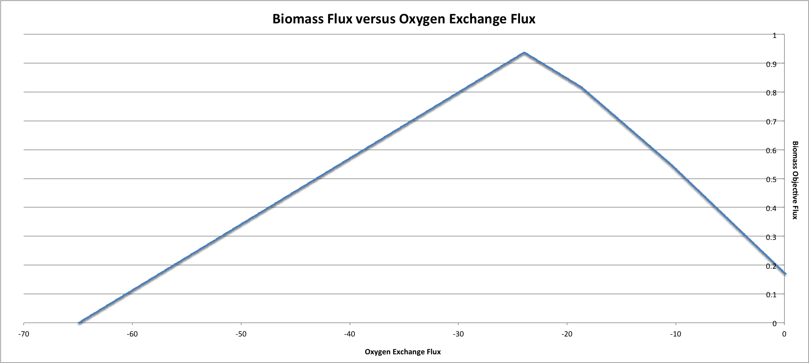

Constraint Based Analysis with PSAMM
====================================

This tutorial will go over how to utilize the curation functions in PSAMM
to correct common errors and ensure that metabolic reconstructions are
accurate representations of the metabolism of an organism.

.. contents::
   :depth: 1
   :local:

Constraint-based Flux Analysis with PSAMM
_________________________________________

Along with the various curation tools that are included with PSAMM there
are also various flux analysis tools that can be used to perform simulations
on the model. This allows for a seamless integration of the model
development, curation, and simulation processes.

There are various options that you can change in these different flux
analysis commands. Before introducing the specific commands these options
will be detailed here.

First, you can choose the options for loop minimization when running
constraint-based analyses. This can be done by using the ``--loop-removal``
option. There are three options for loop removal when performing constraint
based analysis:

`none`
    No removal of loops

`tfba`
    Removes loops by applying thermodynamic constraints

`l1min`
    Removes loops by minimizing the L1 norm (the sum of absolute flux values)

For example, you could run flux balance analysis with thermodynamic
constraints:

.. code-block:: shell

    (psamm-env) $ psamm-model fba --loop-removal=tfba

or without:

.. code-block:: shell

    (psamm-env) $ psamm-model fba --loop-removal=none

You also have the option to set which solver you want to use for the linear
programming problems. To view the solvers that are currently installed the
following command can be used:

.. code-block:: shell

    (psamm-env) $ psamm-list-lpsolvers

By default PSAMM will use CPLEX if it available but if you want to
specify a different solver you can do so using the ``--solver`` option. For
example to select the Gurobi solver during an FBA simulation you can use the
following command:

.. code-block:: shell

    (psamm-env) $ psamm-model fba --solver name=gurobi

If multiple solvers are installed and you do not want to use the
default solver, you will need to set this option for every simulation run.

.. note::
    The QSopt_ex solver does not support integer linear programming
    problems. This solver can be used with any commands but you will not be
    able to run the simulation with thermodynamic constraints.

Another option that can be used with the various flux analysis commands is the
``--epsilon`` option. This option can be used to set the minimum value that a
flux needs to be above to be considered non-zero. By default PSAMM will
consider any number above :math:`10^{-5}` to be non-zero. An example of
changing the epsilon value with this option during an FBA simulation is:

.. code-block:: shell

    (psamm-env) $ psamm-model fba --epsilon 0.0001

These various options can be used for any of the flux analysis functions in
PSAMM by adding them to the command that is being run. A list of the
functions available in PSAMM can be viewed by using the command:

.. code-block:: shell

    (psamm-env) $ psamm-model --help

The options for a specific function can be viewed by using the command:

.. code-block:: shell

    (psamm-env) $ psamm-model <command> --help

FBA in PSAMM
______________

PSAMM allows for the integration of the model development and curation process
with the simulation process. In this way changes to a metabolic model can be
immediately tested using the various flux analysis tools that are present in
PSAMM. In this tutorial, aspects of the `E. coli` core model [1]_ will be
expanded to demonstrate the various functions available in PSAMM and throughout
these changes the model will be analyzed with PSAMM's simulation functions to
make sure that these changes are resulting in a functional model.

Flux Balance Analysis (FBA) is one of the basic methods that allows you
to quickly examine if the model is viable (i.e. can produce biomass). PSAMM
provides the ``fba`` function in the ``psamm-model`` command to perform FBA on
metabolic models. For example, to run FBA on the `E. coli` core model first
make sure that the current directory is the ``E_coli_yaml/`` directory using
the following command:

.. code-block:: shell

    (psamm-env) $ cd <PATH>/psamm-tutorial/E_coli_yaml/

Then run FBA on the model with the following command.

.. code-block:: shell

    (psamm-env) $ psamm-model fba

Note that the command above should be executed within the folder that stores
the ``model.yaml`` file. Alternatively, you could run the following command anywhere
in your file system:

.. code-block:: shell

    (psamm-env) $ psamm-model --model <PATH-TO-MODEL.YAML> fba

The following is a sample of some output from the FBA command:

.. code-block:: shell

    INFO: Model: Ecoli_core_model
    INFO: Model Git version: 9812080
    INFO: Using Biomass_Ecoli_core_w_GAM as objective
    INFO: Loop removal disabled; spurious loops are allowed
    INFO: Setting feasibility tolerance to 1e-09
    INFO: Setting optimality tolerance to 1e-09
    INFO: Solving took 0.05 seconds
    ACONTa	6.00724957535	|Citrate[c]| <=> |cis-Aconitate[c]| + |H2O[c]|	b0118 or b1276
    ACONTb	6.00724957535	|cis-Aconitate[c]| + |H2O[c]| <=> |Isocitrate[c]|	b0118 or b1276
    AKGDH	5.06437566148	|2-Oxoglutarate[c]| + |Coenzyme-A[c]|...
    ...
    INFO: Objective flux: 0.873921506968
    INFO: Reactions at zero flux: 47/95

At the beginning of the output of ``psamm-model`` commands information about
the model as well as information about simulation settings will be printed.
At the end of the output PSAMM will print the maximized flux of the designated
objective function. The rest of the output is a list of the reaction IDs in the
model along with their fluxes,
and the reaction equations represented with the compound names.  This output is
human readable because the reactions equations are represented with the full
names of compound. It can be saved as a tab separated file that can be sorted
and analyzed quickly allowing for easy analysis and comparison between FBA in
different conditions.

By default, PSAMM fba will use the biomass function designated in the central
model file as the objective function. If the biomass tag is not defined in a
``model.yaml`` file or if you want to use a different reaction as the
objective function, you can simply specify it using the ``--objective`` option.
For example to maximize the citrate synthase reactions, `CS`, the command would
be as follows:

.. code-block:: shell

    (psamm-env) $ psamm-model fba --objective=CS

Flux balance analysis will be used throughout this tutorial as both a checking
tool during model curation and an analysis tool. PSAMM allows you to easily
integrate analysis tools like this into the various steps during model
development.

Flux Variability Analysis
~~~~~~~~~~~~~~~~~~~~~~~~~

Another flux analysis tool that can be used in PSAMM is flux variability
analysis. This analysis will maximize the objective function that is
designated and provide a lower and upper bound of the various reactions in
the model that would still allow the model to sustain the same objective
function flux. This can provide insights into alternative pathways in the
model and allow the identification of reactions that can vary in use.

To run FVA on the model use the following command:

.. code-block:: shell

    (psamm-env) $ psamm-model fva
    ...
    EX_pi_e	-3.44906664664	-3.44906664664	|Phosphate[e]| <=>
    EX_pyr_e	-0.0	-0.0	|Pyruvate[e]| <=>
    EX_succ_e	-0.0	-0.0	|Succinate[e]| <=>
    FBA	7.00227721609	7.00227721609	|D-Fructose-1-6-bisphosphate[c]| <=> |Dihydroxyacetone-phosphate[c]| + |Glyceraldehyde-3-phosphate[c]|
    FBP	0.0	0.0	|D-Fructose-1-6-bisphosphate[c]| + |H2O[c]| => |D-Fructose-6-phosphate[c]| + |Phosphate[c]|
    FORt2	0.0	0.0	|Formate[e]| + |H[e]| => |Formate[c]| + |H[c]|
    ...

The output shows the reaction IDs in the first column and then shows the
lower bound of the flux, the upper bound of the flux, and the reaction
equations. With the current conditions the flux is not variable through
the equations in the model. It can be seen that the upper and lower bounds
of each reaction are the same. If another carbon source was added in though
it would allow for more reactions to be variable. For example if glucose was
added into the media along with mannitol then the results might appear as follows:

.. code-block:: shell

    EX_glc_e	-10.0	-2.0	|D-Glucose[e]| <=>
    EX_manni_e	-9.0	-3.0	|Mannitol[e]| <=>
    MANNIPTS	3.0	9.0	|Mannitol[e]| + |Phosphoenolpyruvate[c]| => |Mannitol 1-phosphate[c]| + |Pyruvate[c]|
    GLCpts	2.0	10.0	|D-Glucose[e]| + |Phosphoenolpyruvate[c]| => |Pyruvate[c]| + |D-Glucose-6-phosphate[c]|

It can be seen that in this situation the lower and upper bounds of some
reactions are different indicating that their flux can be variable. This
indicates that there is some variability in the model as to how certain
reactions can be used while still maintaining the same objective function
flux.

Robustness Analysis
~~~~~~~~~~~~~~~~~~~

Robustness analysis can be used to analyze the model under varying
conditions. Robustness analysis will maximize a designated reaction
while varying another designated reaction. For example, you could
vary the amount of oxygen present while trying to maximize the biomass
production to see how the model responds to different oxygen supply. You can
specify the number of steps that will be performed in the robustness as
well as the reaction that will be varied during the steps.

By default, the reaction that is maximized will be the biomass reaction defined
in the ``model.yaml`` file but a different reaction can be designated
with the optional ``--objective`` option. The flux bounds of this reaction will
then be obtained to determine the lower and upper value for the robustness
analysis. These values will then be used as the starting and stopping points
for the robustness analysis. You can also set a customized upper and lower flux
value of the varying reaction using the ``--lower`` and ``--upper`` options.

For this model the robustness command will be used to see how the model
responds to various oxygen conditions with mannitol as the supplied
carbon source. To run the robustness command use the following command:

.. code-block:: shell

    (psamm-env) $ psamm-model robustness --steps 1000 EX_o2_e

If the biomass reaction flux is plotted against the oxygen uptake it can be seen
that the biomass flux is low at the highest oxygen uptake, reaches
a maximum at an oxygen uptake of about 24, and then starts to decrease
with low oxygen uptake.

Random Minimal Network
~~~~~~~~~~~~~~~~~~~~~~

The ``randomsparse`` command can
be used to look at gene essentiality in the metabolic network. To use this function
the model must contain gene associations for the model reactions. This
function works by systematically deleting genes from the network, then
evaluating if the associated reaction would still be available after
the gene deletion, and finally testing the new network to see if the
objective function flux is still above the threshold for viability.
If the flux falls too low then the
gene is marked as essential and kept in the network. If the flux stays
above the threshold then the gene will be marked as non-essential and
removed. The program will randomly do this for all genes until the only
ones left are marked as essential. This can be
done using the ``--type=genes`` option with the ``randomsparse`` command:

.. code-block:: shell

    (psamm-env) $ psamm-model randomsparse --type=genes 90%

This will produce an output of the gene IDs with a 1 if the gene was kept in the
simulation and a 0 if the gene was deleted. Following the list of genes will
be a summary of how many genes were kept out of the total as well as
list of the reaction IDs that made up the minimal network for that
simulation. An example output can be seen as follows:

.. code-block:: shell

    INFO: Essential genes: 58/137
    INFO: Deleted genes: 79/137
    b0008	0
    b0114	1
    b0115	1
    b0116	1
    b0118	0
    b0351	0
    b0356	0
    b0451	0
    b0474	0
    b0485	0
    ...

The random minimal network analysis can also be used to generate a random
subset of reactions from the model that will still allow the model to
maintain an objective function flux above a user-defined threshold. This
function works on the same principle as the gene deletions but instead of
removing individual genes, reactions will be removed.
To run random minimal network analysis on the
model use the randomsparse command with the ``--type=reactions`` option. The
last parameter for the command is a percentage of the maximum objective flux
that will be used as the threshold for the simulation.

.. code-block:: shell

    (psamm-env) $ psamm-model randomsparse --type=reactions 95%
    ...
    FRUKIN	1
    ...
    MANNI1PDEH	0
    MANNI1PPHOS	1
    MANNIDEH	1
    MANNIPTS	1
    ...

The output will be a list of reaction IDs with either a 1 indicating that
the reaction was essential or a zero indicating it was removed.

Due to the random order of deletions during this simulation it may be
helpful to run this command numerous times in order to gain a statistically
significant number of datapoints from which a minimal essential network of
reactions can be established.

In this case the program deleted the `MANN1PDEH` reaction blocking the
mannitol 1-phosphate to fructose 6-phosphate conversion. In this case the
reactions in the other side of the mannitol utilization pathway
should all be essential.

You can also use the ``randomsparse`` command to randomly sample the exchange
reactions and generate putative minimal exchange reaction sets. This can be
done by using the ``--type=exchange`` option with the ``randomsparse`` command:

.. code-block:: shell

    (psamm-env) $ psamm-model randomsparse --type=exchange 90%

It can be seen that when this is run on this small network the mannitol
exchange as well as some other small molecules are identified as being
essential to the network:

.. code-block:: shell

    EX_ac_e	0
    EX_acald_e	0
    EX_akg_e	0
    EX_co2_e	1
    EX_etoh_e	0
    EX_for_e	0
    EX_fru_e	0
    EX_fum_e	0
    EX_glc_e	0
    EX_gln_L_e	0
    EX_glu_L_e	0
    EX_h2o_e	1
    EX_h_e	1
    EX_lac_D_e	0
    EX_mal_L_e	0
    EX_manni_e	1
    EX_nh4_e	1
    EX_o2_e	1
    EX_pi_e	1
    EX_pyr_e	0
    EX_succ_e	0

Using PSAMM to export the model to other Software
___________________________________________________

If you want to export the model in a format to use with other
software, that is also possible using PSAMM. The YAML formatted model can be
easily exported as an SBML file using the following command:

.. code-block:: shell

    (psamm-env) $ psamm-model sbmlexport > Modified_core_ecoli.xml

This will export the model in SBML level 3 version 1 format which can then
be used in other software that support this format.