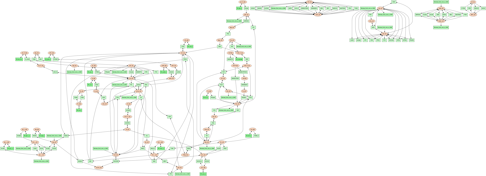
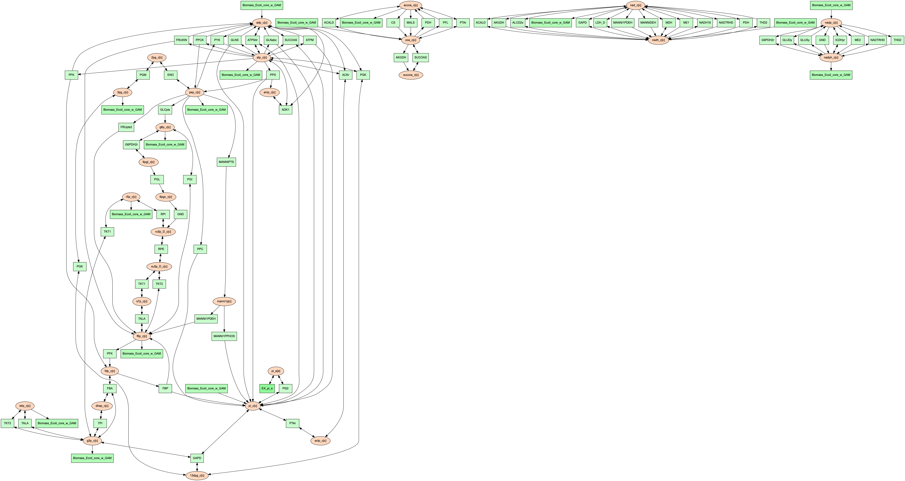
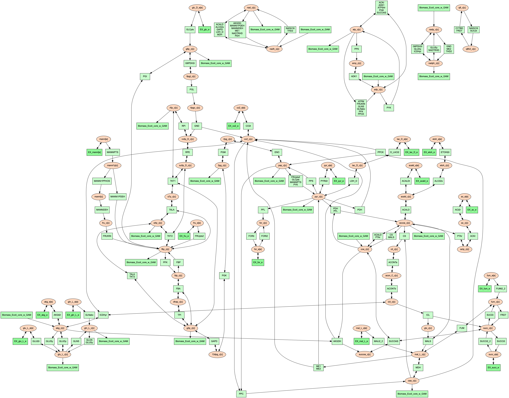
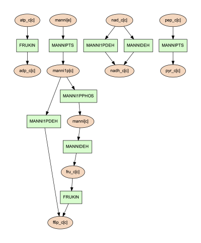
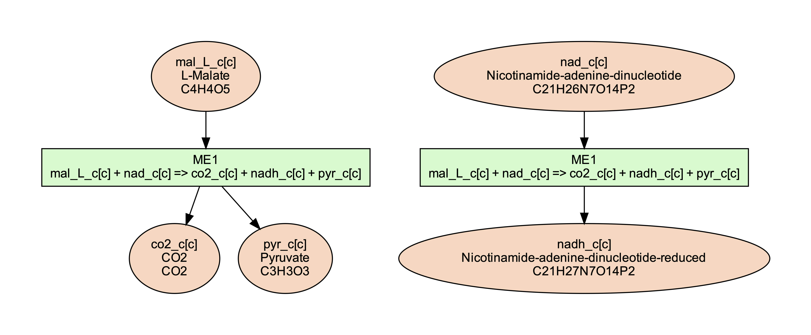
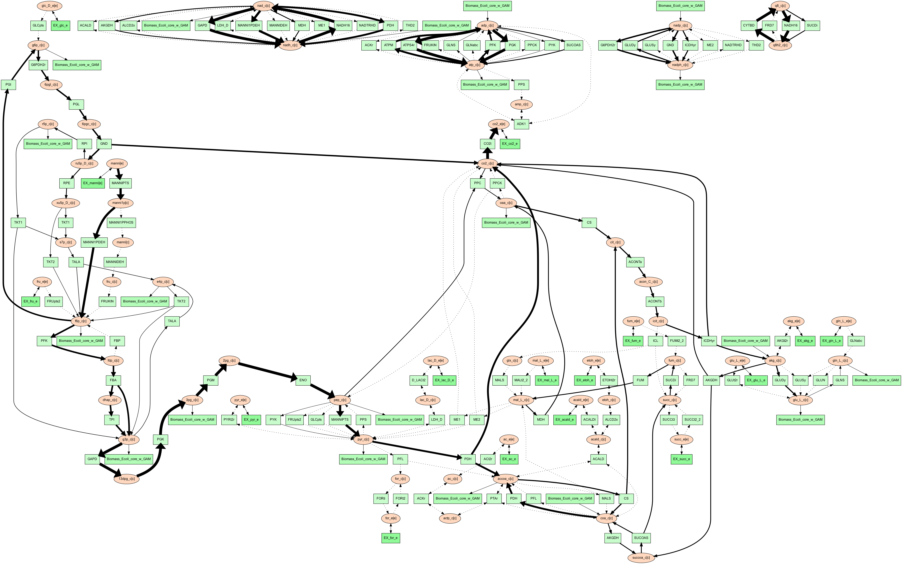
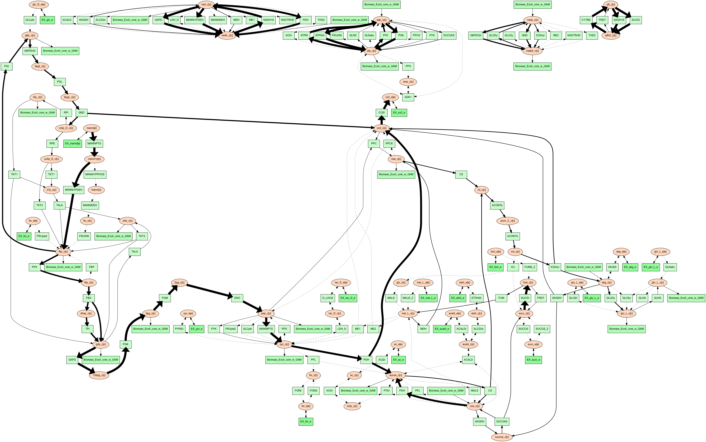

Reactant/Product Pair Prediction and Visualization Using FindPrimaryPairs
=========================================================================

This tutorial will go over how to use the ``primarypairs`` and `PSAMM-Vis` functions
in `PSAMM`. These functions can be used to predict reactant/product pairs in metabolic
models and to use these predictions to generate visualizations of metabolic networks.

.. contents::
   :depth: 1
   :local:

Materials
---------

For information on how to install `PSAMM` and the associated requirements, as well
how to download the materials required for this tutorial, you can reference the
Installation and Materials section of the tutorial.

In addition to the basic installation of `PSAMM`, the visualization function uses
the `Graphviz` program to generate images from the text-based graph format
produced by the ``vis`` command. `Graphviz` version > 0.8.4 must be installed
along with the `Graphviz` python bindings.

.. note::

   Graphviz download: https://www.graphviz.org/download/

   Graphviz python bindings: https://pypi.org/project/graphviz/
   or
   (psamm-env) $ pip install graphviz

For this part of the tutorial, we will be using a modified version of the *E. coli*
core metabolic model that has been used in the other sections of the tutorial.
This model has been modified to add in a new pathway for the utilization of
mannitol as a carbon source. To access this model and the other files needed you
will need to go into the tutorial-part-4 folder located in the psamm-tutorial folder.

.. code-block:: shell

    (psamm-env) $ cd <PATH>/tutorial-part-4/

Once in this folder, you should see a folder called E_coli_yaml which contains
all of the required model files, and a directory called additional_files/ that
contains additional input files that will be used to run the commands in this
tutorial.

To run the following tutorials, go into the E_coli_yaml/ directory:

.. code-block:: shell

   (psamm-env) $ cd E_coli_yaml/

Reactant/Product Pair Prediction using `PSAMM`
----------------------------------------------
Metabolism can be broken down into individual metabolic reactions, which transfer elements
between different metabolites. Take the following reaction as an example:

.. code-block:: shell

   Acetate + ATP <=> Acetyl-Phosphate + ADP

This reaction is catalyzed by the enzyme Acetate Kinase, which can convert acetate
to acetyl-phosphate through the addition of a phosphate group from ATP.
A basic understanding of phosphorylation and the biological role of ATP makes
it possible to manually predict that the primary element transfers for
non hydrogen elements are as follows:

===========================         ==============================
Reactant/Product Pair               Element Transfer
===========================         ==============================
Acetate -> Acetyl-Phosphate         carbon backbone
ATP -> ADP                          carbon backbone and phosphates
ATP -> Acetyl-Phosphate             phosphate group
Acetate -> ADP                      None
===========================         ==============================

While manually inferring this for one or two simple reactions is possible,
genome scale models often contain hundreds or thousands of reactions,
making manual reactant/product pair prediction impractical.
In addition to this, reaction mechanisms are often not known, nor are patterns
of element transfer within reactions available for most metabolic reactions.

To address this problem the `FindPrimaryPairs` algorithm [Steffensen17]_ was
developed and implemented within the `PSAMM` function ``primarypairs``.

The `FindPrimaryPairs` is an iterative algorithm which is used to predict element
transferring reactant/product pairs in genome scale models. `FindPrimaryPairs` relies
on two sources of information, which are generally available in genome scale models:
reaction stoichiometry and metabolite formulas. From this information, `FindPrimaryPairs`
can make a global prediction of element transferring reactant/product pairs without any
additional information about reaction mechanisms.

.. _exclude-fpp:

Basic Use of the ``primarypairs`` Command
~~~~~~~~~~~~~~~~~~~~~~~~~~~~~~~~~~~~~~~~~

The ``primarypairs`` command in PSAMM can be used to perform an element transferring pair
prediction using the `FindPrimaryPairs` algorithm. The basic command can be run as the following:

.. code-block:: shell

   (psamm-env) $ psamm-model primarypairs --exclude @../additional_files/exclude.tsv

This function often requires a file to be provided through the ``--exclude`` option. This file
is a single column list of reaction IDs of any reactions the user wants to remove from the
model when doing the reactant/product pair prediction. the file path should be included in
the command with a '@' preceding it. Typically, this file should contain any
artificial reactions that might be in the model such as Biomass objective reactions, macromolecule
synthesis reactions, etc. While these reactions can be left in the model, the fractional stoichiometries
and presence of artificial metabolites in the reaction can cause the algorithm to take a much longer
time to find a solution. In this example of the *E. coli* core model the only reaction
like this is the biomass reaction ``Biomass_Ecoli_core_w_GAM``, which this is the only reaction listed
in the `exclude.tsv` file.

.. note::

   The `FindPrimaryPairs` algorithm relies on metabolite formulas to make its reactant/product pair
   predictions. If any reaction contains a metabolite that does not have a formula
   then it will be ignored.

The output of the above command will look like the following:

.. code-block:: shell

   INFO: Model: Ecoli_core_model
   INFO: Model version: 3ac8db4
   INFO: Using default element weights for fpp: C=1, H=0, *=0.82
   INFO: Iteration 1: 79 reactions...
   INFO: Iteration 2: 79 reactions...
   INFO: Iteration 3: 8 reactions...
   GLNS    nh4_c[c]        h_c[c]  H
   FBA     fdp_c[c]        g3p_c[c]        C3H5O6P
   ME2     mal_L_c[c]      nadph_c[c]      H
   MANNI1PDEH      manni1p[c]      nadh_c[c]       H
   PTAr    accoa_c[c]      coa_c[c]        C21H32N7O16P3S
   ....

Basic information about the model name and version is provided in the first few lines. In the next
line, the element weights used by the `FindPrimaryPairs` algorithm are listed.
Then, as the algorithm goes through multiple iterations, it will print out the iteration number and
how many reactions it is still figuring out the pairing for. A four
column table is then printed out that contains the following columns
from left to right: Reaction ID, reactant ID, product ID, and elements transferred.

From this output, the Acetate Kinase reaction from the above example can be compared to
the manual prediction of the element transfer. The reaction ID for this reaction is ACKr:

.. code-block:: shell

   ACKr    atp_c[c]        adp_c[c]        C10H12N5O10P2
   ACKr    atp_c[c]        actp_c[c]       O3P
   ACKr    ac_c[c] actp_c[c]       C2H3O2

From this result it can be seen that the prediction contains the same three element transferring pairs
as the above manual prediction; ATP -> ADP, ATP -> Acetyl-Phosphate, Acetate to Acetyl-Phosphate.

This basic usage of the ``primarypairs`` command allows for quick and accurate prediction of element
transferring pairs in any of the reactions in a genome scale model. Additionally, the function also has a few
other options that can be used to refine and adjust how the pair prediction work.

Modifying Element Weights
~~~~~~~~~~~~~~~~~~~~~~~~~
The metabolite pair prediction relies on a parameter called element weight to inform the algorithm
about what chemical elements should be considered more or less important when determining metabolite
similarity. An example of how this might be used can be seen in the default element weights that are
reported when running ``primarypairs``.

.. code-block:: shell

   INFO: Using default element weights for fpp: C=1, H=0, *=0.82

These element weights are the default weights used when running ``primarypairs`` with the `FindPrimaryPairs`
algorithm. In this case, a weight of 1 is given to carbon. Because carbon forms the structural backbone of many
metabolites this element is given the most weight. In contrast, hydrogen is not usually a major structural
element within metabolites. This leads to a weight of 0 being given to hydrogen, meaning that it is not considered
when comparing formulas between two metabolites. By default, all other elements are given an intermediate weight
of 0.82.

These default element weights can be adjusted using the ``--weights`` command line argument. For example, to adjust
the weight of the element nitrogen while keeping the other elements the same as the default settings, you
could use the following command:

.. code-block:: shell

   (psamm-env) $ psamm-model primarypairs --weights "N=0.2,C=1,H=0,*=0.82" --exclude @../additional_files/exclude.tsv

In the case of a small model like the *E. coli* core model, the results of `primarypairs` will likely not change
unless the weights are drastically altered. However, changes could be seen in larger models, especially if the
models include many reactions related to non-carbon metabolism such as sulfur or nitrogen metabolism.

Report Element
~~~~~~~~~~~~~~

By default, the `primarypairs` result is not filtered to show transfers of any specific element. In certain situations
it might be desirable to only get a subset of these results based on if the reactant/product pair transfers a target
element. To do this, the option ``--report-element`` can be used. In many cases, it might be desirable to only report
carbon transferring reactant/product pairs, to do this run the following on the *E. coli* model.

.. code-block:: shell

   (psamm-env) $ psamm-model primarypairs --report-element C --exclude @../additional_files/exclude.tsv

If the predicted pairs are looked at for one of the mannitol pathway reactions, MANNIDEH, the following can be seen:

.. code-block:: shell

   MANNIDEH        manni[c]        fru_c[c]        C6H12O6
   MANNIDEH        nad_c[c]        nadh_c[c]       C21H26N7O14P2

If this result is compared to the results without the ``--report-element C`` option, it can be seen that when
there are additional transfers in this reaction, but they only involve hydrogen.

.. code-block:: shell

   MANNIDEH        manni[c]        nadh_c[c]       H
   MANNIDEH        manni[c]        h_c[c]  H
   MANNIDEH        manni[c]        fru_c[c]        C6H12O6
   MANNIDEH        nad_c[c]        nadh_c[c]       C21H26N7O14P2

Pair Prediction Methods
~~~~~~~~~~~~~~~~~~~~~~~

Two reactant/product pair prediction algorithms are implemented in the `PSAMM` ``primarypairs`` command.
The default algorithm is the `FindPrimaryPairs` algorithm. The other algorithm that is
implemented is the `Mapmaker` algorithm. These algorithms can be chosen through the ``--method`` argument.

.. code-block:: shell

   $ psammm-model primarypairs --method fpp
   or
   $ psamm-model primarypairs --method mapmaker

Visualizing Models using PSAMM-Vis
-----------------------------------

`PSAMM-Vis`, as implemented in the ``vis`` command in `PSAMM`, can be used to convert
text-based YAML models to graph-based representations of the metabolism.
The graph-based representation contains two sets
of nodes: one set representing the metabolites in the model and one set
representing reactions. These nodes are connected through edges that are determined
based on element transfer patterns predicted through using the `FindPrimaryPairs`
algorithm. The ``vis`` command provides multiple options to customize the graph
representation of the metabolism, including changing network perspectives, customizing
node labels, changing node colors, etc.

Basic Network Visualization
~~~~~~~~~~~~~~~~~~~~~~~~~~~

The basic ``vis`` command can be run through the following command:

.. code-block:: shell

   (psamm-env) $ psamm-model vis

By default, ``vis`` relies on the `FindPrimaryPairs` algorithm to predict
elements transferred in metabolic network. In the ``vis`` function, the biomass
reaction defined in `model.yaml` file will be excluded from the `FindPrimaryPairs`
calculation automatically, but will still be shown on the final network image.
For more information of excluded reactions, see :ref:`exclude-fpp`.

In this version of the *E. coli* core model, the biomass reaction is defined in
the `model.yaml` file, so it will be excluded automatically from the pair prediction
calculation when running ``vis``.

By default, the command above will export three files: 'reaction.dot',
'reactions.nodes.tsv' and 'reactions.edges.tsv'. The first file, 'reactions.dot',
contains a text-based representation of the network graph in the 'dot' language.
This graph language is used primarily by the `Graphviz` program to generate
network images. This graph format contains information of nodes and edges
in the graph along with details related to the size, colors, and shapes
that will be used in the final network image. The 'reactions.nodes.tsv' and
'reactions.edges.tsv' files are tab separated tables that contain the same
information as the `dot` based graph, but in a more generic table based
format that can be used with other graph analysis and visualization software
like `Cytoscape`.

File 'reactions.nodes.tsv' contains all the information that define the
graph nodes, including both reaction and compound nodes. It looks like the
following:

.. code-block:: shell

   id	compartment	fillcolor	shape	style	type	label
   13dpg_c[c]	c	#ffd8bf	ellipse	filled	cpd	13dpg_c[c]
   2pg_c[c]	c	#ffd8bf	ellipse	filled	cpd	2pg_c[c]
   3pg_c[c]	c	#ffd8bf	ellipse	filled	cpd	3pg_c[c]
   6pgc_c[c]	c	#ffd8bf	ellipse	filled	cpd	6pgc_c[c]
   ....

The file 'reactions.edges.tsv' contains information related to the structure of
the graph. Each line in this table represents one edge in the graph and contains
the source, destination and direction (forward, back, or both) of the edge. It
looks like the following:

.. code-block:: shell

    source	target	dir	penwidth	style
    2pg_c[c]	PGM_1	both	1	solid
    PGM_1	3pg_c[c]	both	1	solid
    2pg_c[c]	ENO_1	both	1	solid
   ...

Generate Images from Text-based Graphs
~~~~~~~~~~~~~~~~~~~~~~~~~~~~~~~~~~~~~~~~~~~~~

Images can be generated from the 'reactions.dot' file by using the `Graphviz`
program. `Graphviz` support multiple image formats (PDF, PNG, JPEG, etc).
For example, image file can be generated as a `PDF` file by using the
following `Graphviz` program command:

.. code-block:: shell

   (psamm-env) $ dot -O -Tpdf reactions.dot

An image can also be done in one step by running `vis` command by adding an
``--image`` option followed by image format (pdf, svg, eps, etc.) to the command:

.. code-block:: shell

   (psamm-env) $ psamm-model vis --image pdf

The commands above both generate an image file named 'reactions.dot.pdf'. This pdf file is
a graphical representation of what is in the 'reactions.dot'. This graph will look like:

In this default version of the network image, there are two sets of nodes: oval orange
nodes, which represent metabolites and rectangular green nodes, which represent reactions.
These nodes are connected by edges which indicate reaction directionality.

The rest of the tutorial will detail how to modify the default version of network
image to show different aspects of the metabolism and customize the node properties.
For these sections, the mannitol utilization pathway from the previous tutorial
sections will be used as an example.

Represent Different Element Flows
~~~~~~~~~~~~~~~~~~~~~~~~~~~~~~~~~~~~

By default, the ``vis`` command generates a graph that shows the carbon (C) transfer
in the metabolic network. In the ``primarypairs`` tutorial section above, the element
transfers in the `ACKr` reaction were examined to see how the `FindPrimaryPairs` algorithm would
predict element transfer patterns. The ``vis`` command can use these element transfer
predictions to filter edges in the network image, only edges that transfer specific element
will be shown. In the case of the `ACKr` reaction, if element carbon is required to be
shown, then only edges of 'Acetate -> Acetyl-Phosphate' and 'ATP -> ADP' would present
in the final graph. The 'ATP -> Acetyl-Phosphate' edge will disappear, because ATP
doesn't transfer carbon to Acetyl-Phosphate.

===========================         ===========================
Reactant/Product Pair               Element Transfer
===========================         ===========================
Acetate -> Acetyl-Phosphate         carbon backbone
ATP -> ADP                          carbon backbone, phosphates
ATP -> Acetyl-Phosphate             phosphate group
Acetate -> ADP                      None
===========================         ===========================

This type of element filtering can provide different views of the metabolic
network by showing how metabolic pathways transfer different elements through
those reactions. The mannitol utilization pathway is a multiple-step pathway
that converts extracellular mannitol to
fructose 6-phosphate. This pathway also involves multiple phosphorylation
and dephosphorylation steps. The ``--element`` argument can be added to the
the ``vis`` command to filter this pathway and show the transfer patterns
of the phosphorus in the pathway:

.. code-block:: shell

   (psamm-model) $ psamm-model vis --element P --image png

The resulting 'reactions.dot.png' file will contain the phosphorus transfer
network of the *E. coli* core model.

Condense Reaction Nodes and Edges
~~~~~~~~~~~~~~~~~~~~~~~~~~~~~~~~~~~~

By default, the ``vis`` command assigns only one reaction to each reaction node.
Additionally, it allows users to condense multiple reaction nodes into one node
through the ``--combine`` option, in order to reduce the number of nodes and edges,
and make the image clearer. Combine level 0 is the default, which does not
collapse any nodes. Level 1 is used to condense nodes that represent the
same reaction and have a common reactant or product connected. Level 2 is
used to condense nodes that represent different reactions but connected
to the same reactant/product pair with the same direction
(This is often seen on reactant/product pairs like
ATP/ADP and NAD/NADH).

.. code-block:: shell

   (psamm-env) $ psamm-model vis --combine 1 --image png

Then the image will look like the figure below:

.. image::  03-combine1.dot.png

The combine 2 option will update the image to look like the following:
.. code-block:: shell

   (psamm-env) $ psamm-model vis --combine 2 --image png

Rearrange graph components in the image
~~~~~~~~~~~~~~~~~~~~~~~~~~~~~~~~~~~~

In some cases, the network images contain many connected components,
while these components aren't connected with each other. This may cause the
image too wide and difficult to read. To create a better view, ``--array``
option could be used. It can decompress graphs into their connected components,
then arrange these components with specific array setting. ``--array`` is
followed by an integer, for example, ``--array 2`` indicates placing two
connected components per row. For graphs that contains many small connected
components, ``--array 4`` could be a better option because you can get most
of the important larger components in the top few rows of the image, and
all the smaller components will just be spread out below them. Example of
applying this option see below:

.. code-block:: shell

   (psamm-env) $ psamm-model vis --image png --array 2

Then the exported image "reactions.dot.png" will look like the figure below:

.. image:: 16-array2.dot.png

Moreover, if  `vis` command contains ``--array`` but doesn't contain ``--image``,
it will still exported the DOT file. However, in this case, when converting DOT
file to a network image, to make ``--array`` effective, another `Graphviz`
program command (see below) is required instead  of ``dot`` command we
showed before:

.. code-block:: shell

   (psamm-env) $ neato -O -Tpdf -n reactions.dot

Show Cellular Compartments
~~~~~~~~~~~~~~~~~~~~~~~~~~~~~

GEMs often contain some representations of cellular compartments. At the most
basic level, this includes an intracellular and extracellular compartment,
but in complex models, additional compartments such as the periplasm in bacteria
or mitochondria in eukaryotes are often included.
`PSAMM-Vis` can show these compartments in the final image through
the use of the ``--compartment`` argument. If the compartment information is not
defined in the model.yaml file, then, the command will attempt to
automatically detect the organization of the compartments by examining the reaction
equations in the model. However, this process cannot always accurately predict the compartment
organization. To overcome this problem, it is suggested to define the compartment
organization in the model.yaml file like in the following example:

.. code-block:: shell

   name: Ecoli_core_model
   biomass: Biomass_Ecoli_core_w_GAM
   default_flux_limit: 1000
   extracellular: e
   compartments:
   - id: c
     adjacent_to: e
     name: Cytoplasm
   - id: e
     adjacent_to: e
     name: Extracellular
   ....

Once this information is added to the model.yaml file the following command can
be used to generate an image that shows the compartment information of the model:

.. code-block:: shell

   (psamm-env) $ psamm-model vis --compartment --image png

The resulting file 'reactions.dot.png' will look like the following:

.. image:: 05-cpt.dot.png

In this image there are two compartments that are labeled with
'Compartment: e' and 'Compartment: c'. The *E. coli* core model is relatively
small, meaning that compartment organization is simple, but ``vis`` command
can handle more complex models as well. For example, the following image was
made using a small example model to show a more complex compartments organization. To
do this running the following command:

.. code-block:: shell

   (psamm-env) $ psamm-model --model ../additional_files/toy_model_cpt/toy_model.yaml vis --image png --compartment

The resulting network image "reactions.dot.png" looks like:

.. image:: 06-cptToy.dot.png

Visualize Reactions and Pathways of Interest
~~~~~~~~~~~~~~~~~~~~~~~~~~~~~~~~~~~~~~~~~~~~~~

In some situations, it might be better to visualize a subset of a larger
model so that smaller subsystems can be examined in more detail. This can
be done through the ``--subset`` option. This option takes an input of a single
column file, where each line contains either a reaction ID or a metabolite ID.
The whole file can contain only reaction IDs or metabolite IDs and cannot be
a mix of both.

To show the usage of this option, a subset of reactions involved in mannitol
utilization pathway was visualized through the following command:

.. code-block:: shell

   (psamm-env) $ psamm-model vis --subset ../additional_files/subset_mannitol_pathway.tsv --image png

The input file subset_mannitol_pathway looks like the following:

.. code-block:: shell

   MANNIPTS
   MANNI1PDEH
   MADNNIDEH
   MANNII1PPHOS
   FRUKIN

This resulting image "reactions.dot.png" looks like the following:

This image only contains reactions listed in the subset file and any associated
exchange reactions.

The other usage for using the subset argument is to provide a list of metabolite
IDs (with compartment). This option will generate an image containing all of the
reactions that contain any of given metabolites in their equation. For example,
the following subset file could be used to generate a network image of all
reactions that contain pyruvate.

.. code-block:: shell

   pyr_c[c]
   pyr_e[e]

To use this subset to generate the pyruvate related subnetwork use the following
command:

.. code-block:: shell

   (psamm-env) $ psamm-model vis --subset ../additional_files/subset_pyruvate_list.tsv --image png

This will generate an image like the following that only shows the reactions that
contain pyruvate:

.. image:: 08-subsetCpd.dot.png

Highlight Reactions and Metabolites in the Network
~~~~~~~~~~~~~~~~~~~~~~~~~~~~~~~~~~~~~~~~~~~~~~~~~~~~~

The ``--subset`` option can be used to show only a specific part of the network.
When this is done, the context of those reactions is often lost and it can be hard
to tell where that pathway fits within the larger metabolism. A different way to
highlight a set of reactions without using the ``--subset`` option is to change
the color of a set of nodes through the ``--color`` option.

This option can be used to change the color of the reaction or metabolite nodes
on the final network image, making it easy to highlight certain pathways while still
maintaining the larger metabolic context. This ``--color`` option will take a
two-column file that contains reaction or metabolite IDs in the first column and
hex color codes in the second column. A color file that can be used to color
all of the mannitol utilization pathway reactions purple would look like the following:

.. code-block:: shell

   MANNIPTS #d6c4f2
   MANNI1PDEH #d6c4f2
   MANNIDEH #d6c4f2
   MANNI1PPHOS #d6c4f2
   FRUKIN #d6c4f2

To use this file to generate an image of the larger network with the mannitol
utilization pathway highlighted, use the following command:

.. code-block:: shell

   (psamm-env) $ psamm-model vis --color ../additional_files/color_mannitol_pathway.tsv --image png

The resulting image file should look like the following:

.. image::  09-color.dot.png

Coloring of specific nodes like this can make it easy to locate or highlight
specific pathways, especially in larger models.

.. note::

    Reaction nodes that represent multiple reactions won't be recolored even if
    it contains one or more reactions that are in input table for recolor.

Modify Node Labels in Network Images
~~~~~~~~~~~~~~~~~~~~~~~~~~~~~~~~~~~~

By default, only the reaction IDs or metabolite IDs are shown on the nodes in
final network images. These labels can be modified to include any additional
information defined in the compounds or reactions YAML file through the use
of the ``--cpd-detail`` and ``--rxn-detail`` options. These options are
followed by a space separated list of metabolite or reaction property names,
such as id, name, equation, and formula. The required properties will present
on the node labels in network image. For example, for reaction ME1 (NAD-dependent
malic enzyme), to show metabolite ID, name and formula, as well as reaction ID,
and equation, running the following command:

.. code-block:: shell

   (psamm-env) $ psamm-model vis --subset ../additional_files/detail_ME1.tsv --cpd-detail id name formula --rxn-detail id equation --image png

The image generated looks like this:

.. note::

    For these two options, if a required detail is not included in the model, that
    property will be skipped and not shown on those nodes.

Visualize FBA or FVA
~~~~~~~~~~~~~~~~~~~~~~

Performing various simulations of growth is made possible through methods such
as FBA and FVA. Using the ``--fba`` or ``--fva`` option, the flow of metabolites
calculated by these methods can be visualized. When visualizing FBA, a tsv file
containing the reaction name and flux value is required. For example, the following
command can be used:

.. code-block:: shell

   (psamm-env) $ psamm-model vis --fba ../additional_files/fba.tsv --image png

The image generated looks like this:

If the FVA option is given, the file should contain the reaction name, and a lower
and upper bound flux value that would still allow the model to sustain the same
objective function flux. To visualize the FVA results, you can use the command:

.. code-block:: shell

   (psamm-env) $ psamm-model vis --fva ../additional_files/fva.tsv --image png

The image generated looks like this:

Reactions with a flux of zero is represented as a dotted edge and non-zero fluxes as
solid. Meanwhile, the thickness of the edges is proportional to the flux through
the reaction. Visualizing these fluxes may help highlight reactions that contribute
the most to the objective.

.. note::

    The ``--fba`` and ``--fva`` options cannot be used together.

.. note::

    Fluxes less than the absolute value of 1e-5 will be considered as 0.

Other Visualization Options
~~~~~~~~~~~~~~~~~~~~~~~~~~~

Remove Specific Reactant Product Pairs
________________________________________

Large scale models may have some reactant/product pairs that occur many times
in different reactions. These often involve currency metabolites like ATP, ADP,
NAD and NADH. Due to the large number of times these pairs occur across the
network, they may cause some parts of the graph to look messy.
While making the condensed reaction nodes can help with this problem, there may be
cases where it would be better to hide these edges in the final result. To do this
the ``--hide-edges`` option can be used. This option takes a two-column file where
each row contains two metabolite IDs separated by tab, edges between them will be
hidden in final network image.

For example, to hide the edges between ATP and ADP in the *E. coli* core model, the
input file would look like the following:

.. code-block:: shell

   atp_c[c] adp_c[c]

Then the following command could be run to generate a network image that hides the
edges between ATP and ADP:

.. code-block:: shell

   (psamm-env) $ psamm-model vis --hide-edges ../additional_files/hide_edges_list.tsv --image png

When comparing this image to previous visualizations we can see that many
edges between ATP and ADP have been removed from the graph. While this might
not make a huge difference on a small model like this, on larger models this can help during
the process of generating cleaner final images.

.. image:: 13-hideEdges.dot.png

Adjusting Image Size
____________________

The size of the final network image generated through the ``vis`` command can
be adjusted through the ``--image-size`` option. This option takes the width
and height (in inches) separated by a space. The following command is an example
that generates an image of 8.5 inches x 11 inches:

.. code-block:: shell

   (psamm-env) $ psamm-model vis --image-size 8.5 11 --image png

The resulting image looks like:

.. image::14-imagesize.dot.png

Specifying A File Name
______________________

The ``vis`` command allows users to specify the name of resulting file through
the ``--output`` option. This option should be followed by a string and that string
is the name of output files (without the file extension). For example, the
following command will export 4 files: "Ecolicore.dot", "Ecolicore.dot.png",
"Ecolicore.nodes.tsv" and "Ecolicore.edges.tsv":

.. code-block:: shell

   (psamm-env) $ psamm-model vis --image png --output Ecolicore

Changing Pair Prediction Methods
________________________________

By default, the `vis` function in `PSAMM` applies `FindPrimaryPairs` algorithm to predict
reactant/product pairs. But it can also work without pair prediction (``no-fpp``).
When``no-fpp`` is used, each reactant will be paired with all products in a
reaction, without considering element transferred between reactant and product.
There will tend to be many more connections in the network image if users use this
option, especially for metabolites like ATP, H2O, and H+. To do this, running the
following command:

.. code-block:: shell

   (psamm-env) $ psamm-model vis --method no-fpp --image png

.. image:: 15-nofpp.dot.png

.. note::

   The ``--method no-fpp`` and ``--combine`` options cannot be used together.
   The ``--combine`` option only works for `FindPrimaryPairs` method.
