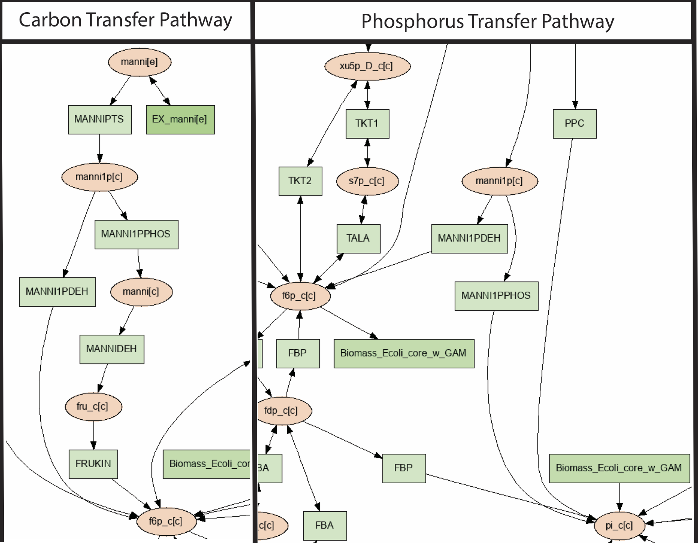
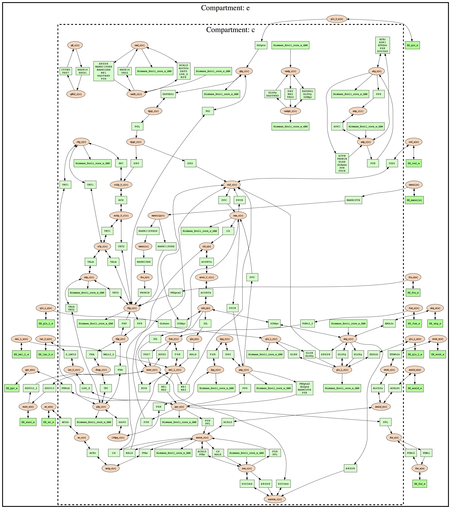
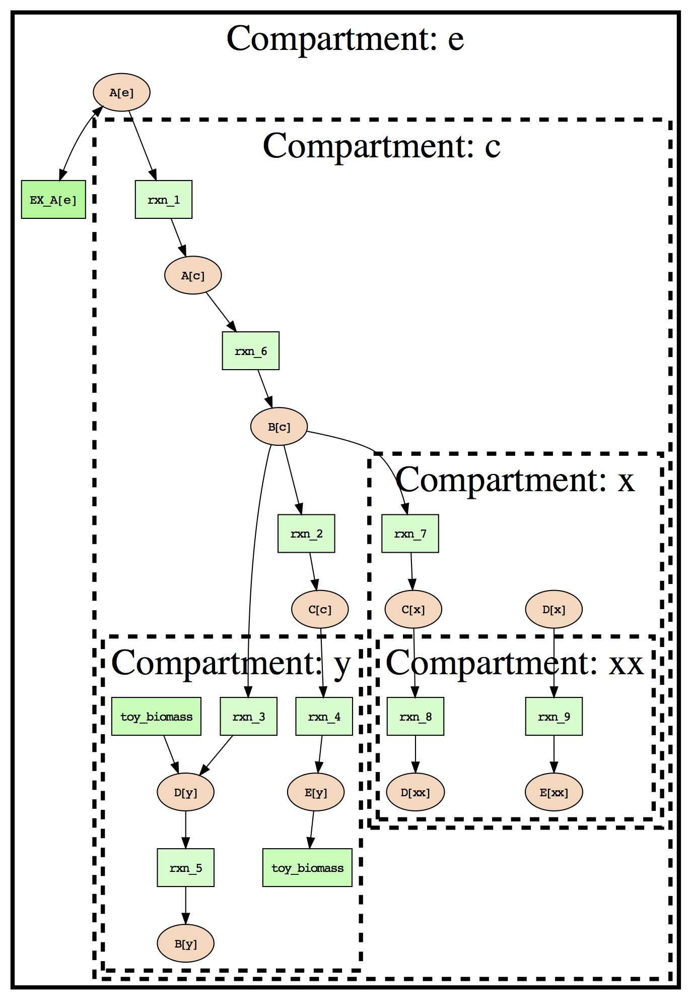
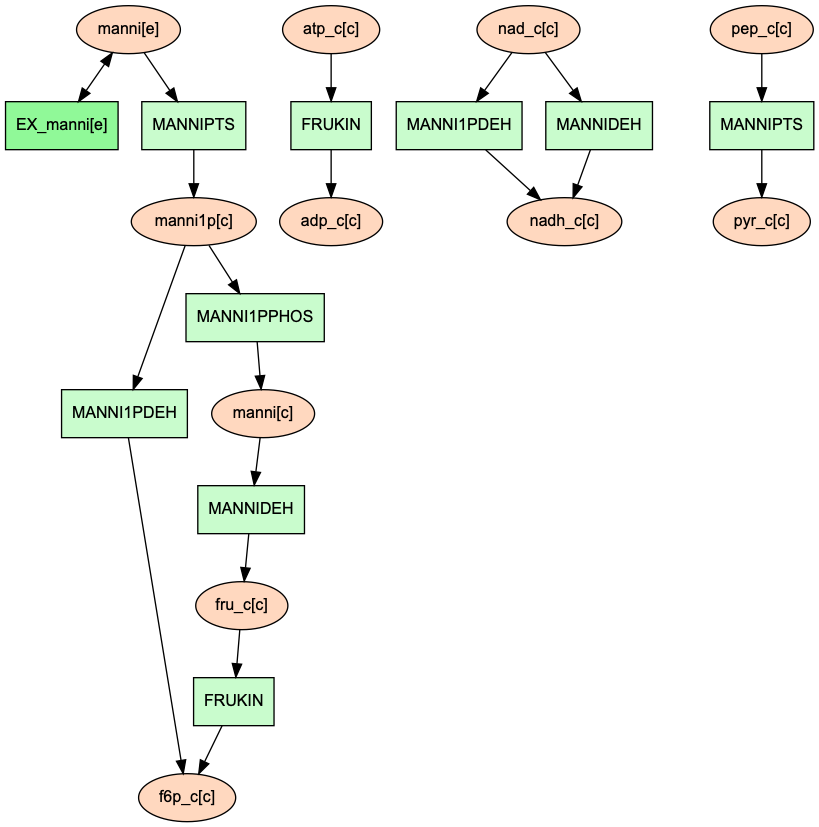
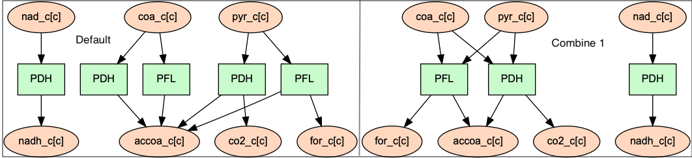
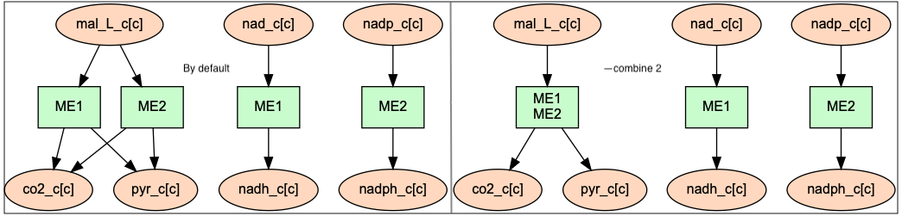
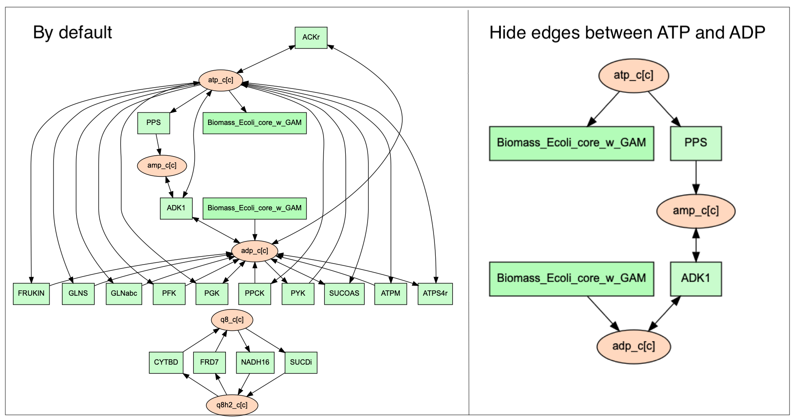

Reactant/Product Pair Prediction Using FindPrimaryPairs
=======================================================

This tutorial will go over how to use the ``primarypairs`` and `PSAMM-Vis` functions
in `PSAMM`. These functions can be used to predict reactant/product pairs in metabolic
models and to use these predictions to generate visualizations of metabolic networks.

.. contents::
   :depth: 1
   :local:

Materials
---------

For information on how to install `PSAMM` and the associated requirements, as well
how to download the materials required for this tutorial you can reference the
Installation and Materials section of the tutorial.

In addition to the basic installation of `PSAMM`, the visualization function uses
the `Graphviz` program to generate images from the text based graph format that will
be generated by the ``vis`` command. `Graphviz` version > 0.8.4 must be installed,
in addition the `Graphviz` python bindings must be installed in the working python
environment.

.. note::

   Graphviz download: https://www.graphviz.org/download/

   Graphviz python bindings: https://pypi.org/project/graphviz/
   or
   (psamm-env) $ pip install graphviz

For this part of the tutorial we will be using a modified version of the E. coli
core metabolic models that has been used in the other sections of the tutorial.
This model has been modified to add in a new pathways for the utilization of
mannitol as a carbon source. To access this model and the other files needed you
will need to go into the tutorial-part-4 folder located in the psamm-tutorial folder.

.. code-block:: shell

    (psamm-env) $ cd <PATH>/tutorial-part-4/

Once in this folder you should see a folder called E_coli_yaml. Inside of this folder
are all files that will be needed to run the commands in this tutorial. Inside of
this folder there will be a directory called E_coli_yaml/ that contains the E. coli
core model, and a directory called additional_files/ that contains some additional
input files that will be used in the visualization portion of the tutorial.

To run the following tutorials go into the E_coli_yaml/ directory:

.. code-block:: shell

   (psamm-env) $ cd E_coli_yaml/

Reactant/Product Pair Prediction using `PSAMM`
----------------------------------------------
Metabolism can be broken down into individual metabolic reactions which transfer elements
between different metabolites. When looking at individual metabolic reactions it may be
possible to derive the element transfer patterns just based on previous knowledge of
the enzyme and biochemistry. Take the following reaction as an example:

.. code-block:: shell

   Acetate + ATP <=> Acetyl-Phosphate + ADP

This reaction is catalyzed by the enzyme Acetate Kinase. In this reaction acetate is
converted to acetyl-phosphate through the addition of a phosphate group from ATP.
A basic understanding of phosphorylation and the biological role of ATP makes
it possible to manually predict that the primary element transfers for
non hydrogen elements are as follows:

===========================         ==============================
Reactant/Product Pair               Element Transfer
===========================         ==============================
Acetate -> Acetyl-Phosphate         carbon backbone
ATP -> ADP                          carbon backbone and phosphates
ATP -> Acetyl-Phosphate             phosphate group
Acetate -> ADP                      None
===========================         ==============================

While doing this for one or two simple reactions is possible, genome scale models often
contain hundreds to thousands of reactions, making manual reactant/product pair prediction
impractical. In addition to this, reaction mechanisms are often not known, and patterns
of element transfer within reactions are not available for most metabolic reactions.

To address this problem the `FindPrimaryPairs` algorithm [Steffensen17]_ was
developed and implemented within the `PSAMM` function ``primarypairs``.

The `FindPrimaryPairs` is an iterative algorithm which can be used to predict element
transferring reactant/product pairs in genome scale models. `FindPrimaryPairs` relies
on two sources of information which are generally available in genome scale models,
reaction stoichiometry and metabolite formulas. From this information, `FindPrimaryPairs`
can make a global prediction of element transferring reactant/product pairs without any
additional information about reaction mechanisms.

.. _exclude-fpp:

Basic Use of the ``primarypairs`` Command
~~~~~~~~~~~~~~~~~~~~~~~~~~~~~~~~~~~~~~~~~

The ``primarypairs`` command in PSAMM can be used to perform an element transferring pair
prediction using the `FindPrimaryPairs` algorithm. The basic command can be run like so:

.. code-block:: shell

   (psamm-env) $ psamm-model primarypairs --exclude @../additional_files/exclude.tsv

This function often requires a file to be provided through the ``--exclude`` option. This file
is a single column list of reaction IDs, of any reactions that the user wants to remove from the
model when doing the reactant/product pair prediction. Typically this file should contain any
artificial reactions that might be in the model such as Biomass objective reactions, macromolecule
synthesis reactions, etc. While these reactions can be left in the model, the fractional stoichiometries
and presence of artificial metabolites in the reaction can cause the algorithm to take a much longer
time to find a solution. In the case of this example with the E. coli core model the only reaction
like this is the biomass reaction ``Biomass_Ecoli_core_w_GAM``. And this is the only reaction listed
in the `exclude.tsv` file.

.. note::

   The `FindPrimaryPairs` algorithm relies on metabolite formulas to make its reactant/product pair
   predictions. If any reactions contain metabolites that do not have any they will automatically be
   excluded from the primary pair prediction.

When the above command is run the output will look like the following:

.. code-block:: shell

   INFO: Model: Ecoli_core_model
   INFO: Model version: 3ac8db4
   INFO: Using default element weights for fpp: C=1, H=0, *=0.82
   INFO: Iteration 1: 79 reactions...
   INFO: Iteration 2: 79 reactions...
   INFO: Iteration 3: 8 reactions...
   GLNS    nh4_c[c]        h_c[c]  H
   FBA     fdp_c[c]        g3p_c[c]        C3H5O6P
   ME2     mal_L_c[c]      nadph_c[c]      H
   MANNI1PDEH      manni1p[c]      nadh_c[c]       H
   PTAr    accoa_c[c]      coa_c[c]        C21H32N7O16P3S
   ....

In the first few lines basic information about the model name and version are provided. In the next
line the element weights used in the `FindPrimaryPairs` algorithm are listed.
Then, as the algorithm goes through multiple iterations it will print out the iteration number and
how many reactions it is still trying to make a pair prediction for. After this information a four
column table is then printed out that contains the following columns from left to right, Reaction ID,
reactant ID, product ID, and elements transferred.

From this output, the Acetate Kinase reaction from the above example can be compared to
the manual prediction of the element transfer. The reaction ID for this reaction is ACKr:

.. code-block:: shell

   ACKr    atp_c[c]        adp_c[c]        C10H12N5O10P2
   ACKr    atp_c[c]        actp_c[c]       O3P
   ACKr    ac_c[c] actp_c[c]       C2H3O2

From this result it can be seen that the prediction contains the same three element transferring pairs
as the above manual prediction; ATP -> ADP, ATP -> Acetyl-Phosphate, Acetate to Acetyl-Phosphate.

This basic usage of the ``primarypairs`` command allows for quick and accurate prediction of element
transferring pairs in any of the reactions in a genome scale model, but the function also has a few
additional options that can be used to refine and adjust how the pair prediction work and what it will
produce as a result.

Modifying Element Weights
~~~~~~~~~~~~~~~~~~~~~~~~~
The metabolite pair prediction relies on a parameter called element weight to inform the algorithm
about what chemical elements should be considered more or less important when determine metabolite
similarity. An example of how this might be used can be seen in the default element weights that are
reported when running ``primarypairs``.

.. code-block:: shell

   INFO: Using default element weights for fpp: C=1, H=0, *=0.82

These element weights are the default weights used when running ``primarypairs`` with the `FindPrimaryPairs`
algorithm. In this case a weight of 1 is given to carbon. Because carbon forms the structural backbone of many
metabolites this element is given the most weight. In contrast, hydrogen is not usually a major structural
element within metabolites. This leads to a weight of 0 being given to hydrogen, meaning that it is not considered
when comparing formulas between two metabolites. By default all other elements are given an intermediate weight
of 0.82.

These default element weights can be adjusted using the `--weights` command line argument. For example, to adjust
the weight of the element nitrogen while keeping the other elements the same as the default settings the following
command could be used:

.. code-block:: shell

   (psamm-env) $ psamm-model primarypairs --weights N=0.2,C=1,H=0,*=0.82 --exclude @../additional_files/exclude.tsv

In the case of a small model like the E. coli core model the results of `primarypairs` will likely not change
unless the weights are drastically altered. Changes could be seen in larger models though especially if the
models include many reactions related to non-carbon metabolism such as sulfur or nitrogen metabolism.

Report Element
~~~~~~~~~~~~~~

By default the `primarypairs` result is not filtered to show transfers of any specific element. In certain situations
it might be desirable to only get a subset of these results based on if the reactant/product pair transfers a target
element. To do this the option `--report-element` can be used. In many cases it might be desirable to only report
carbon transferring reactant/product pairs, to do this run the following on the E. coli model.

.. code-block:: shell

   (psamm-env) $ psamm-model primarypairs --report-element C --exclude @../additional_files/exclude.tsv

If the predicted pairs are looked at for one of the mannitol pathway reactions, MANNIDEH, the following can be seen:

.. code-block:: shell

   MANNIDEH        manni[c]        fru_c[c]        C6H12O6
   MANNIDEH        nad_c[c]        nadh_c[c]       C21H26N7O14P2

If this result is compared to the results without the `--report-element C` option it can be seen that when
there are additional transfers in this reaction but they only involve hydrogen.

.. code-block:: shell

   MANNIDEH        manni[c]        nadh_c[c]       H
   MANNIDEH        manni[c]        h_c[c]  H
   MANNIDEH        manni[c]        fru_c[c]        C6H12O6
   MANNIDEH        nad_c[c]        nadh_c[c]       C21H26N7O14P2

Pair Prediction Methods
~~~~~~~~~~~~~~~~~~~~~~~

Two reactant/product pair prediction algorithms are implemented in the `PSAMM` ``primarypairs`` command.
The default algorithm is the `FindPrimaryPairs` algorithm. The other algorithm that is
implemented is the `Mapmaker` algorithm. These algorithm can be chosen through the ``--method`` argument.

.. code-block:: shell

   $ psammm-model primarypairs --method fpp
   or
   $ psamm-model primarypairs --method mapmaker

Visualize Models using PSAMM-Vis
----------------------------------

`PSAMM-Vis`, as implemented in the ``vis`` command in `PSAMM`, can be used to convert
text based YAML models to graph based representations of the metabolism.
The graph based representation contains two sets
of nodes, with one set representing the metabolites in the model, and the other set
representing reactions. These nodes are connected through edges that are determined
based on element transfer patters predicted through using the `FindPrimaryPairs`
algorithm. The ``vis`` command provides multiple options to customize the graph
representation of the metabolism, including customizing node labels, changing
node colors, etc.

Basic Network Visualization
~~~~~~~~~~~~~~~~~~~~~~~~~~~

The basic ``vis`` command can be run through the following command:

.. code-block:: shell

   (psamm-env) $ psamm-model vis

By default, ``vis`` relies on the `FindPrimaryPairs` algorithm to predict
element transfer in metabolic network. This algorithm requires certain
reactions such as biomass reactions and some artificial reactions to be
excluded from the algorithm's calculations in order to work efficiently. This
can be done through the ``--exclude`` option. By default the biomass reaction
defined in `model.yaml` file will be excluded from the `FPP` calculation,
but will still be shown on the final network image. For more information of
excluded reactions, see :ref:`exclude-fpp`.

In this version of the E. coli core model, the biomass reaction is defined in
the `model.yaml` file, so that it will be excluded automatically from FPP
calculation when running ``vis`` command on this model.

By default, running the command above will export three files: 'reaction.dot',
'reactions.edges.tsv', 'reactions.nodes.tsv'. Users can specify the file name
through ``--output`` argument

The first file, 'reactions.dot', contains a text based representation of the
network graph in the 'dot' language. This graph language is used primarily by
the `Graphviz` program to generate network images. This graph format contains
information on the nodes and edges in the graph along with details related to
the size, colors, and shapes that will be used in the final network image.

The 'reactions.nodes.tsv', and 'reactions.edges.tsv' files are tab separated
tables that contain the same information as the `dot` based graph does, but
in a more generic table based format that can be used with other graph
analysis and visualization software like `Cytoscape`.

The 'reactions.edges.tsv' file contains the information related to the
structure of the graph. Each line in this table represents one edge in
the graph and contains the source of that edge, destination of that edge,
and the direction of the edge (forward, back, or both). This file will
look like the following:

.. code-block:: shell

   source	target	dir
   CS_3	cit_c[c]	forward
   f6p_c[c]	Biomass_Ecoli_core_w_GAM_5	forward
   ALCD2x_1	acald_c[c]	both
   ...

The 'reactions.nodes.tsv' file will contain all of the information related
to what appears on the nodes in the graph. In this representation of the
graph there both reaction nodes and compound nodes. This file will look
like the following:

.. code-block:: shell

   id	compartment	fillcolor	shape	style	type	label
   13dpg_c[c]	c	#ffd8bf	ellipse	filled	cpd	13dpg_c[c]
   2pg_c[c]	c	#ffd8bf	ellipse	filled	cpd	2pg_c[c]
   3pg_c[c]	c	#ffd8bf	ellipse	filled	cpd	3pg_c[c]
   6pgc_c[c]	c	#ffd8bf	ellipse	filled	cpd	6pgc_c[c]
   ....

Generate Images from Text-based Graphs
~~~~~~~~~~~~~~~~~~~~~~~~~~~~~~~~~~~~~~~~~~~~~

Images can be generated from the 'reactions.dot' file by using the `Graphviz`
program. For the best representations of the metabolic network using the `dot`
layout is recommended. The image file can be generated as a `PDF` file by using
the following `Graphviz` program command:

.. code-block:: shell

   (psamm-env) $ dot -O -Tpdf reactions.dot

This can also be done at the same time as the `vis` command step by adding the
``--image`` option with an image format (pdf, svg, eps, etc.) to the command:

.. code-block:: shell

   (psamm-env) $ psamm-model vis --image pdf

These commands will generate an image file called 'reactions.dot.pdf'. This
image file is the representation of what was in the 'reactions.dot' file. This
graph will look like:

.. image:: 01-entireEcolicore.dot.png

In this default version of the graph there are two sets of nodes: ovular orange
nodes representing metabolites and rectangular green nodes representing reactions.
These nodes are connected by edges that will show the direction of the reaction
in the original metabolic model. This graph also contains some reaction nodes that
have multiple reaction IDs. These represent reactions that contain common
reactant/product pairs such as ATP/ADP and have the same reaction direction.

The rest of the tutorial will deal with how to alter this graph representation from
this default format to show different aspects of the metabolism and customize the look
and content of the graph. For these sections, the mannitol utilization pathway that has
been added and used in the previous tutorial sections will be used as an example.

Represent Different Element Flows
~~~~~~~~~~~~~~~~~~~~~~~~~~~~~~~~~~~~

By default the ``vis`` command will produce a graph that shows the carbon transfers
in the metabolic network. In the ``primarypairs`` tutorial section above the element
transfers in the `ACKr` reaction were examined to see how the `FPP` algorithm would
predict element transfer patterns. The ``vis`` command will use the information in
these element transfer predictions to filter the graph that is made to only show
certain edges. In the case of the `ACKr` reaction, if the element being shown is
carbon then only the 'Acetate -> Acetyl-Phosphate' and 'ATP -> ADP' edges would
be shown in the final graph. The 'ATP -> Acetyl-Phosphate' edge will not be shown
in the draft becuase that element transfer only contains phosphate and oxygen.

===========================         ===========================
Reactant/Product Pair               Element Transfer
===========================         ===========================
Acetate -> Acetyl-Phosphate         carbon backbone
ATP -> ADP                          carbon backbone, phosphates
ATP -> Acetyl-Phosphate             phosphate group
Acetate -> ADP                      None
===========================         ===========================

This type of element filtering can provide different views of the metabolic
network by showing how metabolic pathways transfer different elements through
the reactions. The mannitol utilization pathway that was added to the model
contains a multiple step pathway that converts extracellular mannitol to
fructose 6-phosphate. This pathway also involves multiple phosphorylation
and dephosphorylation steps. The ``--element`` argument can be added to the
the ``vis`` command to filter this pathway to show the transfer patterns
of the phosphorous in the pathway:

.. code-block:: shell

   (psamm-model) $ psamm-model vis --element P --image pdf

The resulting 'reactions.dot.pdf' file will contain the phosphorous transfer
network of the E. coli core model.

If the mannitol utilization pathway is examined more closely it will be seen
that the transfers are different from the original and involve transfers
between metabolites like phosphate (pi[c]) that are typically filtered out of
the carbon only graph.

Show Cellular Compartments
~~~~~~~~~~~~~~~~~~~~~~~~~~~~~

GEMs often contain some representations of cellular compartments. At the most
basic level this might just include an intracellular and extracellular compartment,
but in more complex models additional compartments such as the periplasm in bacteria
or the mitochondria in eukaryotes can be included to represent more complex metabolic
processes. `PSAMM-Vis` can show these compartments in the final image through
the use of the ``--compartment`` argument. If the compartment information is not
defined in the model.yaml file then the the command will attempt to
automatically detect the organization of the compartments by examining the reaction
equations in the model. This process cannot always accurately predict the compartment
organization though. To overcome this problem it is better to define the compartment
organization in the model.yaml file. This can be done by adding a new ``compartments``
sections into the model.yaml file like so:

.. code-block:: shell

   name: Ecoli_core_model
   biomass: Biomass_Ecoli_core_w_GAM
   default_flux_limit: 1000
   extracellular: e
   compartments:
   - id: c
     adjacent_to: e
     name: Cytoplasm
   - id: e
     adjacent_to: e
     name: Extracellular
   ....

The first thing to define is the extracellular compartment through the line
'extracellular: {id}'. This will tell `PSAMM` what the outermost compartment
is in the model. The next thing to define is the compartments section. In this
section each compartment can be defined with an id, a name, and a list of compartments
that are adjacent to that compartment.

Once this information is added to the model.yaml file the following command can
be used to generate an image that shows the compartment information of the model:

.. code-block:: shell

   (psamm-env) $ psamm-model vis --compartment --image pdf

This command will produce an different dot file called 'reactions_compartment.dot'
and a new image file 'reactions_compartment.dot.pdf'. The 'reactions_compartment.dot.pdf'
image will look like this:

In this image there will be two compartments that are labeled with
'Compartment: e' and 'Compartment: c'. The E. coli core model is
relatively small, meaning that the compartment
organization is simple, but the ``vis`` command can handle more complex
models as well. For example the following image was made using a toy model
to show a more complex compartments organization.

Visualize Reactions and Pathways of Interest
~~~~~~~~~~~~~~~~~~~~~~~~~~~~~~~~~~~~~~~~~~~~~~

In some situations it might be better to only visualize a subset of a larger
model so that smaller subsystems can be examined in more detail. This can
be done through the ``--subset`` argument. this argument will take an input
of a single column file where each line contains either a reaction ID or
a metabolite ID. The whole file can only contain reaction IDs or metabolite
IDs and cannot be a mix of both in the same subset file.

To use this command to make a subset of the reactions from the model that
are involved in the mannitol utilization pathway the following command can
be used:

.. code-block:: shell

   (psamm-env) $ psamm-model vis --subset ../additional_files/subset_mannitol_pathway --image pdf

The input file subset_mannitol_pathway looks like this:

.. code-block:: shell

   MANNIPTS
   MANNI1PDEH
   MADNNIDEH
   MANNII1PPHOS
   FRUKIN

This subset image will look like the following:

In this image only the reactions directly listed in the subset file and any associated
exchange reactions are included in the final image.

The other option for using the subset argument is to provide a list of metabolite IDs.
This option will generate an image containing all of the reactions that the given
metabolites are involved in. For example the following subset file could be used to
generate a network image that contains all of the reactions involving pyruvate in
this model.

.. code-block:: shell

   pyr_c[c]
   pyr_e[e]

To use this subset to generate the pyruvate related subnetwork use the following
command:

.. code-block:: shell

   (psamm-env) $ psamm-model vis --subset ../additional_files/subset_pyruvate_list --image pdf

This will generate an image like the following that only shows the reactions that
contain the pyruvate metabolite:

.. image:: 06.1-subset_pyr_c0.dot.png

Highlight Reactions and Metabolites in the Network
~~~~~~~~~~~~~~~~~~~~~~~~~~~~~~~~~~~~~~~~~~~~~~~~~~~~~

The ``--subset`` argument can be used to show only a specific part of the network.
When this is done the context of those reactions that are shown is often lost
and it can be hard to tell where that pathway fits withing the larger metabolism.
A different way to highlight a set of reactions without using the ``--subset``
option is to change the color of a set of nodes through the ``--color`` argument.

This argument can be used to change the color of the reaction or metabolite nodes
on the final graph, making it easy to highlight certain pathways while still
maintaining the larger metabolic context. This ``--color`` argument will take a
two column file that contains reaction or metabolite IDs in the first column and
hex color codes in the second column. A color file that can be used to color
all of the mannitol utilization pathway reactions purple would look like the following:

.. code-block:: shell

   MANNIPTS #d6c4f2
   MANNI1PDEH #d6c4f2
   MANNIDEH #d6c4f2
   MANNI1PPHOS #d6c4f2
   FRUKIN #d6c4f2

To use this file to generate an image of the larger network with the mannitol
utilization pathway highlighted, use the following command:

.. code-block:: shell

   (psamm-env) $ psamm-model vis --image pdf --color ../additional_files/color_mannitol_pathway
   --combine 2

The resulting image file should look like the following:

.. image:: 11-color.dot.png

Coloring of specific nodes like this can make it easy to locate or highlight
specific pathways especially in larger models.

Modify Node Labels in Network Images
~~~~~~~~~~~~~~~~~~~~~~~~~~~~~~~~~~~~

By default only the reaction IDs or metabolite IDs are shown on the nodes in the
final network images. These labels can be modified to include any additional
information defined in the compounds or reactions file through the use of the
``--cpd-detail`` and ``--rxn-detail`` arguments. These arguments can be
followed by a space separated list of properties such as id, name,
equation, and formula which will be included on the node labels in the final image.
To apply these options to the model to show the ID, names, and formulas for the
metabolites and the ID and equation for reactions the following command can be used:

.. code-block:: shell

   (psamm-env) $ psamm-model vis --image pdf --subset ../additional_files/subset_mannitol_pathway
   --combine 2 --cpd-detail id name formula --rxn-detail id name equation

The image generated will look like this:

.. image:: 08-detail.dot.png

For these options, if a required detail is not included in the model, that property will be skipped
and not shown on those nodes. For example, if "formula" is followed by ``--rxn-detail``, the Vis will skip
"formula" when preparing label for reaction nodes.

Other Visualization Options
~~~~~~~~~~~~~~~~~~~~~~~~~~~

Condense Reaction Nodes
_________________________

By default the vis command will assign only one reaction to a reaction node. However,
it also allow users to condense multiple reaction nodes into one node in order to reduce
the number of nodes and make the image clearer. The condensation is based on reactant/product
pair connected to those reaction nodes. It has three levels: 0, 1 and 2. 0 is the default
version, no any condensation; Level 1 condenses reaction nodes that represent the same reaction
and have a common reactant or product connected. Level 2 condenses reaction nodes that represent
different reactions but have the same reactant/product pairs, as well as the reaction direction
(This is often seen on reactant/product pairs like ATP/ADP and NADH/NADH). In addition, when these
nodes are condensed, they won't have the any changes shown on the final image when the ``--color``,
``--rxn-detail``, or ``--cpd-detail`` arguments applied. An example of this can be seen with the
following command which will condense reaction nodes:

.. code-block:: shell

   (psamm-env) $ psamm-model --model ../E_coli_yaml/model.yaml vis --image pdf
   --subset ../additional_files/4combine1.tsv --combine 1

Then the image will looks like this compared to the image generated from default setting:

.. code-block:: shell

   (psamm-env) $ psamm-model --model ../E_coli_yaml/model.yaml vis --subset ../additional_files/4combine2.tsv
   --combine 2  --image pdf

Remove Specific Reactant Product Pairs
________________________________________

Larger scale models may have some reactant/product pairs that occur many times
in different reactions. These often involve currency metabolites like ATP, ADP, NAD,
and NADH. Due to the number of times that these pairs occur across the network they
can cause some parts of the graph to look messy. While making the condensed reaction
nodes helps with this problem, there may be cases where it would be better to
hide these edges in the final result. To do this the ``--hide-edges`` argument can
be used. This argument takes a two column file where each row contains metabolite IDs
where the edges between them will be hidden.

To hide the edges between ATP and ADP in the E. coli core model the input file would
look like the following:

.. code-block:: shell

   atp_c[c] adp_c[c]

Then the following command could be run to generate a pathway image that hides the
edges between ATP and ADP.

.. code-block:: shell

   (psamm-env) $ psamm-model vis --hide-edges ../additional_files/hide_edges_list --image pdf

When comparing this image (left) to the image without hiding the ATP/ADP edges (right)
it can be seen that some of the larger
reaction nodes connecting ATP and ADP have been removed from the graph. While this might
not make a huge difference on a small model like this, on larger models this can help during
the process of generating neater final images.

Adjust Image Size
____________________

The size of the final image file that is produced through the ``vis`` command can
be adjusted through the ``--image-size`` argument. This argument will take the width
and height (in inches) separated by a comma. The following command can be used to
generate an image that is 8.5 inches x 11 inches:

.. code-block:: shell

   (psamm-env) $ psamm-model vis --image pdf --image-size 8.5,11

Specify File Name
____________________

Name of final image file generated through the ``vis`` command can be specified through
``--output`` option, this option should followed by a string and that string is the
name of output files (without the file extension). The following command will export
4 files: "Ecolicore.dot", "Ecolicore.dot.pdf", "Ecolicore.nodes.tsv", "Ecolicore.edges.tsv":

.. code-block:: shell

   (psamm-env) $ psamm-model vis --image pdf --output Ecolicore

Change Pair Prediction Methods
________________________________

By default, `vis` function in `PSAMM` will apply the `FPP` algorithm. but it can also work without
pair prediction (``no-fpp``). The graph will generate edges only based on the reaction equations,
do not considering element transfer. There will tend to be many more connections in the network
image if users use this option, especially for metabolites like ATP, H2O, and H+. This option can
be applied through the following command:

.. code-block:: shell

   (psamm-env) $ psamm-model vis --method no-fpp

.. image:: 10-no_fpp.png

.. note::

   The ``--method no-fpp`` and ``--combine`` arguments cannot be used together. The
   ``--combine`` option work only for `FPP` method.

