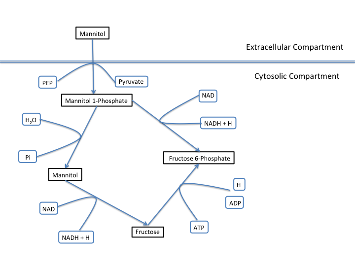

Importing, Exporting, and working with Models with PSAMM
========================================================

This part of the tutorial will focus on how to use PSAMM to convert
files between the YAML format and other popular formats. An additional
description of the YAML model format and its features is also provided
here.

.. contents::
   :depth: 1
   :local:

Import Functions in PSAMM
_________________________

For information on how to install `PSAMM` and the associated requirements, as well
how to download the materials required for this tutorial you can reference the
Installation and Materials section of the tutorial.

Importing Existing Models (psamm-import)
________________________________________

In order to work with a metabolic model in PSAMM the model must be in
the PSAMM-specific YAML format. This format allows for a human readable
representation of the model components and allows for enhanced customization
with respect to the organization of the metabolic model. This enhanced
organization will allow for a more direct interaction with the metabolic
model and make the model more accessible to both the modeler and experimental
biologists.

Import Formats
~~~~~~~~~~~~~~

The ``psamm-import`` program supports the import of models in various formats.
For the SBML format, it supports the COBRA-compliant SBML specifications, the FBC
specifications, and the basic SBML specifications in levels 1, 2, and 3;
for the JSON format, it supports the import of JSON files directly from the
`BiGG`_ database or from locally downloaded versions.

The support for importing from Excel file is model specific and are available
for 17 published models. This import requires the installation of the separate
psamm-import repository. There is also a generic Excel import for models
produced that were produced by older versions of ModelSEED. Models from the
current ModelSEED can be imported in the SBML format.

To install the ``psamm-import`` package for Excel format models use the following
command:

.. code-block:: shell

    (psamm-env) $ pip install git+https://github.com/zhanglab/psamm-import.git

This install will make the Ezxcel importers available from the command line when the
``psamm-import`` program is called.

To see a list of the models or model formats that are supported for import, use the command:

.. _BiGG: http://bigg.ucsd.edu

.. code-block:: shell

    (psamm-env) $ psamm-import list

In the output, you will see a list of specific Excel models that are supported
by ``psamm-import`` as well as the different SBML parsers that are available in
PSAMM:

.. code-block:: shell

    Generic importers:
    json          COBRApy JSON
    modelseed     ModelSEED model (Excel format)
    sbml          SBML model (non-strict)
    sbml-strict   SBML model (strict)

    Model-specific importers:
    icce806       Cyanothece sp. ATCC 51142 iCce806 (Excel format), Vu et al., 2012
    ecoli_textbook  Escerichia coli Textbook (core) model (Excel format), Orth et al., 2010
    ijo1366       Escerichia coli iJO1366 (Excel format), Orth et al., 2011
    gsmn-tb       Mycobacterium tuberculosis GSMN-TB (Excel format), Beste et al., 2007
    inj661        Mycobacterium tuberculosis iNJ661 (Excel format), Jamshidi et al., 2007
    inj661m       Mycobacterium tuberculosis iNJ661m (Excel format), Fang et al., 2010
    inj661v       Mycobacterium tuberculosis iNJ661v (Excel format), Fang et al., 2010
    ijn746        Pseudomonas putida iJN746 (Excel format), Nogales et al., 2011
    ijp815        Pseudomonas putida iJP815 (Excel format), Puchalka et al., 2008
    stm_v1.0      Salmonella enterica STM_v1.0 (Excel format), Thiele et al., 2011
    ima945        Salmonella enterica iMA945 (Excel format), AbuOun et al., 2009
    irr1083       Salmonella enterica iRR1083 (Excel format), Raghunathan et al., 2009
    ios217_672    Shewanella denitrificans OS217 iOS217_672 (Excel format), Ong et al., 2014
    imr1_799      Shewanella oneidensis MR-1 iMR1_799 (Excel format), Ong et al., 2014
    imr4_812      Shewanella sp. MR-4 iMR4_812 (Excel format), Ong et al., 2014
    iw3181_789    Shewanella sp. W3-18-1 iW3181_789 (Excel format), Ong et al., 2014
    isyn731       Synechocystis sp. PCC 6803 iSyn731 (Excel format), Saha et al., 2012

Now the model can be imported using the ``psamm-import`` functions. Return to
the ``psamm-tutorial`` folder if you have left it using the following command:

.. code-block:: shell

    (psamm-env) $ cd <PATH>/tutorial-part-1

Importing an SBML Model
~~~~~~~~~~~~~~~~~~~~~~~

In this tutorial, we will use the `E. coli` textbook core model [Orth13]_ as an
example to demonstrate these functions in PSAMM. First, we will convert the model
from the SBML model. To import the ``E_coli_core.xml`` model to YAML format run
the following command:

.. code-block:: shell

    (psamm-env) $ psamm-import sbml --source E_coli_sbml/ecoli_core_model.xml --dest E_coli_yaml

This will convert the SBML file in the ``E_coli_sbml`` directory into the YAML
format that will be stored in the ``E_coli_yaml/`` directory. The output will
give the basic statistics of the model and should look like this:

.. code-block:: shell

    ...
    WARNING: Species M_pyr_b was converted to boundary condition because of "_b" suffix
    WARNING: Species M_succ_b was converted to boundary condition because of "_b" suffix
    INFO: Detected biomass reaction: R_Biomass_Ecoli_core_w_GAM
    INFO: Removing compound prefix 'M_'
    INFO: Removing reaction prefix 'R_'
    INFO: Removing compartment prefix 'C_'
    Model: Ecoli_core_model
    - Biomass reaction: Biomass_Ecoli_core_w_GAM
    - Compartments: 2
    - Compounds: 72
    - Reactions: 95
    - Genes: 137
    INFO: e is extracellular compartment
    INFO: Using default flux limit of 1000.0
    INFO: Converting exchange reactions to exchange file

``psamm-import`` will produce some warnings if there are any aspects of the
model that are going to be changed during import. In this case the warnings are
notifying you that the metabolites with a ``_b`` suffix have been converted to the
boundary conditions of the model. There will also be information on what prefixes
were removed from the metabolite IDs and if the importer was able to identify the
Biomass Reaction in the model. This information is important to check to make sure
that the model was imported correctly. After the import the model will be available
and ready to use for any other PSAMM functions.

Importing an Excel Model
~~~~~~~~~~~~~~~~~~~~~~~~

The process of importing an Excel model is the same as importing an SBML model
except that you will need to specify the specific model name in the command.
The list of supported models can be seen using the list function above. An
example of an Excel model import is below:

.. code-block:: shell

    (psamm-env) $ psamm-import ecoli_textbook --source E_coli_excel/ecoli_core_model.xls --dest converted_excel_model

This will produce a YAML version of the Excel model in the
``converted_excel_model/`` directory.

Since the Excel models are not in a standardized format these parsers need to
be developed on a model-by-model basis in order to parse all of the relevant
information out of the model. This means that the parser can only be used for the
listed models and not for a general import.

Importing a JSON Model
~~~~~~~~~~~~~~~~~~~~~~

``psamm-import`` also supports the conversion of JSON format models that follows
the conventions in COBRApy. If the JSON model is stored locally, it can be
converted with the following command:

.. code-block:: shell

    (psamm-env) $ psamm-import json --source E_coli_json/e_coli_core.json --dest converted_json_model/

Alternatively, an extension of the JSON importer has been provided,
``psamm-import-bigg``, which can be applied to convert JSON models from `BiGG`_
database. To see the list of available models on the BiGG database the
following command can be used:

.. code-block:: shell

    (psamm-env) $ psamm-import-bigg list

This will show the available models as well as their names. You can then
import any of these models to YAML format. For example, using the following
command to import the `E. coli` iJO1366 [Orth11]_ model from the BiGG database:

.. code-block:: shell

    (psamm-env) $ psamm-import-bigg iJO1366 --dest converted_json_model_bigg/

.. note::
    To use ``psamm-import-bigg`` you must have internet access to download the
    models remotely.

YAML Format and Model Organization
__________________________________

Now that we have imported the models into the YAML format we can take a look
at what the different files are and what information they contain.
The PSAMM YAML format stores individual models under a designated directory,
in which there will be a number of files that stores the information of the
model and specifies the simulation conditions. The entry point of the YAML
model is a file named ``model.yaml``, which points to additional files that
store the information of the model components, including compounds, reactions,
flux limits, exchange conditions, etc. While we recommend that you use the name
``model.yaml`` for the central reference file, the file names for the included
files are flexible and can be customized as you prefer. In this tutorial, we
simply used the names: ``compounds.yaml``, ``reactions.yaml``, ``limits.yaml``,
and ``exchange.yaml`` for the included files.

First change directory into ``E_coli_yaml``:

.. code-block:: shell

    (psamm-env) $ cd E_coli_yaml/

The directory contains the main ``model.yaml`` file as well as the other files
that contain the model data:

.. code-block:: shell

    (psamm-env) $ ls
    compounds.yaml
    exchange.yaml
    limits.yaml
    model.yaml
    reactions.yaml

These files can be opened using any standard text editor. We highly recommend
using an editor that includes syntax highlighting for the YAML language (one such
editor is the Atom_ editor which includes built-in support for YAML and is
available for macOS, Linux and Windows). You can also use commands like
``less`` and editors like ``vi`` or ``nano`` to quickly inspect and edit
the files from the command line:

.. _Atom: https://atom.io/

.. code-block:: shell

    (psamm-env) $ less <file_name>.yaml

The central file in this organization is the ``model.yaml`` file. The following
is an example of the ``model.yaml`` file that is obtained from the import of
the `E. coli` textbook model. The ``model.yaml`` file for this imported SBML
model should look like the following:

.. code-block:: yaml

    name: Ecoli_core_model
    biomass: Biomass_Ecoli_core_w_GAM
    default_flux_limit: 1000.0
    compartments:
    - id: c
      adjacent_to: e
      name: Cytoplasm
    - id: e
      adjacent_to: c
      name: Extracellular
    compounds:
    - include: compounds.yaml
    reactions:
    - include: reactions.yaml
    exchange:
    - include: exchange.yaml
    limits:
    - include: limits.yaml

The ``model.yaml`` file defines the basic components of a metabolic model,
including the model name (`Ecoli_core_model`), the biomass function
(`Biomass_Ecoli_core_w_GAM`), the compound files (``compounds.yaml``), the
reaction files (``reactions.yaml``), the flux boundaries (``limits.yaml``), and
the exchange conditions (``exchange.yaml``). The additional files are defined using
include functions. This organization allows you to easily change
aspects of the model like the exchange reactions by simply referencing a
different exchange file in the central ``model.yaml`` definition. In addition to the
information on the other components of the model there will also be details on the
compartment information for the model. This will provide an overview of how compartments
are related to each other and what their abbreviations and names are. For this small
model there is only an ``e`` and a ``c`` compartment representing the cytoplasm
and extracellular space but more complex cells with multiple compartments
can also be represented.

This format can also be used to include multiple files in the list of
reactions and compounds. This feature can be useful, for example, if you
want to name different reaction files based on the subsystem designations or
cellular compartments, or if you want to separate the temporary reactions
that are used to fill reaction gaps from the main model. An example of how you
could designate multiple reaction files is found below. This file can be found
in the additional files folder in the file ``complex_model.yaml``.

.. code-block:: yaml

    name: Ecoli_core_model
    biomass: Biomass_Ecoli_core_w_GAM
    default_flux_limit: 1000.0
    compartments:
    - id: c
      adjacent_to: e
      name: Cytoplasm
    - id: e
      adjacent_to: c
      name: Extracellular
    model:
    - include: core_model_definition.tsv
    compounds:
    - include: compounds.yaml
    reactions:
    - include: reactions/cytoplasm.yaml
    - include: reactions/periplasm.yaml
    - include: reactions/transporters.yaml
    - include: reactions/extracellular.yaml
    exchange:
    - include: exchange.yaml
    limits:
    - include: limits.yaml

As can be seen here the modeler chose to distribute their reaction database
files into different files representing various cellular compartments and roles.
This organization can be customized to suit your preferred workflow.

There are also situations where you may wish to designate only a subset
of the reaction database in a metabolic simulation. In these situations it is
possible to use a model definition file to identify which subset of reactions
will be used from the larger database. The model definition file is simply a
list of reaction IDs that will be included in the simulation.

An example of how to include a model definition file can be found below.

.. code-block:: yaml

    name: Ecoli_core_model
    biomass: Biomass_Ecoli_core_w_GAM
    default_flux_limit: 1000.0
    compartments:
    - id: c
      adjacent_to: e
      name: Cytoplasm
    - id: e
      adjacent_to: c
      name: Extracellular
    model:
    - include: subset.tsv
    compounds:
    - include: compounds.yaml
    reactions:
    - include: reactions.yaml
    exchange:
    - include: exchange.yaml
    limits:
    - include: limits.yaml

.. note::
    When the model definition file is not identified, PSAMM will include
    the entire reaction database in the model. However, when it is identified,
    PSAMM will only include the reactions that are listed in the model
    definition file in the model. This design can be useful when you want to
    make targeted tests on a subset of the model or when you want to include a
    larger database for use with the gap filling functions.

Reactions
~~~~~~~~~

The ``reactions.yaml`` file is where the reaction information is stored in the
model. A sample from this file can be seen below:

.. code-block:: yaml

    - id: ACALD
      name: acetaldehyde dehydrogenase (acetylating)
      genes: b0351 or b1241
      equation: '|acald[c]| + |coa[c]| + |nad[c]| <=> |accoa[c]| + |h[c]| +
        |nadh[c]|'
      subsystem: Pyruvate Metabolism
    - id: ACALDt
      name: acetaldehyde reversible transport
      genes: s0001
      equation: '|acald[e]| <=> |acald[c]|'
      subsystem: Transport, Extracellular

Each reaction entry is designated with the reaction ID first. Then the various
properties of the reaction can be listed below it. The required properties for
a reaction are ID and equation. Along with these required attributes others
can be included as needed in a specific project. These can include but are not
limited to EC numbers, subsystems, names, and genes associated with the
reaction. For example, in a collaborative reconstruction you may want to
include a field named ``authors`` to identify which authors have contributed to
the curation of a particular reaction.

Reaction equations can be formatted in multiple ways to allow for more
flexibility during the modeling process. The reactions can be formatted in a
string format based on the ModelSEED reaction format. In this representation
individual compounds in the reaction are represented as compound IDs followed by
the cellular compartment in brackets, bordered on both sides by single pipes.
For example if a hydrogen compound, ``Hydr``, in a ``cytosol`` compartment
was going to be in an equation it would be represented as follows:

.. code-block:: shell

    |Hydr[cytosol]|

These individual compounds can be assigned stoichiometric coefficients by
adding a number in parentheses before the compound. For example if a reaction
contained two hydrogens it could appear as follows:

.. code-block:: shell

    (2) |Hydr[cytosol]|

These individual components are separated by + signs in the reaction string. The
separation of the reactants and products is through the use of an equal sign
with greater than or less than signs designating directionality. These could
include => or <= for reactions that can only progress in one direction or <=>
for reactions that can progress in both directions. An example of a correctly
formatted reaction could be as follows:

.. code-block:: shell

    '|ac[c]| + |atp[c]| <=> |actp[c]| + |adp[c]|'

For longer reactions the YAML format
provides a way to list each reaction component on a single line. For example a
reaction could be represented as follows:

.. code-block:: yaml

    - id: ACKr
      name: acetate kinase
      equation:
        compartment: c
        reversible: yes
        left:
          - id: ac_c
            value: 1
          - id: atp_c
            value: 1
        right:
          - id: actp_c
            value: 1
          - id: adp_c
            value: 1
      subsystem: Pyruvate Metabolism

This line based format can be especially helpful when dealing with larger
equations like biomass reactions where there can be dozens of components in
a single reaction.

Gene associations for the reactions in a model can also be included in the
reaction definitions so that gene essentiality experiments can be performed
with the model. These genes associations are included by adding the ``genes``
property to the reaction like follows:

.. code-block:: yaml

    - id: ACALDt
      name: acetaldehyde reversible transport
      equation: '|acald[e]| <=> |acald[c]|'
      subsystem: Transport, Extracellular
      genes: gene_0001

More complex gene associations can also be included by using logical and/or
statements in the genes property. When performing gene essentiality simulations
this logic will be taken into account. Some examples of using this logic with
the genes property can be seen below:

.. code-block:: yaml

    genes: gene_0001 or gene_0002

    genes: gene_0003 and gene_0004

    genes: gene_0003 and gene_0004 or gene_0005 and gene_0006

    genes: gene_0001 and (gene_0002 or gene_0003)

Compounds
~~~~~~~~~

The ``compounds.yaml`` file is organized in a similar way as the
``reactions.yaml``. An example can be seen below.

.. code-block:: yaml

    - id: 13dpg_c
      name: 3-Phospho-D-glyceroyl-phosphate
      formula: C3H4O10P2
    - id: 2pg_c
      name: D-Glycerate-2-phosphate
      formula: C3H4O7P
    - id: 3pg_c
      name: 3-Phospho-D-glycerate
      formula: C3H4O7P

The compound entries begin with a compound ID which is then followed by the
compound properties. These properties can include a name, chemical formula,
and charge of the compound.

Limits
~~~~~~

The limits file is used to designate reaction flux limits when it is different
from the defaults in PSAMM. By default, PSAMM would assign the lower and
upper bounds to reactions based on their reversibility, i.e. the boundary of
reversible reactions are :math:`-1000 \leq v_j \leq 1000`, and the boundary for
irreversible reactions are :math:`0 \leq v_j \leq 1000`. Therefore, the
``limits.yaml`` file will consist of only the reaction boundaries that are
different from these default values. For example, if you want to force flux
through an artificial reaction like the ATP maintenance reaction `ATPM` you
can add in a lower limit for the reaction in the limits file like this:

.. code-block:: yaml

    - reaction: ATPM
      lower: 8.39

Each entry in the limits file includes a reaction ID followed by upper and
lower limits. Note that when a model is imported only the non-default flux
limits are explicitly stated, so some of the imported models will not contain
a predefined limits file. In the `E. coli` core model, only one reaction has a
non-default limit. This reaction is an ATP maintenance reaction and the
modelers chose to force a certain level of flux through it to simulate the
general energy cost of cellular maintenance processes.

Exchange
~~~~~~~~

The exchange file is where you can designate the boundary conditions for the
model. The compartment of the exchange compounds can be designated using the
``compartment`` tag, and if omitted, the extracellular compartment (`e`) will
be assumed. An example of the exchange file can be seen below.

.. code-block:: yaml

    compounds:
    - id: ac_e
      reaction: EX_ac_e
      lower: 0.0
    - id: acald_e
      reaction: EX_acald_e
      lower: 0.0
    - id: akg_e
      reaction: EX_akg_e
      lower: 0.0
    - id: co2_e
      reaction: EX_co2_e

Each entry starts with the ID of the boundary compound and followed by lines
that defines the lower and upper limits of the compound flux. Internally,
PSAMM will translate these boundary compounds into exchange reactions in
metabolic models. Additional properties can be designated for the exchange
reactions including an ID for the reaction, the compartment for the reaction,
and lower and upper flux bounds for the reaction. In the same way that only
non-standard limits need to be specified in the limits file, only non-standard
exchange limits need to be specified in the exchange file. This can be seen with the
example above where the upper limits are not set since they should just be the
default limit of 1000.

Model Format Customization
~~~~~~~~~~~~~~~~~~~~~~~~~~

The YAML model format is highly customizable to suit your preferences.
File names can be changed according to your own design. These customizations
are all allowed by PSAMM as long as the central ``model.yaml`` file is also
updated to reflect the different file names referred. While all the file names
can be changed it is recommended that the central ``model.yaml`` file name does
not change. PSAMM will automatically detect and read the information from the
file if it is named ``model.yaml``. If you *do* wish to also alter the name of
this file you will need to specify the path of your model file using
the ``--model`` option whenever any PSAMM commands are run. For
example, to run FBA with a different central model file named
``ecoli_model.yaml``, you could run the command like this:

.. code-block:: shell

    (psamm-env) $ psamm-model --model ecoli_model.yaml fba

Version Control with the YAML Format
____________________________________

The YAML format contains a logical division of the model information and
allows for easier modification and interaction with the model. Moreover, the
text-based representation of YAML files can enable the tracking of model
modifications using version control systems. In this tutorial we will
demonstrate the use of the Git version control system during model development
to track the changes that have been added to an existing model. This feature
will improve the documentation of the model development process and improve
collaborative annotations during model curation.

A broad overview of how to use various Git features can be found here: `Git`_

.. _Git: https://git-scm.com

Initiate a Git Repository for the YAML Model
~~~~~~~~~~~~~~~~~~~~~~~~~~~~~~~~~~~~~~~~~~~~

Throughout this tutorial version tracking using Git will be highlighted in
various sections. As you follow along with the tutorial you can try to run the
Git commands to get a sense of how Git and PSAMM work together. We will also
highlight how the features of Git help with model curation and
development when using the YAML format.

To start using Git to track the changes in this git model the folder must first
be initialized as a Git repository. To do this first enter the YAML model
directory and use the following command:

.. code-block:: shell

    (psamm-env) $ git init
    Initialized empty Git repository in <...>/psamm-tutorial/E_coli_yaml/.git/

After the folder is initialized as a Git repository the files that were
initially imported from the SBML version can be added to the repository
using the following command:

.. code-block:: shell

    (psamm-env) $ git add *.yaml

this will stage all of the files with the ``yaml`` extension to be committed.
Then the addition of these files can be added to the repository to be tracked
by using the following command:

.. code-block:: shell

    (psamm-env) $ git commit -m 'Initial import of E. coli Core Model'

Now these files will be tracked by Git and any changes that are made will be
easily viewable using various Git commands. PSAMM will also print out the Git
commit ID when any commands are run. This makes it easier for you to track
exactly what version of the model a past simulation was done on.

The next step in the tutorial will be to add in a new carbon utilization
pathway to the `E. coli` core model and Git will be used to track these new
additions and manage the curation in an easy to track manner. The tutorial
will return to the version tracking at various points in order to show how
this can be used during model development.

FBA on Model Before Expansion
~~~~~~~~~~~~~~~~~~~~~~~~~~~~~

Now that the model is imported and being tracked by Git it will be helpful to
do a quick simulation to confirm that the model is complete and able to
generate flux. To do this you can run the FBA command in the model directory:

.. code-block:: shell

    (psamm-env) $ psamm-model fba

The following is a sample of the output from this initial flux balance
analysis. It can be seen that the model is generating flux through the
objective function and seems to be a complete working model. Now that this
is known any future changes that are made to the model can be made with the
knowledge that the unchanged model was able to generate biomass flux.

.. code-block:: shell

    ACONTa	6.00724957535	|Citrate[c]| <=> |cis-Aconitate[c]| + |H2O[c]|	b0118 or b1276
    ACONTb	6.00724957535	|cis-Aconitate[c]| + |H2O[c]| <=> |Isocitrate[c]|	b0118 or b1276
    ...
    INFO: Objective flux: 0.873921506968

Adding a new Pathway to the Model
~~~~~~~~~~~~~~~~~~~~~~~~~~~~~~~~~

The `E. coli` textbook model that was imported above is a small model
representing the core metabolism of `E. coli`. This model is great for small
tests and demonstrations due to its size and excellent curation. For the
purposes of this tutorial this textbook model will be modified to include a
new metabolic pathway for the utilization of D-Mannitol by `E. coli`. This is a
simple pathway which involves the transport of D-Mannitol via the PTS system
and then the conversion of D-Mannitol 1-Phosphate to D-Fructose 6-Phosphate.
Theoretically the inclusion of this pathway should allow the model to utilize
D-Mannitol as a sole carbon source. Along with this direct pathway another
set of reactions will be added that remove the phosphate from the mannitol
1-phosphate to create cytoplasmic mannitol which can then be converted to
fructose and then to fructose 6-phosphate.

To add these reactions, there will need to be three components added to the
model. First the new reactions will be added to the model, then the relevant
exchange reactions, and finally the compound information.

The new reactions in the database can be added directly to the already
generated reactions file but for this case they will be added to a separate
database file that can then be added to the model through the include function
in the ``model.yaml`` file.

A reaction database file named ``mannitol_path.yaml`` is supplied in
``additional_files`` folder. This file can be added into the ``model.yaml``
file by copying it to your working folder using the following command:

.. code-block:: shell

    (psamm-env) $ cp ../additional_files/mannitol_pathway.yaml .

And then specifying it in the ``model.yaml`` file by adding the following line
in the reactions section:

.. code-block:: shell

    reactions:
    - include: reactions.yaml
    - include: mannitol_pathway.yaml

Alternatively you can copy an already changed ``model.yaml`` file from the
additional files folder using the following command:

.. code-block:: shell

    (psamm-env) $ cp ../additional_files/model.yaml .

This line tells PSAMM that these reactions are also going to be included in the
model simulations.

Now you can test the model again to see if there were any effects from
these new reactions added in. To run an FBA simulation you can use the
following command:

.. code-block:: shell

    (psamm-env) $ psamm-model fba --all-reactions

The ``--all-reactions`` option makes the command write out all reactions in
the model even if they have a flux of zero in the simulation result. It can be
seen that the newly added reactions are being read into the model
since they do appear in the output. For example the `MANNI1DEH` reaction can be
seen in the FBA output and it can be seen that this reaction is not carrying
any flux. This is because there is no exchange reaction added into the model that
would provide mannitol.

.. code-block:: shell

    FRUKIN	0.0	|fru[c]| + |ATP[c]| => |D-Fructose-6-phosphate[c]| + |ADP[c]| + |H[c]|
    ...
    MANNI1PDEH	0.0	|Nicotinamide-adenine-dinucleotide[c]| + |manni1p[c]| => |D-Fructose-6-phosphate[c]| + |H[c]| + |Nicotinamide-adenine-dinucleotide-reduced[c]|
    MANNI1PPHOS	0.0	|manni1p[c]| + |H2O[c]| => |manni[c]| + |Phosphate[c]|
    MANNIDEH	0.0	|Nicotinamide-adenine-dinucleotide[c]| + |manni[c]| => |Nicotinamide-adenine-dinucleotide-reduced[c]| + |fru[c]|
    MANNIPTS	0.0	|manni[e]| + |Phosphoenolpyruvate[c]| => |manni1p[c]| + |Pyruvate[c]|
    ...

Changing the Boundary Definitions Through the Exchange File
~~~~~~~~~~~~~~~~~~~~~~~~~~~~~~~~~~~~~~~~~~~~~~~~~~~~~~~~~~~

To add new exchange reactions to the model a modified ``exchange.yaml`` file has
been included in the additional files. This new boundary condition could be
added by creating a new entry in the existing ``exchange.yaml`` file but for this
tutorial the exchange file can be changed by running the following command:

.. code-block:: shell

    (psamm-env) $ cp ../additional_files/exchange.yaml .

This will simulate adding in the new mannitol compound into the exchange file as
well as setting the uptake of glucose to be zero.

Now you can track changes to the exchange file using the Git command:

.. code-block:: shell

    (psamm-env) $ git diff exchange.yaml

From the output, it can be seen that a new entry was added in the exchange file
to add the mannitol exchange reaction and that the lower flux limit for glucose
uptake was changed to zero. This will ensure that any future simulations
done with the model in these conditions will only have mannitol available as a
carbon source.

.. code-block:: diff

    @@ -1,5 +1,7 @@
     name: Default medium
     compounds:
    +- id: manni
    +  lower: -10
     - id: ac_e
       reaction: EX_ac
       lower: 0.0
    @@ -25,7 +27,7 @@
       lower: 0.0
     - id: glc_D_e
       reaction: EX_glc
    -  lower: -10.0
    +  lower: 0.0
     - id: gln_L_e
       reaction: EX_gln_L
       lower: 0.0

In this case the Git output indicates what lines were added or removed from the
previous version. Added lines are indicated with a plus sign next to them.
These are the new lines in the new version of the file. The lines with a minus
sign next to them are the line versions from the old format of the file. This
makes it easy to figure out exactly what changed between the new and old
version of the file.

Now you can test out if the new reactions are functioning in the model.
Since there is no other carbon source, if the model sustains flux through the
biomass reaction it must be from the supplied mannitol. The following command
can be used to run FBA on the model:

.. code-block:: shell

    (psamm-env) $ psamm-model fba --all-reactions

From the output it can be seen that there is flux through the biomass reaction
and that the mannitol utilization reactions are being used. In this situation
it can also be seen that the pathway that converts mannitol to fructose first
is not being used.

.. code-block:: shell

    FRUKIN	0.0	|fru[c]| + |ATP[c]| => |D-Fructose-6-phosphate[c]| + |ADP[c]| + |H[c]|
    ...
    MANNI1PDEH	10.0	|Nicotinamide-adenine-dinucleotide[c]| + |manni1p[c]| => |D-Fructose-6-phosphate[c]| + |H[c]| + |Nicotinamide-adenine-dinucleotide-reduced[c]|
    MANNI1PPHOS	0.0	|manni1p[c]| + |H2O[c]| => |manni[c]| + |Phosphate[c]|
    MANNIDEH	0.0	|Nicotinamide-adenine-dinucleotide[c]| + |manni[c]| => |Nicotinamide-adenine-dinucleotide-reduced[c]| + |fru[c]|
    MANNIPTS	10.0	|manni[e]| + |Phosphoenolpyruvate[c]| => |manni1p[c]| + |Pyruvate[c]|

You can also choose to maximize other reactions in the network. For
example this could be used to analyze the network when production of a certain
metabolite is maximized or to quickly change between different objective
functions that are in the model. To do this you will just need to specify
a reaction ID in the command and that will be used as the objective function
for that simulation. For example if you wanted to analyze the network when
the `FRUKIN` reaction is maximized the following command can be used:

.. code-block:: shell

    (psamm-env) $ psamm-model fba --objective=FRUKIN --all-reactions

It can be seen from this simulation that the `FRUKIN` reaction is now being
used and that the fluxes through the network have changed from when the biomass
function was used as the objective function.

.. code-block:: shell

    ...
    EX_lac_D_e	20.0	|D-Lactate[e]| <=>
    EX_manni_e	-10.0	|manni[e]| <=>
    EX_o2_e	-5.0	|O2[e]| <=>
    EX_pi_e	0.0	|Phosphate[e]| <=>
    EX_pyr_e	0.0	|Pyruvate[e]| <=>
    EX_succ_e	0.0	|Succinate[e]| <=>
    FBA	10.0	|D-Fructose-1-6-bisphosphate[c]| <=> |Dihydroxyacetone-phosphate[c]| + |Glyceraldehyde-3-phosphate[c]|	b2097 or b1773 or b2925
    FBP	0.0	|D-Fructose-1-6-bisphosphate[c]| + |H2O[c]| => |D-Fructose-6-phosphate[c]| + |Phosphate[c]|	b3925 or b4232
    FORt2	0.0	|Formate[e]| + |H[e]| => |Formate[c]| + |H[c]|	b0904 or b2492
    FORti	0.0	|Formate[c]| => |Formate[e]|	b0904 or b2492
    FRD7	0.0	|Fumarate[c]| + |Ubiquinol-8[c]| => |Ubiquinone-8[c]| + |Succinate[c]|	b4151 and b4152 and b4153 and b4154
    FRUKIN	10.0	|fru[c]| + |ATP[c]| => |D-Fructose-6-phosphate[c]| + |ADP[c]| + |H[c]|
    ...

Adding new Compounds to the Model
~~~~~~~~~~~~~~~~~~~~~~~~~~~~~~~~~

In the previous two steps the reactions and boundary conditions were added
into the model. There was no information added in about what the compounds in
these reactions actually are but PSAMM is still able to treat them as
metabolites in the network and utilize them accordingly. It will be helpful if
there is information on these compounds in the model. This will allow you
to use the various curation tools and will allow PSAMM to use the new
compound names in the output of these various simulations. To add the new
compounds to the model a modified ``compounds.yaml`` file has been provided in
the ``additional_files`` folder. These compounds can be entered into the
existing ``compounds.yaml`` file but for this tutorial the new version can be
copied over by running the following command.

.. code-block:: shell

    (psamm-env) $ cp ../additional_files/compounds.yaml .

Using the diff command in Git, you will be able to identify changes in the new
``compounds.yaml`` file:

.. code-block:: shell

    (psamm-env) $ git diff compounds.yaml

It can be seen that the new compound entries added to the model were the
various new compounds involved in this new pathway.

.. code-block:: diff

    @@ -1,3 +1,12 @@
    +- id: fru_c
    +  name: Fructose
    +  formula: C6H12O6
    +- id: manni
    +  name: Mannitol
    +  formula: C6H14O6
    +- id: manni1p
    +  name: Mannitol 1-phosphate
    +  formula: C6H13O9P
     - id: 13dpg_c
       name: 3-Phospho-D-glyceroyl-phosphate
       formula: C3H4O10P2

This will simulate adding in the new compounds to the existing database.
Now you can run another FBA simulation to check if these new compound
properties are being incorporated into the model. To do this run the following
command:

.. code-block:: shell

    (psamm-env) $ psamm-model fba --all-reactions

It can be seen that the reactions are no longer represented with compound IDs
but are now represented with the compound names. This is because the new
compound features are now being added to the model.

.. code-block:: shell

    EX_manni_e	-10.0	|Mannitol[e]| <=>
    ...
    FRUKIN	0.0	|Fructose[c]| + |ATP[c]| => |D-Fructose-6-phosphate[c]| + |ADP[c]| + |H[c]|
    ...
    MANNI1PDEH	10.0	|Nicotinamide-adenine-dinucleotide[c]| + |Mannitol 1-phosphate[c]| => |D-Fructose-6-phosphate[c]| + |H[c]| + |Nicotinamide-adenine-dinucleotide-reduced[c]|
    MANNI1PPHOS	0.0	|Mannitol 1-phosphate[c]| + |H2O[c]| => |Mannitol[c]| + |Phosphate[c]|
    MANNIDEH	0.0	|Nicotinamide-adenine-dinucleotide[c]| + |Mannitol[c]| => |Nicotinamide-adenine-dinucleotide-reduced[c]| + |Fructose[c]|
    MANNIPTS	10.0	|Mannitol[e]| + |Phosphoenolpyruvate[c]| => |Mannitol 1-phosphate[c]| + |Pyruvate[c]|

Checking File Changes with Git
~~~~~~~~~~~~~~~~~~~~~~~~~~~~~~

Now that the model has been updated it will be useful to track the changes
that have been made.

First it will be helpful to get a summary of all the files have been
modified in the model. Since the changes have been tracked with Git the
files that have changed can be viewed by using the following Git command:

.. code-block:: shell

    (psamm-env) $ git status

The output of this command should show that the exchange, compound, and
``model.yaml`` files have changed and that there is a new file that is not
being tracked named ``mannitol_pathway.yaml``. First the new mannitol pathway
file can be added to the Git repository so that future changes can be tracked
using the following commands:

.. code-block:: shell

    (psmam-env) $ git add mannitol_pathway.yaml

Then specific changes in individual files can be viewed by using the
``git diff`` command followed by the file name. For example to view the changes
in the ``compounds.yaml`` file the following command can be run.

.. code-block:: shell

    (psamm-env) $ git diff model.yaml

The output should look like the following:

.. code-block:: diff

    @@ -5,6 +5,7 @@ compounds:
       - include: compounds.yaml
       reactions:
       - include: reactions.yaml
    +  - include: mannitol_pathway.yaml
       exchange:
       - include: exchange.yaml
       limits:

This can be done with any file that had changes to make sure that no
accidental changes are added in along with whatever the desired changes are.
In this example there should be one line added in the ``model.yaml`` file,
three compounds added into the ``compounds.yaml`` file, and one exchange
reaction added into the ``exchange.yaml`` file along with one change that removed
glucose from the list of carbon sources in the exchange settings (by changing the lower
bound of its exchange reaction to zero).

Once the changes are confirmed these files can be added with the Git add
command.

.. code-block:: shell

    (psamm-env) $ git add compounds.yaml
    (psamm-env) $ git add exchange.yaml
    (psamm-env) $ git add model.yaml

These changes can then be committed to the repository using the following
command:

.. code-block:: shell

    (psamm-env) $ git commit -m 'Addition of mannitol utilization pathway and associated compounds'

Now the model has been updated and the changes have been committed. The Git log
command can be used to view what commits have been made in the repository.
This allows you to track the overall progress as well as examine what
specific changes have been made. More detailed information between the commits
can be viewed using the ``git diff`` command along with the commit ID that you
want to compare the current version to. This will tell you specifically what
changes occurred between that commit and the current version.

You can also view a log of the commits in the model by using the following command:

.. code-block:: shell

    (psamm-env) $ git log

This can be helpful for getting an overall view of what changes have been made
to a repository.

The Git version tracking can also be used with GitHub_, BitBucket_, GitLab_ or
any other Git hosting provider to share repositories with other people. This
can enable you to collaborate on different aspects of the modeling
process while still tracking the changes made by different groups and
maintaining a functional model.

.. _GitHub: https://github.com/
.. _BitBucket: https://bitbucket.org/
.. _GitLab: https://gitlab.com/

Using PSAMM to export the model to other Software
_________________________________________________

If you want to export the model in a format to use with other
software, that is also possible using PSAMM. The YAML formatted model can be
easily exported as an SBML file using the following command:

.. code-block:: shell

    (psamm-env) $ psamm-model sbmlexport Modified_core_ecoli.xml

This will export the model in SBML level 3 version 1 format which can then
be used in other software that support this format.
