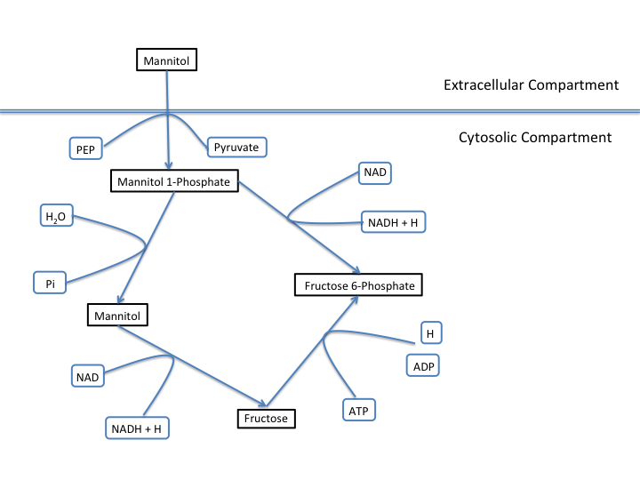

Tutorial
========

This tutorial will show you how to get PSAMM up and running on your computer,
how to work with the PSAMM YAML format, how to import published models into
PSAMM, and how to apply the main tools included with PSAMM to your models.

.. contents::
   :depth: 1
   :local:

Downloading the PSAMM Tutorial Data
_____________________________________

The PSAMM tutorial materials are available in the psamm-tutorial GitHub repository

These files can be downloaded using the following command:

.. code-block:: shell

    $ git clone https://github.com/zhanglab/psamm-tutorial.git

This will create a directory named ``psamm-tutorial`` in your current working
folder. You can then navigate to this directory using the following command:

.. code-block:: shell

    $ cd psamm-tutorial

Now you should be in the ``psamm-tutorial`` folder and should see the following
folders:

.. code-block:: shell

    additional_files/
    E_coli_sbml/
    E_coli_excel/
    E_coli_json/

These directories include all of the files that will be needed to run the tutorial.

PSAMM Installation
____________________

PSAMM can be installed using the Python package installer pip. We recommend
that all installations be performed under a virtual Python environment. Major
programs and dependencies include: ``psamm-model``, which supports model
checking, model simulation, and model exports; Linear programming (LP) solvers
(e.g. CPLEX, Gurobi, QSopt_ex), which provide the solution of linear
programming problems; ``psamm-import``, which supports the import of models
from SBML, JSON, and Excel formats.

Setting up a Virtual Python Environment
~~~~~~~~~~~~~~~~~~~~~~~~~~~~~~~~~~~~~~~

It is recommended that the PSAMM software and dependencies should be
installed under a virtual Python environment. This can be done by using
the Virtualenv_ software. Virtualenv will set up a Python environment that
permits you to install Python packages in a local directory that will not
interfere with other programs in the global Python. The virtual environment
can be set up at any local directory that you have write permission to. For
example, here we will set up the virtual environment under the main directory
of this PSAMM tutorial. First, run the following command if you are not in
the ``psamm-tutorial`` folder:

.. _Virtualenv: https://virtualenv.pypa.io/

.. code-block:: shell

    $ cd <PATH>/psamm-tutorial

In this command, ``<PATH>`` should be substituted by the directory path to
where you created the ``psamm-tutorial``. This will change your current
directory to the ``psamm-tutorial`` directory. Then, you can create a virtual
environment in the ``psamm-tutorial`` directory:

.. code-block:: shell

    $ virtualenv psamm-env

That will set up the virtual environment in a folder called ``psamm-env/``.
The next step is to activate the virtual environment so that the Python that is
being used will be the one that is in the virtualenv. To do this use the
following command:

.. code-block:: shell

    $ source psamm-env/bin/activate

This will change your command prompt to the following:

.. code-block:: shell

    (psamm-env) $

This indicates that the virtual environment is activated, and any installation
of Python packages will now be installed in the virtual environment. It is
important to note that when you leave the environment and return at a later
time, you will have to reactivate the environment (use the ``source`` command
above) to be able to use any packages installed in it.

.. note::

    For Windows users, the virtual environment is installed in a different
    file structure. The ``activate`` script on these systems will reside in a
    ``Scripts`` folder. To activate the environment on these systems use the
    command:

    .. code-block:: batch

        > psamm-env\Scripts\activate

.. note::

    After activating the environment, the command ``pip list`` can be used to
    quickly get an overview of the packages installed in the environment and
    the version of each package.

Installation of ``psamm-model`` and ``psamm-import``
~~~~~~~~~~~~~~~~~~~~~~~~~~~~~~~~~~~~~~~~~~~~~~~~~~~~

The next step will be to install ``psamm-model`` and ``psamm-import`` as well
as their requirements. To do this, you can use the Python Package Installer,
`pip`. To install both ``psamm-import`` and ``psamm-model`` you can use the
following command:

.. code-block:: shell

    (psamm-env) $ pip install git+https://github.com/zhanglab/psamm-import.git

This will install ``psamm-import`` from its Git repository and also install its
Python dependencies automatically. One of these dependencies is
``psamm-model``, so when ``psamm-import`` is installed you will also be
installing ``psamm-model``.

If you only want to install ``psamm-model`` in the environment you can run
the following command:

.. code-block:: shell

    (psamm-env) $ pip install psamm

It is important to note that if only ``psamm-model`` is installed you will be
able to apply PSAMM only on models that are represented in the YAML format
which will be described later on in the tutorial.

Installation of LP Solvers
~~~~~~~~~~~~~~~~~~~~~~~~~~

The LP (linear programming) solvers are necessary for analysis of metabolic
fluxes using the constraint-based modeling approaches.

CPLEX is the recommended solver for PSAMM and is available with an academic
license from IBM. Make sure that you use at least **CPLEX version 12.6**.
Instructions on how to install CPLEX can be found
`here <http://www-01.ibm.com/support/docview.wss?uid=swg21444285>`_.

Once CPLEX is installed, you need to install the Python bindings under
the psamm-env virtual environment using the following command:

.. code-block:: shell

    (psamm-env) $ pip install <PATH>/IBM/ILOG/CPLEX_Studio<XXX>/cplex/python/<python_version>/<platform>

The directory path in the above command should be replaced with the path to
the IBM CPLEX installation in your computer. This will install the Python
bindings for CPLEX into the virtual environment.

.. note::
    While the CPLEX software will be installed globally, the Python bindings
    should be installed specifically under the virtual environment with the
    PSAMM installation.

PSAMM also supports the use of two other linear programming solvers, Gurobi and
QSopt_ex. To install the Gurobi solver, Gurobi will first need to be installed
on your computer. Gurobi can be obtained with an academic license from
here: `Gurobi`_

Once Gurobi is installed the Python bindings will need to be installed in the
virtual environment by using pip to install them from the package directory. An
example of how this could be done on a macOS is (on other platforms the path
will be different):

.. _Gurobi: http://www.gurobi.com/registration/download-reg

.. code-block:: shell

    (psamm-env) $ pip install /Library/gurobi604/mac64/

The QSopt_ex solver can also be used with PSAMM. To install this solver you
will first need to install Qsopt_ex on your computer and afterwards the
Python bindings (`python-qsoptex`) can be installed in the virtual environment:

.. code-block:: shell

    (psamm-env) $ pip install python-qsoptex

Please see the `python-qsoptex documentation`_ for more information on
installing both the library and the Python bindings.

.. _`python-qsoptex documentation`: https://github.com/jonls/python-qsoptex

.. note::
    The QSopt_ex solver does not support Integer LP problems and as a result
    cannot be used to perform flux analysis with thermodynamic constraints. If this
    solver is used thermodynamic constraints cannot be used during simulation. By
    default ``psamm-model`` will not use these constraints.

Once a solver is installed you should now be able to fully use all of the
``psamm-model`` flux analysis functions. To see a list of the installed solvers
the use the ``psamm-list-lpsolvers`` command:

.. code-block:: shell

    (psamm-env) $ psamm-list-lpsolvers

You will see the details on what solvers are installed currently and
avaliable to PSAMM. For example if the Gurobi and CPLEX solvers were both
installed you would see the following output from ``psamm-list-lpsolvers``:

.. code-block:: shell

    Prioritized solvers:
    Name: cplex
    Priority: 10
    MILP (integer) problem support: True
    Rational solution: False
    Class: <class 'psamm.lpsolver.cplex.Solver'>

    Name: gurobi
    Priority: 9
    MILP (integer) problem support: True
    Rational solution: False
    Class: <class 'psamm.lpsolver.gurobi.Solver'>

    Unavailable solvers:
    qsoptex: Error loading solver: No module named qsoptex

By default the solver with the highest priority (highest priority number) is
used in constraint based simulations. If you want to use a solver with a
lower priority you will need to specify it by using the ``--solver`` option.
For example to run FBA on a model while using the Gurobi solver the following
command would be used:

.. code-block:: shell

    (psamm-env) $ psamm-model fba --solver name=gurobi

Version Control with the YAML Format
____________________________________

The YAML format contains a logical division of the model information and
allows for easier modification and interaction with the model. Moreover, the
text-based representation of YAML files can enable the tracking of model
modifications using version control systems. In this tutorial we will
demonstrate the use of the Git version control system during model development
to track the changes that have been added to an existing model. This feature
will improve the documentation of the model development process and improve
collaborative annotations during model curation.

A broad overview of how to use various Git features can be found here: `Git`_

.. _Git: https://git-scm.com

Initiate a Git Repository for the YAML Model
~~~~~~~~~~~~~~~~~~~~~~~~~~~~~~~~~~~~~~~~~~~~

Throughout this tutorial version tracking using Git will be highlighted in
various sections. As you follow along with the tutorial you can try to run the
Git commands to get a sense of how Git and PSAMM work together. We will also
highlight how the features of Git help with model curation and
development when using the YAML format.

To start using Git to track the changes in this model the folder must first
be initialized as a Git repository. To do this first enter the YAML model
directory and use the following command:

.. code-block:: shell

    (psamm-env) $ git init
    Initialized empty Git repository in <...>/psamm-tutorial/E_coli_yaml/.git/

After the folder is initialized as a Git repository the files that were
initially imported from the SBML version can be added to the repository
using the following command:

.. code-block:: shell

    (psamm-env) $ git add *.yaml

this will stage all of the files with the ``yaml`` extension to be committed.
Then the addition of these files can be added to the repository to be tracked
by using the following command:

.. code-block:: shell

    (psamm-env) $ git commit -m 'Initial import of E. coli Core Model'

Now these files will be tracked by Git and any changes that are made will be
easily viewable using various Git commands. PSAMM will also print out the Git
commit ID when any commands are run. This makes it easier for you to track
exactly what version of the model a past simulation was done on.

The next step in the tutorial will be to add in a new carbon utilization
pathway to the `E. coli` core model and Git will be used to track these new
additions and manage the curation in an easy to track manner. The tutorial
will return to the version tracking at various points in order to show how
this can be used during model development.

FBA on Model Before Expansion
~~~~~~~~~~~~~~~~~~~~~~~~~~~~~

Now that the model is imported and being tracked by Git it will be helpful to
do a quick simulation to confirm that the model is complete and able to
generate flux. To do this you can run the FBA command in the model directory:

.. code-block:: shell

    (psamm-env) $ psamm-model fba

The following is a sample of the output from this initial flux balance
analysis. It can be seen that the model is generating flux through the
objective function and seems to be a complete working model. Now that this
is known any future changes that are made to the model can be made with the
knowledge that the unchanged model was able to generate biomass flux.

.. code-block:: shell

    ACONTa	4.69666522532	|Citrate[c]| <=> |cis-Aconitate[c]| + |H2O[c]|	b0118 or b1276
    ACONTb	4.69666522532	|cis-Aconitate[c]| + |H2O[c]| <=> |Isocitrate[c]|	b0118 or b1276
    AKGDH	3.68511277336	|2-Oxoglutarate[c]| + |Coenzyme-A[c]| + |Nicotinamide-adenine-dinucleotide[c]| => |CO2[c]| + |Nicotinamide-adenine-dinucleotide-reduced[c]| + |Succinyl-CoA[c]|	b0116 and b0726 and b0727
    ATPM	8.39	|ATP[c]| + |H2O[c]| => |ADP[c]| + |H[c]| + |Phosphate[c]|
    ...
    INFO: Objective flux: 0.873921506968

Adding a new Pathway to the Model
~~~~~~~~~~~~~~~~~~~~~~~~~~~~~~~~~

The `E. coli` textbook model that was imported above is a small model
representing the core metabolism of `E. coli`. This model is great for small
tests and demonstrations due to its size and excellent curation. For the
purposes of this tutorial this textbook model will be modified to include a
new metabolic pathway for the utilization of D-Mannitol by `E. coli`. This is a
simple pathway which involves the transport of D-Mannitol via the PTS system
and then the conversion of D-Mannitol 1-Phosphate to D-Fructose 6-Phosphate.
Theoretically the inclusion of this pathway should allow the model to utilize
D-Mannitol as a sole carbon source. Along with this direct pathway another
set of reactions will be added that remove the phosphate from the mannitol
1-phosphate to create cytoplasmic mannitol which can then be converted to
fructose and then to fructose 6-phosphate.

To add these reactions, there will need to be three components added to the
model. First the new reactions will be added to the model, then the relevant
exchange reactions, and finally the compound information.

The new reactions in the database can be added directly to the already
generated reactions file but for this case they will be added to a separate
database file that can then be added to the model through the include function
in the ``model.yaml`` file.

A reaction database file named ``mannitol_path.yaml`` is supplied in
``additional_files`` folder. This file can be added into the ``model.yaml``
file by copying it to your working folder using the following command:

.. code-block:: shell

    (psamm-env) $ cp ../additional_files/mannitol_pathway.yaml .

And then specifying it in the ``model.yaml`` file by adding the following line
in the reactions section:

.. code-block:: shell

    reactions:
    - include: reactions.yaml
    - include: mannitol_pathway.yaml

Alternatively you can copy an already changed ``model.yaml`` file from the
additional files folder using the following command:

.. code-block:: shell

    (psamm-env) $ cp ../additional_files/model.yaml .

This line tells PSAMM that these reactions are also going to be included in the
model simulations.

Now you can test the model again to see if there were any effects from
these new reactions added in. To run an FBA simulation you can use the
following command:

.. code-block:: shell

    (psamm-env) $ psamm-model fba --all-reactions

The ``--all-reactions`` option makes the command write out all reactions in
the model even if they have a flux of zero in the simulation result. It can be
seen that the newly added reactions are being read into the model
since they do appear in the output. For example the `MANNI1DEH` reaction can be
seen in the FBA output and it can be seen that this reaction is not carrying
any flux. This is because there is no exchange reaction added into the model that
would provide mannitol.

.. code-block:: shell

    FRUKIN	0.0	|fru_c[c]| + |ATP[c]| => |D-Fructose-6-phosphate[c]| + |ADP[c]| + |H[c]|
    ...
    MANNI1PDEH	0.0	|Nicotinamide-adenine-dinucleotide[c]| + |manni1p[c]| => |D-Fructose-6-phosphate[c]| + |H[c]| + |Nicotinamide-adenine-dinucleotide-reduced[c]|
    MANNI1PPHOS	0.0	|manni1p[c]| + |H2O[c]| => |manni[c]| + |Phosphate[c]|
    MANNIDEH	0.0	|Nicotinamide-adenine-dinucleotide[c]| + |manni[c]| => |Nicotinamide-adenine-dinucleotide-reduced[c]| + |fru_c[c]|
    MANNIPTS	0.0	|manni[e]| + |Phosphoenolpyruvate[c]| => |manni1p[c]| + |Pyruvate[c]|
    ...

Changing the Boundary Definitions Through the Medium File
~~~~~~~~~~~~~~~~~~~~~~~~~~~~~~~~~~~~~~~~~~~~~~~~~~~~~~~~~

To add new exchange reactions to the model a modified ``medium.yaml`` file has
been included in the additional files. This new boundary condition could be
added by creating a new entry in the existing ``medium.yaml`` file but for this
tutorial the media can be changed by running the following command:

.. code-block:: shell

    (psamm-env) $ cp ../additional_files/medium.yaml .

This will simulate adding in the new mannitol compound into the media file as
well as setting the uptake of glucose to be zero.

Now you can track changes to the medium file using the Git command:

.. code-block:: shell

    (psamm-env) $ git diff medium.yaml

From the output, it can be seen that a new entry was added in the medium file
to add the mannitol exchange reaction and that the lower flux limit for glucose
uptake was changed to zero. This will ensure that any future simulations
done with the model in these conditions will only have mannitol available as a
carbon source.

.. code-block:: diff

    @@ -1,5 +1,7 @@
     name: Default medium
     compounds:
    +- id: manni
    +  lower: -10
     - id: ac_e
       reaction: EX_ac_e
       lower: 0.0
    @@ -25,7 +27,7 @@
       lower: 0.0
     - id: glc_D_e
       reaction: EX_glc_e
    -  lower: -10.0
    +  lower: 0.0
     - id: gln_L_e
       reaction: EX_gln_L_e
       lower: 0.0

In this case the Git output indicates what lines were added or removed from the
previous version. Added lines are indicated with a plus sign next to them.
These are the new lines in the new version of the file. The lines with a minus
sign next to them are the line versions from the old format of the file. This
makes it easy to figure out exactly what changed between the new and old
version of the file.

Now you can test out if the new reactions are functioning in the model.
Since there is no other carbon source, if the model sustains flux through the
biomass reaction it must be from the supplied mannitol. The following command
can be used to run FBA on the model:

.. code-block:: shell

    (psamm-env) $ psamm-model fba --all-reactions

From the output it can be seen that there is flux through the biomass reaction
and that the mannitol utilization reactions are being used. In this situation
it can also be seen that the pathway that converts mannitol to fructose first
is not being used.

.. code-block:: shell

    FRUKIN	0.0	|fru_c[c]| + |ATP[c]| => |D-Fructose-6-phosphate[c]| + |ADP[c]| + |H[c]|
    ...
    MANNI1PDEH	10.0	|Nicotinamide-adenine-dinucleotide[c]| + |manni1p[c]| => |D-Fructose-6-phosphate[c]| + |H[c]| + |Nicotinamide-adenine-dinucleotide-reduced[c]|
    MANNI1PPHOS	0.0	|manni1p[c]| + |H2O[c]| => |manni[c]| + |Phosphate[c]|
    MANNIDEH	0.0	|Nicotinamide-adenine-dinucleotide[c]| + |manni[c]| => |Nicotinamide-adenine-dinucleotide-reduced[c]| + |fru_c[c]|
    MANNIPTS	10.0	|manni[e]| + |Phosphoenolpyruvate[c]| => |manni1p[c]| + |Pyruvate[c]|

You can also choose to maximize other reactions in the network. For
example this could be used to analyze the network when production of a certain
metabolite is maximized or to quickly change between different objective
functions that are in the model. To do this you will just need to specify
a reaction ID in the command and that will be used as the objective function
for that simulation. For example if you wanted to analyze the network when
the `FRUKIN` reaction is maximized the following command can be used:

.. code-block:: shell

    (psamm-env) $ psamm-model fba --objective=FRUKIN --all-reactions

It can be seen from this simulation that the `FRUKIN` reaction is now being
used and that the fluxes through the network have changed from when the biomass
function was used as the objective function.

.. code-block:: shell

    ...
    EX_lac_D_e	20.0	|D-Lactate[e]| <=>
    EX_manni_e	-10.0	|manni[e]| <=>
    EX_o2_e	-5.0	|O2[e]| <=>
    EX_pi_e	0.0	|Phosphate[e]| <=>
    EX_pyr_e	0.0	|Pyruvate[e]| <=>
    EX_succ_e	0.0	|Succinate[e]| <=>
    FBA	10.0	|D-Fructose-1-6-bisphosphate[c]| <=> |Dihydroxyacetone-phosphate[c]| + |Glyceraldehyde-3-phosphate[c]|	b2097 or b1773 or b2925
    FBP	0.0	|D-Fructose-1-6-bisphosphate[c]| + |H2O[c]| => |D-Fructose-6-phosphate[c]| + |Phosphate[c]|	b3925 or b4232
    FORt2	0.0	|Formate[e]| + |H[e]| => |Formate[c]| + |H[c]|	b0904 or b2492
    FORti	0.0	|Formate[c]| => |Formate[e]|	b0904 or b2492
    FRD7	0.0	|Fumarate[c]| + |Ubiquinol-8[c]| => |Ubiquinone-8[c]| + |Succinate[c]|	b4151 and b4152 and b4153 and b4154
    FRUKIN	10.0	|fru_c[c]| + |ATP[c]| => |D-Fructose-6-phosphate[c]| + |ADP[c]| + |H[c]|
    ...

Adding new Compounds to the Model
~~~~~~~~~~~~~~~~~~~~~~~~~~~~~~~~~

In the previous two steps the reactions and boundary conditions were added
into the model. There was no information added in about what the compounds in
these reactions actually are but PSAMM is still able to treat them as
metabolites in the network and utilize them accordingly. It will be helpful if
there is information on these compounds in the model. This will allow you
to use the various curation tools and will allow PSAMM to use the new
compound names in the output of these various simulations. To add the new
compounds to the model a modified ``compounds.yaml`` file has been provided in
the ``additional_files`` folder. These compounds can be entered into the
existing ``compounds.yaml`` file but for this tutorial the new version can be
copied over by running the following command.

.. code-block:: shell

    (psamm-env) $ cp ../additional_files/compounds.yaml .

Using the diff command in Git, you will be able to identify changes in the new
``compounds.yaml`` file:

.. code-block:: shell

    (psamm-env) $ git diff compounds.yaml

It can be seen that the new compound entries added to the model were the
various new compounds involved in this new pathway.

.. code-block:: diff

    @@ -1,3 +1,12 @@
    +- id: fru_c
    +  name: Fructose
    +  formula: C6H12O6
    +- id: manni
    +  name: Mannitol
    +  formula: C6H14O6
    +- id: manni1p
    +  name: Mannitol 1-phosphate
    +  formula: C6H13O9P
     - id: 13dpg_c
       name: 3-Phospho-D-glyceroyl-phosphate
       formula: C3H4O10P2

This will simulate adding in the new compounds to the existing database.
Now you can run another FBA simulation to check if these new compound
properties are being incorporated into the model. To do this run the following
command:

.. code-block:: shell

    (psamm-env) $ psamm-model fba --all-reactions

It can be seen that the reactions are no longer represented with compound IDs
but are now represented with the compound names. This is because the new
compound features are now being added to the model.

.. code-block:: shell

    EX_manni_e	-10.0	|Mannitol[e]| <=>
    ...
    FRUKIN	0.0	|Fructose[c]| + |ATP[c]| => |D-Fructose-6-phosphate[c]| + |ADP[c]| + |H[c]|
    ...
    MANNI1PDEH	10.0	|Nicotinamide-adenine-dinucleotide[c]| + |Mannitol 1-phosphate[c]| => |D-Fructose-6-phosphate[c]| + |H[c]| + |Nicotinamide-adenine-dinucleotide-reduced[c]|
    MANNI1PPHOS	0.0	|Mannitol 1-phosphate[c]| + |H2O[c]| => |Mannitol[c]| + |Phosphate[c]|
    MANNIDEH	0.0	|Nicotinamide-adenine-dinucleotide[c]| + |Mannitol[c]| => |Nicotinamide-adenine-dinucleotide-reduced[c]| + |Fructose[c]|
    MANNIPTS	10.0	|Mannitol[e]| + |Phosphoenolpyruvate[c]| => |Mannitol 1-phosphate[c]| + |Pyruvate[c]|

Checking File Changes with Git
~~~~~~~~~~~~~~~~~~~~~~~~~~~~~~

Now that the model has been updated it will be useful to track the changes
that have been made.

First it will be helpful to get a summary of all the files have been
modified in the model. Since the changes have been tracked with Git the
files that have changed can be viewed by using the following Git command:

.. code-block:: shell

    (psamm-env) $ git status

The output of this command should show that the medium, compound, and
``model.yaml`` files have changed and that there is a new file that is not
being tracked named ``mannitol_pathway.yaml``. First the new mannitol pathway
file can be added to the Git repository so that future changes can be tracked
using the following commands:

.. code-block:: shell

    (psmam-env) $ git add mannitol_pathway.yaml

Then specific changes in individual files can be viewed by using the
``git diff`` command followed by the file name. For example to view the changes
in the ``compounds.yaml`` file the following command can be run.

.. code-block:: shell

    (psamm-env) $ git diff model.yaml

The output should look like the following:

.. code-block:: diff

    @@ -5,6 +5,7 @@ compounds:
       - include: compounds.yaml
       reactions:
       - include: reactions.yaml
    +  - include: mannitol_pathway.yaml
       media:
       - include: medium.yaml
       limits:

This can be done with any file that had changes to make sure that no
accidental changes are added in along with whatever the desired changes are.
In this example there should be one line added in the ``model.yaml`` file,
three compounds added into the ``compounds.yaml`` file, and one exchange
reaction added into the ``media.yaml`` file along with one change that removed
glucose from the list of carbon sources in the medium (by changing the lower
bound of its exchange reaction to zero).

Once the changes are confirmed these files can be added with the Git add
command.

.. code-block:: shell

    (psamm-env) $ git add compounds.yaml
    (psamm-env) $ git add medium.yaml
    (psamm-env) $ git add model.yaml

These changes can then be committed to the repository using the following
command:

.. code-block:: shell

    (psamm-env) $ git commit -m 'Addition of mannitol utilization pathway and associated compounds'

Now the model has been updated and the changes have been committed. The Git log
command can be used to view what commits have been made in the repository.
This allows you to track the overall progress as well as examine what
specific changes have been made. More detailed information between the commits
can be viewed using the ``git diff`` command along with the commit ID that you
want to compare the current version to. This will tell you specifically what
changes occurred between that commit and the current version.

The Git version tracking can also be used with GitHub_, BitBucket_, GitLab_ or
any other Git hosting provider to share repositories with other people. This
can enable you to collaborate on different aspects of the modeling
process while still tracking the changes made by different groups and
maintaining a functional model.

.. _GitHub: https://github.com/
.. _BitBucket: https://bitbucket.org/
.. _GitLab: https://gitlab.com/

Search Functions in PSAMM
-------------------------

``psamm-model`` includes a search function that can be used to search the model
information for specific compounds or reactions. To do this the search function
can be used. This can be used for various search methods. For example to search
for the compound named fructose the following command can be used:

.. code-block:: shell

    (psamm-env) $ psamm-model search compound --name 'Fructose'
    INFO: Model: Ecoli_core_model
    INFO: Model Git version: db22229
    id: fru_c
    formula: C6H12O6
    name: Fructose
    Defined in ./compounds.yaml:?:?

To do the same search but instead use the compound ID the following command can
be used:

.. code-block:: shell

    (psamm-env) $ psamm-model search compound --id 'fru_c'

These searches will result in a printout of the relevant information contained
within the model about these compounds. In a similar way reactions can also be
searched. For example to search for a reaction by a specific ID the following
command can be used:

.. code-block:: shell

    (psamm-env) $ psamm-model search reaction --id 'FRUKIN'

Or to search for all reactions that include a specific compound the following
command can be used:

.. code-block:: shell

    (psamm-env) $ psamm-model search reaction --compound 'manni[c]'

PSAMM Model Collection
______________________

Converted versions of 57 published SBML metabolic models, 9 published Excel
models and one MATLAB model are available in the `PSAMM Model Collection`_ on
GitHub. These models were converted to the YAML format and then manually edited
when needed to produce models that can generate non-zero biomass fluxes. The
changes to the models are tracked in the Git history of the repository so you
can see exactly what changes needed to be made to the models. To download
and use these models with PSAMM you can clone the Git repository using the
following command:

.. _`PSAMM Model Collection`: https://github.com/zhanglab/psamm-model-collection

.. code-block:: shell

    $ git clone https://github.com/zhanglab/psamm-model-collection.git

This will create the directory ``psamm-model-collection`` in your current
folder that contains one directory named ``excel`` with the converted Excel
models, one directory named ``sbml`` with the converted SBML models and one
named ``matlab`` with the converted MATLAB model. These models can then be
used for simulations with `PSMAM` using the commands detailed in this tutorial.

References
__________

.. [1] Orth JD, Palsson BØ, Fleming RMT. Reconstruction and Use of Microbial
    Metabolic Networks: the Core Escherichia coli Metabolic Model as an
    Educational Guide. EcoSal Plus. asm Pub2Web; 2013;1.
    :doi:`10.1128/ecosalplus.10.2.1`.
.. [2] Orth JD, Conrad TM, Na J, Lerman JA, Nam H, Feist AM, et al. A
    comprehensive genome-scale reconstruction of Escherichia coli
    metabolism--2011. Mol Syst Biol. EMBO Press; 2011;7: 535.
    :doi:`10.1038/msb.2011.65`.
